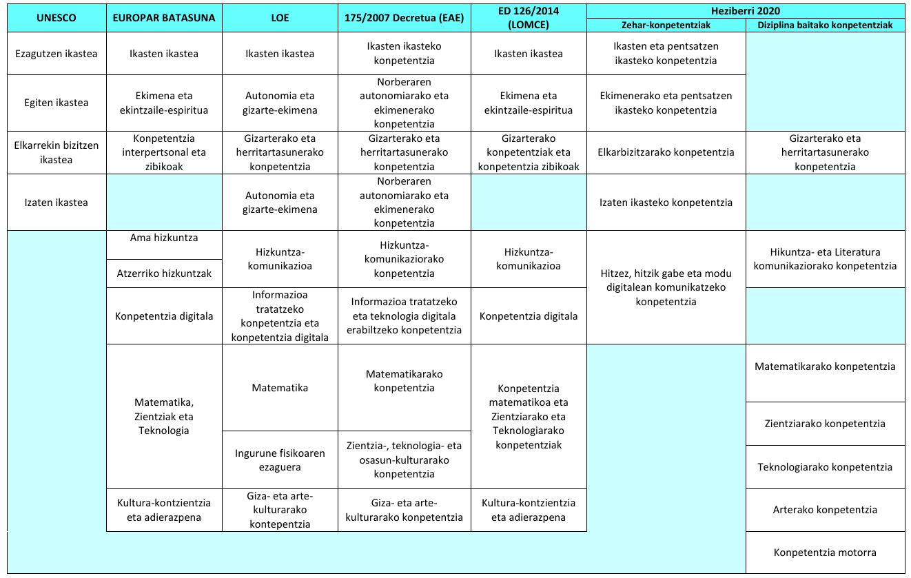

# Hizkuntza  <small>eta ageriko curriculuma</small>

---

  

---

#### Delors txostena (UNESCO)

#### DeSeCo (OCDE)

#### Gaitasun giltzarriak (Europar Legebiltzarra)

#### LOMCE 8/2013 + Frantziako ordenamendua

#### Curriculuma 126/2014

#### Agindua ECD/65/2015

#### Oinarrizko Hezkuntzarako curriculum Dekretua + Nafarroako ordenamendua

---

### LOMCE

  > <small>... 	 Obligatoria en un curso fundamentalmente propedéutico y con dos trayectorias bien diferenciadas.
>
  > La LOMCE hace especial incidencia con vistas a la transformación del sistema educativo: las Tecnologías de la Información y la Comunicación, el fomento del plurilingüismo, y la modernización de la Formación Profesional.
>

  Ley Orgánica 8/2013, de 9 de diciembre, para la mejora de la calidad educativa[*](https://www.boe.es/buscar/act.php?id=BOE-A-2013-12886).</small>

---

  > ...se entiende por currículo la regulación de los elementos que determinan los procesos de enseñanza y aprendizaje para cada una de las enseñanzas...
>

  126/2014 Erret dekretua[*](https://www.boe.es/buscar/pdf/2014/BOE-A-2014-2222-consolidado.pdf)

<small>Real Decreto 126/2014, de 28 de febrero, por el que se establece el currículo básico de la Educación Primaria[*](https://www.boe.es/buscar/pdf/2014/BOE-A-2014-2222-consolidado.pdf). </small>

##

* Curriculuma
* Helburuak
* Konpetentziak  <small>(gaitasunak) </small>
  * Edukiak
* Ikaskuntza estandarrak <small>(ebaluatzen direnak) </small>
  * Ebaluazio irizpideak
* Metodologia didaktikoa

<small>Ikasgaien antolaketa ere zehazten da.</small>

# Ariketa *didaktikoa* {data-background=#AA1100 }

Zuetariko bakoitzak definitu behar du, aurreko puntuak oinarri hartuta, ikasteko molde **ez akademiko bat**.

## Badaezpada, berriro: {data-background=#AA1100 }

* Helburuak
* Konpetentziak  <small>(gaitasunak) </small>
  * Edukiak
* Ikaskuntza estandarrak <small>(ebaluatzen direnak) </small>
  * Ebaluazio irizpideak
* Metodologia didaktikoa

---

ECD/65/2015 Agindua[*](https://www.boe.es/buscar/doc.php?id=BOE-A-2015-738)

<small>Orden ECD/65/2015, de 21 de enero, por la  que se describen las relaciones entre las competencias, los contenidos y los criterios de evaluación de la educación primaria, la educación secundaria obligatoria y el bachillerato</small>

##

### Honako konpetentziak zehazten dira:

1. Comunicación lingüística.
2. Competencia matemática y competencias básicas en ciencia y tecnología.
3. Competencia digital.
4. Aprender a aprender.
5. Competencias sociales y cívicas.
6. Sentido de iniciativa y espíritu emprendedor.
7. Conciencia y expresiones culturales.

---

  <small>

  |                                      | Ebaluazioa | Hizkuntza ofizial eta koofizialak | Atzerriko hizkuntza | Komunikazio gaitasuna | Ikuspuntu komunikatiboa |
  | -----------------------------------: | :--------: | :-------------------------------: | :-----------------: | :-------------------: | :---------------------: |
  |                            **LOMCE** |     x      |                                   |                     |                       |                         |
  |              **Curriculum dekretua** |     x      |                 x                 |          x          |           x           |                         |
  |              **ECD 65/2015 Agindua** |            |                                   |                     |           x           |                         |
  |                   **Heziberri 2020** |     x      |                 x                 |          x          |           x           |            x            |
  </small>

##

##### Oinarrizko konpetentzia giltzei buruzko proposamen arteko erlazioa [*](http://www.hezkuntza.ejgv.euskadi.eus/contenidos/informacion/heziberri_2020/eu_erlazioa/adjuntos/oinarrizko_konpetentzia_giltzei_buruzko_proposamen_arteko_erlazioa.pdf)

  

---

## Oinarrizko Hezkuntzarako curriculum Dekretua [*](https://www.euskadi.eus/y22-bopv/eu/bopv2/datos/2016/01/1600141e.shtml)

  [236/2015 Dekretua](http://www.jusap.ejgv.euskadi.eus/r47-bopvapps/es/bopv2/datos/2016/01/1600141e.pdf), abenduaren 22koa, Oinarrizko Hezkuntzaren curriculuma zehaztu eta Euskal Autonomia Erkidegoan ezartzen duena (EHAA, 2016-01-15)

## 

### 1. Hizkuntza- eta literatura- komunikaziorako konpetentzia.

  1.1.2.– Eduki multzoen ezaugarriak.

Lehen Hezkuntzari dagozkion adierazpenezko, prozedurazko eta jarrerazko edukiak honako eduki multzo hauetan multzokatzen dira:

##

### Eduki multzoak

1.  Arlo guztietan komunak diren oinarrizko zehar-konpetentziekin lotutako edukiak.
2. Ahozko komunikazioa: hitz egitea, entzutea eta elkarrekin solasean jardutea.
3. Idatzizko komunikazioa: irakurtzea eta idaztea.
4. Literatura-hezkuntza.
5. Hizkuntzari eta haren erabilerei buruzko gogoeta.
6. Hizkuntzaren alderdi soziala.

# Jarduera

## 1/2 Irakurri eta aztertu:

Oinarrizko Hezkuntzako Curriculuma
(236/2015eko Dekretuaren II. Eranskina osatzen duen curriculum orientatzailea)

## 2/2- Aurkeztu eta konpartitu:

Sort ezazu  egokitu zaizuen multzoaren eskema. Ikaskideei erakutsi eta eurekin partekatu beharko duzue.

**Ebaluazioa** egiteko erabiliko dut zuek [hauen artean](http://evirtual.uaslp.mx/FCQ/estrategias/Material de Apoyo/cat_rubrica.pdf)
aukeratzen duzuen errubrika bat.

<small>ez ahaztu lanarekin batera errubrikaren kopia ere ematea</small>
