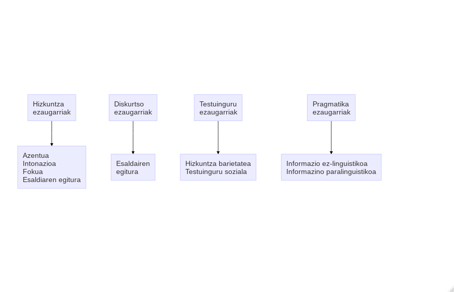

# Hizkuntzen irakaskuntzan ikuspegi eta metodo ezberdinak eraman dira
praktikara eta ahozko komunikazioak ez du beti toki bera izan:

## 

|                                     | Ikuspegia/Metodoa                                            | Ahozkotasunaren<br/>irakaskuntza                             |
| ----------------------------------- | ------------------------------------------------------------ | ------------------------------------------------------------ |
| XX. Mendearen aurretik              | Metodo zuzena edo Naturala                                   | Ahozko elkarreragina:<br/>irakaslearen galdera-ikaslearen erantzuna |

## 

|                                     | Ikuspegia/Metodoa                                            | Ahozkotasunaren<br/>irakaskuntza                             |
| ----------------------------------- | ------------------------------------------------------------ | ------------------------------------------------------------ |
| XX. mendea                          | Metodo Estrukturalistak:<br/>Situazionala eta Audiolinguala | Egituren errepikapena<br/>Dena ahoz lantzen da eta idatzizko hizkuntza bigarren maila |

## 

|                                     | Ikuspegia/Metodoa                                            | Ahozkotasunaren<br/>irakaskuntza                             |
| ----------------------------------- | ------------------------------------------------------------ | ------------------------------------------------------------ |
| Ikuspegi eta metodo alternatiboak   | Erantzun fisiko Totala, Metodo Isila,<br/>Hizkuntzaren Ikaskuntza Komunitarioa,<br/>Sugestopedia,<br/>Adimen anitzak,<br/>Ikuspegi Lexikoa<br/>eta Gaitasunetan Oinarritutako Hizkuntzen Irakaskuntza. | Gramatikaren irakaspenari emandako garrantzitik alde egin nahi zuten, eta ikasgeletan elkarrizketarako tartea zabaldu. |

## 

|                                     | Ikuspegia/Metodoa                                            | Ahozkotasunaren<br/>irakaskuntza                             |
| ----------------------------------- | ------------------------------------------------------------ | ------------------------------------------------------------ |
| Gaur egungo ikuspegi komunikatiboak | Hizkuntzaren Irakaskuntza Komunikatiboa,<br/>Ikuspegi Naturala,<br/>Hizkuntzaren Ikaskuntza Kooperatiboa,<br/>Edukietan Oinarritutako Instrukzioa,<br/>Atazetan Oinarritutako Hizkuntzaren Irakaskuntza eta post-metodo aroa. | Ikasleen arteko harremanak sortzea; ez bakarrik egiturak ezagutzea.<br/>Ikasleek hizkuntza ikasiko dute komunikatzeko beharragatik |

# Ahozko ekoizpen eta jarduera motak

##

+ Adierazpen publikoak egitea (informazioa, jarraibideak, etab.)
+ Jendaurrean hitz egitea (azalpenak ematea bileretan, unibertsitateko hitzaldiak, sermoiak, ikuskizunak, kiroletako azalpenak, salmenten aurkezpenak, etab.)
+ Elkarrizketak

## ...eta ekintza horiek hurrengoak eska ditzakete:

## 

+ Idatzizko testu bat ozen irakurtzea;
+ Oharretan, idatzizko testu batean edo ikusizko elementuetan (eskemak, irudiak,
grafikoak, etab.) oinarrituta hitz egitea;
+ Aldez aurretik prestatutako zerbait antzeztea;
+ Bat-batean hitz egitea;
+ Abestea.

```{r echo=FALSE, eval=FALSE}
library(DiagrammeR)
mermaid("
graph TB
  A[Hizkuntza<br> ezaugarriak]-->B[Azentua<br>Intonazioa<br>Fokua<br>Esaldiaren egitura]
  C[Diskurtso<br> ezaugarriak]-->D[Esaldairen<br>egitura]
  E[Testuinguru<br> ezaugarriak]-->F[Hizkuntza barietatea<br>Testuinguru soziala]
  G[Pragmatika<br> ezaugarriak]-->H[Informazio ez-linguistikoa<br>Informazino paralinguistikoa]
")

```

# Marko bat

## 



# Lantzeke egon dan eremua {data-background=#dddddd }

## {data-background=#dddddd }

> Hizkuntzaren ikaskuntzan nahiz irakaskuntzan, sarritan, ahozkotasuna ahaztu
egin da. Horren ondorioz, ahozkotasunaren ezaugarri segmentalak
(kontsonanteak eta bokalak) nahiz suprasegmentalak (erritmoa, azentua eta
intonazioa) sarritan ez omen ditugu irakatsi 
>
> ---*Usó, 2008*

## {data-background=#dddddd }

> El papel marginal de la pronunciación tanto en
los materiales didácticos (en la introducción, en
el apéndice, en actividades desligadas del tema
de la unidad... ) como en las publicaciones en
el ámbito de la didáctica de la LE.
>
> ---*Cortés Moreno, 2001: 128*

## {data-background=#dddddd}

> Hoy en día, muchos profesionales sin conocimientos específicos de fonética
quieren o necesitan por motivos laborales adaptar su pronunciación al uso
estándar de la lengua y alejar, en su proyección pública, rasgos considerados
demasiado dialectales o marcados especialmente de algún modo. Pueden estar
en este caso periodistas, locutores de televisión y de radio, cantantes de éxito,
políticos, empresarios, financieros... Para dirigirse a un amplio público y
transmitir mensajes alejados de la broma como puede ser un telediario o un
discurso de política general puede ser interesante intentar circunscribirse a un
estilo estándar formal de pronunciación para que aspectos marcadamente
dialectales o sociales no desvíen la atención del contenido que se pretende
transmitir. También puede verse en esta situación un actor o una actriz que para
poder trabajar deba disimular su acento original o, por el contrario, deba
adoptar un acento que no es el suyo nativo.
>
> ---*Fernández, 2007:43*

## Baliabideak {data-background=#dddddd}

BIDEOJOKOAK: Bideojokoak sortu izan dira behar bereziak dituztenei
laguntzeko (Corrales, 2015; Aguilar et. al., 2015), izan ere bideojokoek aukera
ematen dute errealiatea errepresentatzeko, hiztunen arteko erlazioak
adierazteko eta komunikazio egoeretan gertatzen diren kausa-ondorio erlazioak
lantzeko (Aguilar et. al., 2015).

## [Pradia](http://pradia.net/) bideojokoa: {data-background=#dddddd}

Intonazio eta emozio patroiak
identifikatu eta lantzeko.  
Batez ere behar bereziak dituzten
umeentzako baliabidea da.


## Jolasak {data-background=#dddddd}

## {data-background=#dddddd}

> <small>**ESKU JOLASA**
>
> **Antolaketa**: Binaka.
>
> **Helburua**: Emozioen adierazpena lantzea.
>
> **Materiala**: Errezitatu bat.
>
> **Prozesua**: Jolasarekin hasi aurretik: Irakasleak binaka jarriko ditu umeak
eta errezitatu bitartean zati batzuk pozik, haserre eta triste adieraziko
dituztela esango die, irakasleak aukeratuko du zer zati esango duten
pozik, haserre ala triste, eta emozio mota adierazten dutenean, ikasleek
era horretan errezitatuko dute.
Jolasaren hasieran: Errezitatu hau denen artean esango dute ahoz
gora:
>
> <center>*Arre arre mandako  
Bihar Tolosarako  
Etzi Iruñerako  
Handik zer ekarriko  
Zapata ta gerriko*  
> ---Gaminde, 2007</center>
>
> *Jolastu bitartean*: Eskuekin binaka jolastuko dira, errezitatu bitartean
binaka ezkuekin jolastuko dira eta irakasleak emozio mota adieraztean
errezitatua adierazteko era emozio horretarako moldatuko dute.
>
> ---*Gaminde et al. 2014*</small>

# Trebetasunak eta sekuentzia didaktikoak

##

+ ikasgela txokoetan antolatzen da
+ antolatzeko era ezberdinak: espazio eta denbora berean
+ bakarkako zein taldekako ariketa ezberdinak landu daitezke aldi berean
+ ikasleak autonomiaz aritzen dira
+ irakasle zein ikaskideei laguntza eskatzeko aukera dago
+ irakasleak ikasleak behatzeko aukera zabalagoa du

# Hirugarren jarduera (1/3) {data-background=#ff0000}

## Sartu [Heziberri 2020](http://heziberri.berritzegunenagusia.eus/heziberri_eus/)n eta aztertu sekuentzia didaktiko batzuk {data-background=#ff0000}

## Txostena idatzi {data-background=#ff0000}

Egituraketaren berri emanaz, bereziki kontu hauek kontuan izanda:

+ gaitasunak eta helburuak (behar bereziak, irakurzaletasuna, kokapena curriculum dekretuan...)
* taldekatzea (teknikarik? ...)
+ berdinen arteko tutoretza (bai/ez)
+ familien, ingurunearen... parte hartzea (bai/ez, zein neurritan...)
+ baliabideak edo materialak originalak diren eta zein neurritan
+ denboralizazioa

