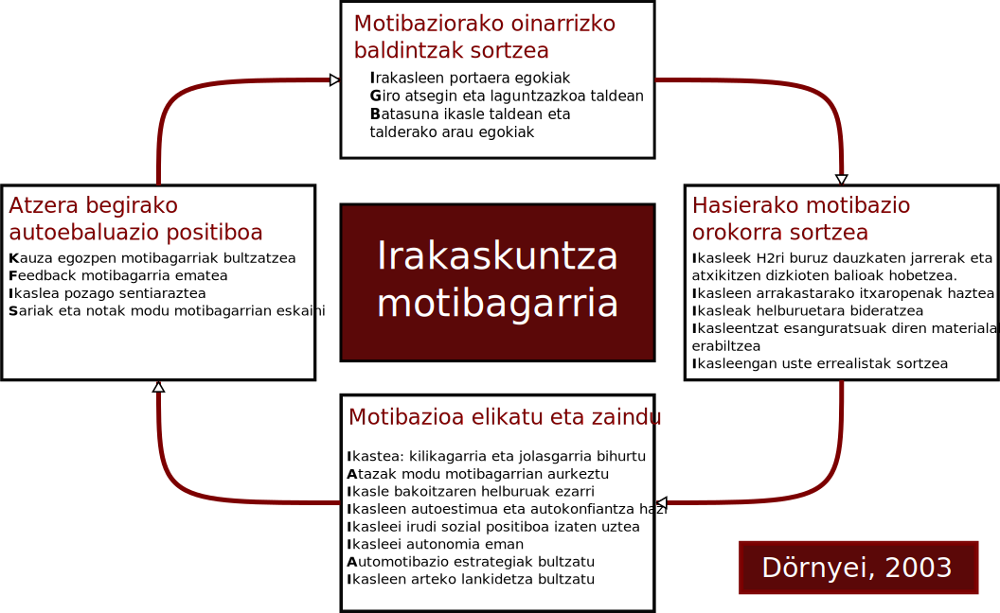

# Hizkuntzen ikaskuntza estrategiak {data-background=#000055 }

## Ikasleen eta irakasleen galderak eta baieztapenak

##

> Ikasle txarra da

<small>edo</small>

> Oso motibatuta dago

<small>edo</small>

> Ez dauka motibaziorik

<small>edo</small>

> Zergatik ateratzen ote ditu horrelako nota txarrak?

<small>edo</small>

> Zergatik ikasten du hain erraz horrek?

##

> Ez dut ondo entzuten

<small>edo</small>

> Gogaituta nago akatsekin

<small>edo</small>

> Zaila da hizkuntza honetan aritzea!

# Testuingurua {data-background=#000555 }

##

80ko eta 90eko hamarkadetako **eredu psikopragmatikoa**ri  jarraituz

##

>  Teoria **kognitiboen** (ikaskuntzari buruzkoak) eta **konstruktibisten** garaia da,  estrategiez  jabetzea komunikazio egoeretan nahiz  **autonomiaren** garapena lortzea izan dira helburuak.  Ekintza **metakognitiboak** bultzatzen dira.
>
> *M.L. Villanueva, 1997: 82- 84*

## Hizkuntza-ikaslea **ez** da **pasiboa** 

### Zenbait ezaugarri propio ditu ikastunak: 

* sinismenak, 
* beharrizanak,
* motibazioak, 
* estilo kognitiboa, 
* izaera,
* ... 

##

### Prozesuan gaitasunak garatzeko eta trebetasunak lantzeko ikasleen prozedurak 

Cuq, 2003; Legendre, 1993; Tardif, 1992; Stern, 1983:

* Planak
* Buruko ariketa konszienteak, ez konszienteak  eta erabat konszienteak 
* Arazoak konpontzeko ekintza kognitiboak portaerak, ekintza funtzionalak

##

> ### Ikasleak bere ikaskuntza era autonomoan eta aktiboan hobetzeko erabiltzen dituen prozedurak dira ikas-estrategiak
>
> *Oxford, 1989*

##

### Egoera horiei aurre egiteko **metakognizioa**, **kontzientzia  estrategikoa** eta **esperientzia praktikoa** lantzeko bidea ireki

##  + 

### Garrantzia ematen hasi zaio: **ikasleei ikasten irakastea** 

##

Irakasleak, Roy (1991) egilearen arabera: 

* Ikasleak **ezagutu** behar ditu
* Hizkuntzaren ikaskuntzaren planifikazioa egiteko ikasleek **zer helburu eta estrategia dituzten jakin** behar du.
* Ikasgelako interbentzioa egiteko **zer egoera diren egokienak jakin** behar du
* **Ebaluazioa** egiteko, zer baliabide dauden jakin behar du, ikasleen aurrerapena eta emaitzak ikusteko

##

### Motibazio estrategiak

### Ikasteko estrategiak

### Komunikazio estrategiak

##

> Motibazioa gaur egun irakasleek aurrean daukaten erronkarik konplexu eta handiena da, zalantza barik
>
> *Scheidecker eta Freeman, 199: 116*

# Motibazio estrategiak {data-background=#005555 }

##

>  Gizakiarengan helburuak kontuan hartuta portaera positiboa bultzatzen duten teknikak, nahita sortutako motibazioa eraginez.
>
> *Dörnyei, 2003: 40*

## Jarraitu beharreko irizpideak:

* Motibaziorako oinarrizko baldintzak sortzea.
* Hasierako motibazioa sortzea.
* Motibazioa elikatu eta babestea.
* Atzera begirako autoebaluazio positiboa bultzatzea.

## {data-background=#BBBBBB}

## Motibazioaren garrantziaren ondorioz

Irakaskuntzan saiatu behar dugu ikasi behar dutenen motibazioaz ere arduratzen. Horretarako Dörnyeik prestatu eta HABEk euskaratu zuen [*Motibazio-estrategiak hizkuntza-ikasgelan](https://b08normalkuntza.wikispaces.com/file/view/MOTIBAZIO+ESTRAT.pdf) artikuluan eskaintzen den irakaslearentzako galdetegia erabil daiteke.

##

# Ikasteko eta komunikatzeko estrategiak {data-background=#055555}

## Ikuskera desberdin eta osagarriak zenbaitetan

##

> Ikasleak komunikazioarekin erlazionatutako arazo bat duenean, eta hizkuntza baliabide nahiko ez dituenean, komunikazio-estrategiak erabiltzen ditu (parafrasia erabiltzea, laguntza eskatzea). Ikertzaile biek adierazten dute komunikazio-estrategien bidez ikasten dela eta, horregatik, bi helburu izan ditzaketela: alde batetik, ikastea; eta bestetik, komunikatzea.
>
> *Faerch eta Kasper (1980)*

##

Oxford-ek (1990) dio, baina:

ikaskuntzan laguntzaileak baino ez direla, **ez** direla **erabakigarriak** hizkuntza ikasteko orduan. 

##

O’Malley eta Chamot-ek (1990) bi funtzio bereizten dituzte: 

### ikastea: **ikas-estrategia**

### komunikazioa: **komunikazio-estrategia**

## Adibidea: *plumber*

<small>Gerta daiteke ikasleren batek plumber hitza ez ezagutzea eta hori komunikazio-ekintza batean erabili behar izatea. 

Zer egingo du ikasleak? 

Komunikazio-estrategia bat erabili dezake, hala nola, parafrasia, *hoditeria konpontzen duen langilea*, adierazi nahi duena esateko. 

Momentu zehatz horretarako lagungarri izango zaio, baina helburua hitz hori ikastea baldin bada, beste estrategia bat erabili beharko du. Esate baterako, hiztegian bilatuko du hitza, solaskideari hitza errepikatzea eskatuko dio edota koadernoan idatziko du ez ahazteko (ikas-estrategiak). 

Hainbat estrategia erabili ditzake hitza barneratzeko. Estrategia-mota bat edo bestea erabiltzea **ikas-estiloa**ren araberakoa izango da.</small>

# Ikas estiloak {data-background=#111155}

## Zer dira? Ikas-estrategiekin zerikusirik ote dute?

##

>  Informazioa prozesatzeko erak
>
>  *Smith (1988)*

##

> Ikasteko gaitasunak genetikak, inguruak eta norberaren eskarmentuak baldintzatuak dauden ezaugarriak
>
> *Kolb (1984)*

##

> Ezaugarri afektiboen, joera psikologikoen eta ezagutza-ezaugarrien multzoa 
>
> Rumiche-Chávarry (2013)

##

> Ikas estrategien bidez, ikas estiloak antzeman ditzakegu
>
> Esteban eta Ruiz (1996:121-122)

##

Aurrez Oxfordek egindako lanean (1993) oinarrituta, Pikabeak (2002) egindako zerrenda dakargu, ikasleen ikas-estiloen hurrenkera bat aurkezteko.

##

### Zentzumenak erabiltzen dituzten estiloak

### Jendearekin duten harremanaren arabera

### Norabideen arabera

### Ariketa moten arabera

### Ideiak tratatzeko moduaren arabera

##

+ **Zentzumenak** erabiltzen dituzten estiloak
  + Ikuslea
    Ikusiz hobeto ikasten duenari deritzo: bideoak, grafikoak, liburuak
  + Entzulea
    Entzunez eta mintzatuz hobeto ikasten duenari deritzo: eztabaidak, audiozintak, rol-jokoak...
  + Egilea
    Ekinaz ikasten hobeto ikasten duenari deritzo: mugimenduzko jokoak, esku-lanak, etab.

##

+ Jendearekin duten **harremanaren** araberakoa:
  + Konparakoia.
    Gustuko ditu hartuemanak, eztabaidak, rol-jokoak...
  + Barnerakoia
    Gustuko du bakarka, bere kasa edo gertukoekin ikastea

##

+ **Norabideen** arabera
  + Intuitiboa
    Gustuko ditu abstrakzioa, orokortzea eta geroaldia
  + Zehatza eta sekuentziala
    Gustuko ditu zehaztasuna, orainaldia eta urratsez urrats aritzea.

##

+ **Ariketa moten** arabera
  + Ariketa itxi zalea
    Gustuko ditu ariketa zehatz eta oso arautuak: azpimarratzea, egituraketak, planifikazioak...
  + Ariketa ireki zalea
    Gustuko ditu egoera ez egituratuak: informazioa jasotzea, era ez sistematikoan ikastea...

##

+ **Ideiak tratatzeko modua**ren arabera
  + Globala
    Globaltasuna ezagutzea du gustuko: ideia nagusiak biltzea, esanahiak asmatzea, istorioen hasierak edo bukaerak asmatzea; hitz guztiak ezagutu ez arren komunikatzea du gustuko.
  + Analitikoa
    Gustuko ditu logika eta xehetasunak: esaldi eta hitzak zatitu eta txikitzea, arauak aztertzea eta alikatzea

# Ikas-estrategiak {data-background=#551111}

##

O'Malleyk eta Chamoteren zerrenda (1990)

##

+ Estrategia **metakognitiboak**:
  + Ikas-prozesuari buruzko gogoeta.
  + Ikasteko prestakuntza.
  + Ikas-ekintzen kontrola.
  + Autoebaluazioa.
+ Estrategia **kognitiboak**:
  + Gaiarekiko elkarreragina.
  + Gaiaren manipulazioa.
+ Estragegia **sozio-afektiboak**:
  + Beste pertsona batekiko elkarreragina.
  + Alde afektiboaren kontrola.

# Klaseko ariketa {data-background=#005500}

## {data-background=#005500}

Teorian eta galdetegiko erantzunetan oinarrituta, erantzun galderok:

1. Zein da taldean gailentzen den ikas-estiloa? 
2. Zeintzuk ikas-estrategia erabiltzen dituzue gehien?
   Eta gutxien?

# Ikas-estrategiak lantzeko proposamenak {data-background=#002222}

##

Adibide batzuk Etxeberria eta Garay (2012) artikulutik hartuta

##

##

Beste proposamen bat egin zuten O'Malleyk eta Chamotek (1994)

##

**Prestakuntza fasea**
 : Ezagutza metakognitiboa garatu.
   Hizkutza-ariketa laburrak taldean egin eta nola egin duten azaldu.

**Aurkezpena**
 : Ikas-estrategiak modu esplizituan irakasten dira, zer diren eta nola erabili.

**Praktika**
 : Ariketen bidez ikas-estrategien erabilera jarduera ezberdinetan txertatzen da.

**Ebaluazioa**
 : Galdeketa erantzun

## Aurkezpena:

A. Chamot eta M. O ́Malley, 1994

## Praktikarako proposamena:

+ Ikaskuntza kooperatiboa
+ Berdinen arteko tutoretza
+ Zientzia esperimentuak
+ Matematika problemak
+ Ikerkuntza proiektuak
+ Erreportajeak
+ Literatura

##

<small>**Topatu zure bidea jarduera**

Entzutezko ulermena lantzen den ariketa honetan mapa batean ibilbide bat adierazteko eskatuko zaie ikasleei. 

Ariketa hau egiteko estrategia hauek erabil daitezke: 

+ zuzeneko estrategiak:
  + praktikatzea
  + galdetzea
  + irudiak erabiltzea
+ zeharkako estrategiak 
  + arreta jartzea

Baliabide materiala
 : mapa baten fotokopia

Denbora
 : 20 minutu

Nola egin
 : leku baten mapa lortu. Irakasleak bere mapan ibilbide batmarkatuko du, gero ikasleei nora joan behar duten azalduko dieinguruko lekuak, jendea... aipatuz.

Oxford, 1989: 106</small>

##

<small>**Esanahia asmatzea irakurtzen ari diren testu batean**.

Ariketa honek ikasleei irakurtzen ari diren testu baten esanahia asmatzen laguntzeaz gain, nolaasmatu duten azaltzen ere laguntzen die.

Baliabide materiala
 : irakurtzeko testu-zatiak.

Denbora
 : 30-50 minutu irauten du.

Nola egin
 : irakasleak ikasleei asmakizunak hainbat hizkuntzatan egingo dituztela azalduko die. 
Gero,orri bat instrukzioekin eta irakurri behar dituzten testu-zatiekin emango die. 
Ikasleak, testu-zatiak irakurri ondoren, esanahi orokorra asmatzen ahaleginduko dira. 
Bukatzeko, ikasleek R. Oxford-ekproposatzen dituen galdera hauek erantzun beharko dituzte:

> 1. Summarize the meaning of each passage in one sentence 
> 2. How well did you understand the meaning of each the passages above
>    Which passages gave you the most trouble, and why?
> 3. If you did not understand certain words, which ones werw they?
> 4. Did you try to guess the meaning of unknown or unclear words?
>    If so, how often?
>    What are some examples of wunknown words you were able to guess?
>    Whatt information did you use to make your guesses? 
> 5. What other information sources might you hvave used to guess the meanings? 
>    List as many sources as you can think of.
> 6. Did you need tto know (or guess) the meanings of all the words in a passage in order to know (or guess) the overall meaning of the whole passage? In other words, do you need to get the details in order to get the general idea?

Oxford, 1989: 112</small>

##

<small>**Irudiekin asmatzen**
Ariketa honek ikasleari irudiak erabiliz asmatzeko estrategiak praktikatzen lagunduko dio.

Baliabide materiala
 : hitzik gabeko komiki bat.

Denbora
 : 10-30 minututan egin daitekeen ariketa da, baina erabiltzen diren komikien kopuruaren arabera, denbora hori aldakorra izan daiteke.

Nola egin
 : ikasleek hitzik gabeko komikietako hutsuneak xede hizkuntzan bete beharko dituzte. Irudiak hutsuneak betetzeko orduan erabilgarriak izan daitezke.

Oxford, 1989: 112</small>

# Jarduera (04) {data-background=#AA0000}

## Bideotutorialaz {data-background=#AA0000}

> + Zer da? (definizioa)
> + Zein ezaugarri ditu?
> + Zein mota daude?
> + Adibideak aurkitu

## Bideotutorialaren kalitatea ebaluatzeko errubrika sortu {data-background=#AA0000}

## Bideotutoriala sortu {data-background=#AA0000}

LHko ikasleek euren herriko deskribapena egiteko bideoa sortu behar dute. Zuok hori egiteko laguntza-baliabidea sortu behar duzue, ikasteko estrategia desberdinak dituztela kontuan hartuaz.

# Lanera {data-background=#AA0055}
