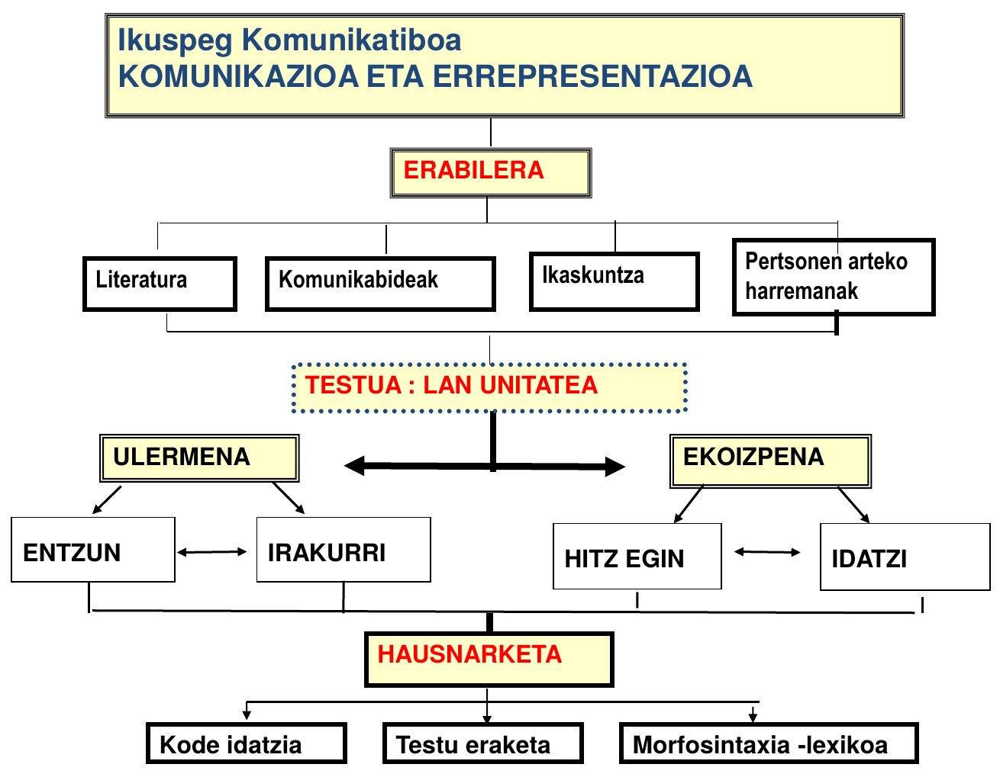

# Testuingurua

 

Hizkuntza Didaktikaz ari izan aurretik, hizkuntza, didaktika honen objektua alegia, inguratzen duten ezaugarriez jardun beharra dugu.

Kontuan izan beharreko hainbat elementu xehetuko dira hurrengo lerrootan, Hizkuntzaren Didaktikaren nondik norakoa hobeto uler dadin

## Hizkuntza desberdinek egoera desberdinak

Hizkuntzak ez dira elementu linguistiko hutsa. Bere horretan beste elementu guztietatik aparte uler daitekeen objektua. Ez, behintzat, hizkuntzen irakaskuntza-ikaskuntzaz ezer esan nahi badugu. 

Horrela, begiratzen badugu zen zen egoera XX. mendera arte, besteak beste, ikusiko dugu eskolan gehien irakatsi diren hizkuntzak, hizkuntza handiak izan direla (Idiazabal, 2003; Martí eta beste, 2005).

Kontuan izan behar da XIX. mendeko estatu mugen sorrerak hizkuntza gutxituen presentzia eskolan erabat baztertu zuela, eskolak hizkuntza nagusia eta bakarra irakatsi behar zuen. *Nazioa*^[kultura, hizkuntza, etnia] eta *estatua*^[ofiziala, administratiboa] kontzeptuak bat egin ziren.

Hizkuntzak nazioak eta estatuak baino askoz ere ugariagoak dira, eta ez datoz bat lurraldeetako mugekin, gainera, hizkuntza asko estatu bat baino gehiagoko lurretan hitz egiten dira (euskara, gaztelania eta frantsesa adibide argiak dira).

> _Hizkuntza_ kontzeptua ez da zehatza; eta hizkuntza-mugak ez datoz bat geografia-mugekin. Espainian lau hizkuntza onartzen dira, baina badira beste batzuk ere, lenoesa, bablea eta aragoiko *fabla*tik caló eta inmigranteen hizkuntzetaraino. Hala eta guztiz ere, Espainia herririk homogenoetakoa da linguistikoki, denentzako komuna den hizkuntza baitu, gaztelania, bertako hiritar gehien-gehienek ulertu eta egiten dutena. 

_**Santiago Trancón **_[https://www.lanuevacronica.com/lengua-nacion-estado](https://www.lanuevacronica.com/lengua-nacion-estado)

<small>

> El concepto de lengua no es preciso, ni las fronteras lingüísticas coinciden con las geográficas. En España se reconocen cuatro lenguas, pero hay otras más, desde el leonés, el bable o la fabla aragonesa, hasta las lenguas de los emigrantes o el caló. Así y todo, España es uno de los países lingüísticamente más homogéneos, pues tiene una lengua oficial y común, el español, que hablan y entienden la mayoría de sus ciudadanos.”

</small> 

## Zer da Hizkuntzaren Didaktika

Jakintza eremu hau prozesu luze baten ondorioz finkatu da ikerketa eremu bakar gisa. Berez, eremu ezberdinetatik aztertua izan da *hizkuntza* objektuaren didaktika: hizkuntzalaritzatik, pedagogiatik, filologiatik, politikatik eta abarretik.

Hizkuntzaren irakaskuntzak aspaldiko erroak ditu; hizkuntza bera zer den ulertzeko era bakoitzak irakasteko era edo filosofiaren bat ekarri baitu, horrela, aniztasun handia aurki dezakegu hizkuntzaren didaktikaren arloaren historian eta jardunean.

70eko hamarkadan has daiteke hizkuntzaren didaktikaz hitz egiten. Lehenago hizkuntzalaritza aplikatuaz hitz egiten zen, eta ordura arte psikologiako, soziologiako eta pedagogiako jakintzak alde batera uzten ziren.

> Horrela (Galisson, 1986) esan dezakegu Hizkuntzaren Didaktika, berez, Hizkuntzalaritzaren menpekoa izan dela eta bertatik sortu zela Hizkuntzalaritza Aplikatua, batez ere *zer?* eta *nola?* galderei erantzuten ahalegindu dena.
>
> Gerora, Garapearen Psikologiaren, hezkuntza Psikologiaren eta Psikologia Kognitiboaren  eraginpean metodologiarekiko ardura gehitu zuen.
> 
> Azkenik, beste disziplina batzuen eraginpean, besteak beste Lengoai Zienntziak, Gizarte-Psikologia eta Hezkuntza Psikologiatiksortu zen berezko osotasunez Hizkuntza eta Literaturaren Didaktika, honelako galderei erantzuna eman nahi diena: **Zergatik irakastsi hizkuntza eta literatura?**, **zer irakatsi?**, **nori irakatsi?**, **nola?** eta **non?**
>
> --*López Valero*, 1998: 222
>

</small> 

> Así (Galisson, 1986) podemos decir que la Didáctica de la Lengua dependió directamente de la Lingüística y que de ahí surgió la Lingüística Aplicada, la cual intentó responder ante todo a las cuestiones ¿Qué? y ¿Cómo?. 
>
> A continuación y bajo la ínfluencia de la Psicología Evolutiva, de la Psicología Educativa y de la Psicología Cognitiva, añadió una preocupación por la metodología. 
> 
> Finalmente y del conjunto de una serie de disciplinas tales como las Ciencias del Lenguaje, de la Psicología, de la Sociedad y de la Educación surgiría con entidad propia la Didáctica de la Lengua y la Literatura que intenta responder a las preguntas: ¿Por qué enseñar lengua y Literatura?, ¿Qué enseñar?, ¿A quién enseñar?, ¿Cómo? Y ¿Dónde?

</small> 

Galdera horiei erantzuna emateko sortu zen **Hizkuntzaren Didaktika** diziplina hau honela defini dezakegu:

> La Didáctica de la Lengua constituye un campo de conocimiento que tiene como objeto el complejo proceso de enseñar y aprender lenguas con el fin de mejorar las prácticas y adecuarlas a las situaciones cambiantes en que esta actividad se desarrolla
>
> --Camps, Guasch y Ruiz Bikandi, 2010, p. 71

Gogoratu ditzagun, beraz, azpimarratutako ideiak:

*Ezagutza eremu bat da bere objektua hizkuntzak irakastea eta ikastea duena, jarduna hobetu eta egokitzea helburu*

## Hizkuntzak zergatik galtzen dira?

Kanpoko indarren ondorioz: **Globalizazioa.** Sarritan kanpoko indarrak barnekoari eragiten dio. Hizkuntza indartsuak, aurrerapen soziala eta pertsonala, hizkuntza natiboak desagertu.

Barneko indarren ondorioz: **Estatu/nazio** kontzeptuaren eragina ulertu behar da (grikoa, behe-prusiera edo euskara bera, bakoitza bere historiarekin).

Moreno-Cabrerak (2008) horren azalpena ekskaintzen du hurrengoa azalduaz: Hizkuntza inperialistak hedatzeak homogeneotasun linguistikoa ekarri du eta ez aniztasuna, izan ere hiztunek euren hizkuntza natiboak baztertu dituzte edota ez dituzte zaindu behar bezala, sarritan pentsatu baitute hizkuntza horiek garapen eta aurrerapen sozialaren nahiz pertsonalaren kontra doazela. Era honetan, bost kontinenteetako hizkuntza internazionalek beste zenbait baztertu eta desagertarazi dituzte.

## Bost kontinenteetako hizkuntzen egoeraz

Hurrengo taulak hizkuntzen egoera erakusten du, ikuskera administratibo-kauntitatibo batetik gehienbat.

|                     | Amerikak | Afrika | Europa | Asia | Ozeania|
| :------------------ |---------:|-------:|-------:|-----:|-------:|
| Instituzionala      | 37       | 194    | 73     | 203  | 71     |
| Garatzeko bidean    | 234      | 542    | 81     | 362  | 379    |
| Indartsua           | 145      | 1026   | 31     | 856  | 421    |
| Arazoduna           | 309      | 245    | 50     | 693  | 234    |
| Desagertzeko zorian | 339      | 131    | 51     | 187  | 208    |

Table: Hizkuntzen egoera administratiboa (Iturria:[ethnologue.com](https://www.ethnologue.com/)).

Kontuan izan, hizkuntza instituzionalez ari garenean, ez garela ari 578 hizkuntzez. Kontinente guztietako gehiketak horretara eramango bagintuzke ere, Europako hizkuntza nagusiak dira Ameriketan, Afrikan, Asian eta Ozeanian hizkuntza instituzionalak; hala nola, ingelesa, gaztelania, frantsesa, portugesa eta neerlandera.

Hizkuntza minorizatuen gaineko testigantza batzuk Nathional Geographic-eko erreportai [honetan](http://www.nationalgeographic.com.es/mundo-ng/grandes-reportajes/lenguas-peligro-extincion_6174/26).

## Hizkuntzen egoera eta hizkuntzen didaktikak

Lewisek 2005ean azaldu zuenez, bada ezaugarri zerrenda bat kontuan hartu beharrekoa:

* Hizkuntzaren transmisioa edo ondorengoetaratzea
* Hiztun kopuru absolutua
* Hiztun-portzentajea
* Hizkuntzaren erabilera-eremu berrien sorrera
* Alfabetatzerako eta hezkuntzarako materialak egotea (gramatikak, hiztegiak, idatzizko literatura, hedabideak…)
* Gobernu eta erakundeen babesa
* Hiztunen jarrera
* Hizkuntza dokumentatua egotea

## Hizkuntza gutxituak: Irakatsi beharraz gain, indarberritu ere egin behar dira

**UNESCO**:[http://www.unesco.org/languages-atlas/es/atlasmap.html](http://www.unesco.org/languages-atlas/es/atlasmap.html)

> “INSTRUMENTO de ratificación de la Carta Europea de las Lenguas Regionales o Minoritarias, hecha en Estrasburgo el 5 de noviembre de 1992.
>
> Los Estados miembros del Consejo de Europa, signatarios de la presente Carta, Considerando que la finalidad del Consejo de Europa es conseguir una unión más estrecha entre sus miembros, en articular para salvaguardar y promover los ideales y principios que son su patrimonio común; Considerando que la protección de las lenguas regionales o minoritarias históricas de Europa, de las que algunas corren el riesgo de desaparecer con el tiempo, contribuye al mantenimiento y al desarrollo de las tradiciones y la riqueza culturales de Europa.”
>
>--Carta Europea de las Lenguas Minoritarias o Regionales
>
>_BOE, 2001_

> La Declaración es un texto necesario, tal como manifiestan sus Preliminares, para «corregir los desequilibrios lingüísticos de manera que aseguren el respeto y el pleno despliegue de todas las lenguas y que establezcan los principios de una paz lingüística planetaria justa y equitativa, como factor principal de la convivencia social».
>
> La propia voluntad de universalismo de la Declaración comporta la corrección de los desequilibrios para que se asegure el respeto y el pleno desarrollo de todas las lenguas.
>
>--Declaración Universal de Derechos Lingüísticos
>
> _1996, Bartzelona_

### Europako Erreferentzia Marko Bateratuak:

Gaitasunak, jarduera komunikatiboak, mailak, deskribatu eta zehazten ditu helburuak, edukiak eta ebaluazio-irizpideen oinarri gisa.Europako Kontseiluak hartutako erabakiak dira.

### Ikastetxeko Hizkuntza Proiektuaren bidez:

Ikastetxeak duen identitatea kontuan izanik, hizkuntzaren aldetiko erabakiak hartzen dira bai alor pedagogikoan bai instituzionalean.

#### Adibideak:

<iframe width="560" height="315" src="http://www.youtube.com/embed/iFEjAhnv3ys?rel=0" frameborder="0" allowfullscreen></iframe> 

Bideoa: [Hizkuntz Proiektua guraso bilera](http://www.youtube.com/embed/iFEjAhnv3ys?rel=0)

[http://elblogdemiguelcalvillo.blogspot.com.es/2011/02/video-promocional-del-proyecto.html](http://elblogdemiguelcalvillo.blogspot.com.es/2011/02/video-promocional-del-proyecto.html)

[http://elblogdemiguelcalvillo.blogspot.com.es/2011/04/proyecto-linguistico-de-centro-el-video.html](http://elblogdemiguelcalvillo.blogspot.com.es/2011/04/proyecto-linguistico-de-centro-el-video.html)

### Hizkuntza Programak

Irakasleek ikasleekin egin beharreko **jarduerak **dira, eta betebeharretako bat zentroan dauden hizkuntza ezberdinen gaineko kontzientzia piztea izan daiteke.

### Munduko eskola batzuetan nolako programez erantzuten zaie hizkuntza gutxituei?

Adibide bi ikusi ditzakegu hurrengo bideoan, bata Hego Afrikako errepublikan eta bestea Mazedoniako errepublikan.

<iframe width="560" height="315" src="http://www.youtube.com/embed/nPUMvUBuX00?rel=0" frameborder="0" allowfullscreen></iframe> 

Bideoa: [Euronews Learning World - El bilingüismo en el mundo](http://www.youtube.com/embed/nPUMvUBuX00?rel=0)

## Irakaskuntzan

Txepetx

Hizkuntza bat **ikastean **hiru faktorek eragiten dutela dio, gainera, osagarriak dira eta lotura dute:

1. **Motibazioak**: Hizkuntza bat ikastera daramaten arrazoi, nahi edo interesak

2. **Ezagutzak**: Hizkuntzaren funtzionamendua ulertzeko gaitasuna edo prozesua.

3. **Erabilerak**.

Aurreko irudiak erakusten du zelan ulertzen eta antolatzen den hizkuntzen irakaskuntza gaurko erakunde-moldeen arabera, lege markoa oinarri hartuta.

Baliteke orduko planteamendutik urruntxo gaudela bururatzea, baina egituratzeko modua orduan planteatu zenetik gaur egunera arte bat da, berori.

## Metodoak

**Hizkuntza ulertzeko modua**-**Irakasteko modua**-**Metodologia ezberdinak**

* Gramatika/itzulpen metodoak
* Eredu audiolinguala(egituren errepikapena, buruz ikasi)
* Eredu kognoszitiboa (arauak)
* Pragmatika eta eredu nozional/komunikaziozkoa:_The communicative approach_

Testu horiek era egokian “erabiltzea” nahi badugu, gure lan eduki nagusiak trebezia mailakoak izango dira: hitz egiten, idazten, irakurtzen, entzuten irakastea izango da gure zeregina. 
Eta testu horiek gero eta hobeto erabili ahal izateko, gero eta hobeto hitz egin, idatzi, irakurri edo entzuteko,  egiten dugun horren inguruko hausnarketa beharko dugu. Gramatika eta hizkuntzaren sistemaren gaineko lanak beste era bateko funtzioa hartzen du, ez da aprendizaiaren helburu, baizik eta  baliabide

---

##  Erreferentziak

Idiazabal I.(2003). Eskolaren kalitatea eta euskara.*BAT Soziolinguistika Aldizkaria* 49, 2003, 195-199. ISSN: 1130-8435

Idiazabal, I., & Manterola, I. (2009). Euskal eredu elebidunak, murgilketa eta hizkuntzen irakaskuntza bateratua: kontzeptuen berrikusketa. *Euskera*, 54, 2–1. Eskuragarri http://www.euskaltzaindia.net/dok/euskera/74632.pdf helbidean

Lewis, M. P.(2005). Towards a categorization of endangerment of the world’s languages._SIL International_.

López Valero, A. (1998). Hacia una conformación histórica de la Didáctica de la Lengua y la Literatura. *Didáctica. Lengua y literatura*, (10), 215–232.

Martí, F., Ortega, P., Idiazabal, I., Barreña, A., Juaristi, P., Junyent, C., … Amorrortu, E.(2005).*Hizkuntzen mundua. Munduko hizkuntzei buruzko txostena*. Bilbo: UPV/EHU.

Moseley, Christopher (ed.). *2010. Atlas of the World’s Languages in Danger*, 3rd edn. Paris:UNESCO Publishing. Online version: http://www.unesco.org/culture/en/endangeredlanguages/atlas

Moreno-Cabrera, J. C.(2008). _El nacionalismo lingüístico: Una ideología destructiva_. Barcelona: Ediciones Península.

Sánchez, J. M.(1991). *Un futuro para nuestro pasado. Claves de la recuperación del Euskara y teoría social de las lenguas* (Libk. 1). Donostia: Gipuzkoako Foru Aldundia. Berreskuratua [http://www.ehu.eus/ojs/index.php/ASJU/article/view/8593](http://www.ehu.eus/ojs/index.php/ASJU/article/view/8593-%28e%29tik)-tik

[^1]: *Txepetx* da Jose Maria Sánchezen desizena. izenpetu ere bere desizenez egiten zuenez, hori ere erabiltzeko ohitura zabaldu da.

# Lehenengo jarduera {-}

Landu Idiazabal & Manterola (2008) testua, bertako kontzeptu gakoak ulertze aldera.

### Taldearen hizkuntz esperientzia {-}

Ikaskideen aurreko aurkezpena egin behar duzue aipatu testuko gako idiak kontuan izanda.

Honako kontzeptuok argitu behar dira irakurketaren bitartez, gero aurkezpenean egoki erabiltzeko.

+ Ikasteredua
+ Eskola hizkuntza
+ Murgilketa eredua
+ D eredua
+ D eredu naturala
+ Tesuinguru euskalduna
+ Elebiduna
+ Elebakarra
+ Bigarren hizkuntza (H~2~)
+ Garapen interdependentea

Lanerako galdera  
  : Zein izan da zuon taldearen eskarmentua hizkuntzaren ikaskuntzari dagokionez?

## Hautazko jarduera: {-}

- [ ] Irakurri *Txepetx*ek[^1] dioena eta erantzun galderak. Horretarako aparteko laburpena dago, Telegrameko kanaleko lehenengotariko dokumentua edo [esteka honetan](https://github.com/JuanAbasolo/HD/blob/01-gaia/1_Txepetx_testuak.pdf).

# Ahozko aurkezpena ebaluatzeko errubrika {-}

Hurrengo errubrika hau erabiliko dugu ahozko ebaluazioetarako

|                         | **Hobekuntza franko behar duen lana**    | **Lan nahikoa**                        | **Lan ona**                            | **Lan bikaina**                        |
| ----------------------: | :--------------------------------------- | ---------------------------------------- | ---------------------------------------- | ---------------------------------------- |
|      **Taldeko lana** | Taldekideen artean ez da elkarlanik egon eta lanean nabaritzen da | Kohesio falta dago, lana taldekideen artean banatu dute baina oso zaila da tokatu zaien zatiaz hitz egitea. | Lana taldekideen artean banatu dute baina azken entsegua denen artean egin dute. | Koordinazio eta komunikazio handia dago, guztiek tokatu zaien zatia ondo egin dute. |
|             **Edukiak** | Edukiak txarto hautau dituzte, txarto antolatuta daude eta errepikatuta | Edukiak egokiak dira, baina edukiak hobeto antolatu daitezke | Edukiak ondo aukeratu dituzte, ondo antolatuta daude eta ondo azalduta | Edukiak ondo aukeratu dituzte, ondo antolatuta daude eta ondo azalduta. |
| **Irudia** | Kolorea txarto aukeratu da, testu gehiegi, ikusteko arazoak. | Aurkezpena ondo ikusten da, baina itxusia da. | Argazkiak  ondo aukeratu dira, testua orekatua da, ondo ikusten da. | Argazkiak ondo aukeratu dira, testua orekatua da, gainera, ikusten dena oso erakargarria da. |
| **Ahozko aurkezpena** | Isilune handiak, testua falta da. Diapositibak nahasten dira. | Aurkezpena egokia da, baina denboretara egokitzeko arazoak. Ahozkera arazoak. | Aurkezpen egokia, denboretara ondo egokituta, ahozkera ona. | Aurkezpen egokia, denboretara ondo egokituta, ahozkera ona.	Gorpuzkerak, aurpegikerak eta keinuek diskurtsoari indarra ematen diote.|
