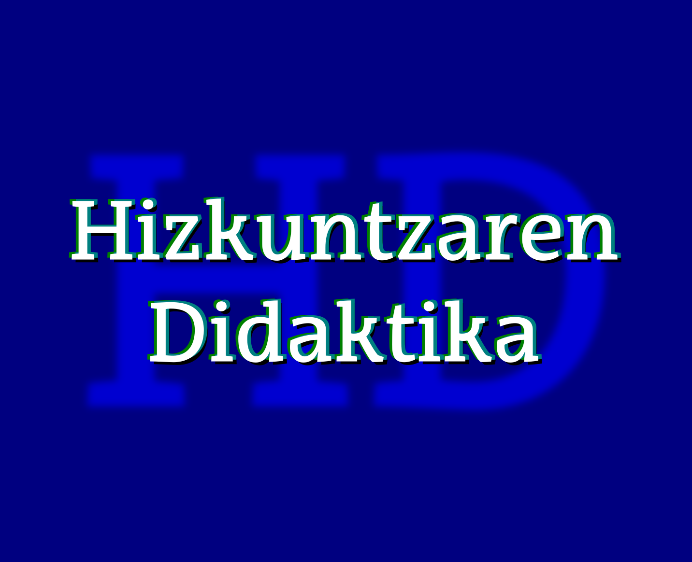

--- 
title: "Hizkuntzaren Didaktika (Lehen Hezkuntza) V-`r Sys.Date()`"
author: 
  name: "Irakaslea: Juan Abasolo"
  affiliation: UPV/EHU
  # email: juan.abasolo@ehu.eus
date: "2021/2022"
site: bookdown::bookdown_site
output: bookdown::gitbook
documentclass: book
biblio-style: apalike
link-citations: yes
description: "Hizkuntzaren Didaktika ikasgaiko apunteak dira hauek. Ikasgaian aurrera egin ahala egokitzen joango dira"
url: 'https://juanabasolo.github.io/HD-LH/apunteak/'
cover-image: "assets/azala.png"  # relative to index
github-repo: JuanAbasolo/HD-LH
favicon: "assets/azala.png"
---

```{r echo=FALSE}
# options(tinytex.verbose = TRUE)
```

# Hizkuntzaren Didaktika (LH): apunteak 2020/2021 {-}




## Jakingarriak {-}

Hemen duzun dokumentuak ikasgairako beharko dituzun elementu gehienak ditu berton edo estekatuta:

1. Ikasgaiaren gida eta nirekin harremanetan paratzeko argigarriak
2. [Gida ofiziala](https://www.ehu.eus/eu/lehen-hezkuntzako-gradua-bizkaia/kreditu-eta-irakasgaiak?p_redirect=consultaAsignatura&p_cod_proceso=egr&p_anyo_acad=20210&p_ciclo=X&p_curso=3&p_cod_asignatura=25868) (kapitulu honetan)
3. Kapitulurik kapitulu, apunteak, diapositibetarako estekak eta bakoitzaren amaieran bibliografia eta ariketak aurkituko dituzu.

Goiko "download" botoian PDF(?) edo EPUB formatuan ere jaits dezakezue gida.

**Irakaslea**: Juan Abasolo

Nirekin kontaktuan jartzeko, Telegram erabiltzea gomendatzen dizuet, korreoak eta abar baino eraginkorragoa baita. Hala ere, batzuetan ibili ez arren eta biltegiratze gaitasun urria badu ere, denok dugunez UPV/EHUko korreoa, komunikazio ofizialak bertatik egin behar ditugu. Aurten zuen banaketa zerrenda ez dabil.

+ Telegram: [abildua] JuanAbasolo
+ emaila: juan [puntu] abasolo [abildua] ehu [puntu] eus
+ Bulegoa: 3S40B
+ Tutoretzak: https://labur.eus/JAbasolo-tutoretzak  
   Aurretik norbaitekin hitzordua egiten dudanean hor ere agertuko da. Fakultatekoa edo GAURrekoa bitaminizatua, beraz.

**Ikastaldea**: LH 32, 3. maila, lehenengo lauhilekoan.

Balibideak partekatzeko, eztabaida informaletarako eta azken momentuko informazio edo premietarako-eta proposatzen dizuedan foroa [hemen](https://t.me/joinchat/CheQnxAMdJ206V3d4kDLkw) duzue. Hori erabiltzeko Telegrameko kontua egin beharko duzue (telefonoan edo ordenagailuan erabil dezakezue). Whatsappeko taldeen antzerako kudeaketa du, baina inori telefono zenbakia eman beharrik gabe.

Ikasgaiaren lehenengo zatian ia ez dugu erabiliko Moodle-n oinarritutako plataformarik.

**Ikasgaia**: Gida hau UPV/EHUko web [orritik bertatik](https://www.ehu.eus/eu/lehen-hezkuntzako-gradua-bizkaia/kreditu-eta-irakasgaiak?p_redirect=consultaAsignatura&p_cod_proceso=egr&p_anyo_acad=20180&p_ciclo=X&p_curso=3&p_cod_asignatura=25868) hartutakoa da, beraz, irakurri eta aztertuta baduzu, hurrengo pausura iragan.

**Proiektua**: 

[](syllabusa/Syllabus_HDLH21-V0.pdf)

# Hizkuntzaren eta Literaturaren Didaktika - 25868 {-}

- Ikastegia  
  Bilboko Hezkuntza Fakultatea

- Titulazioa  
  Lehen Hezkuntzako Gradua

- Ikasturtea  
  2020/21

- Maila  
  3

- Kreditu kopurua  
  10

- Hizkuntzak  
  Euskara 

## Irakaskuntza {-}

| Irakaskuntza mota | Ikasgelako eskola-orduak | Ikaslearen ikasgelaz kanpoko jardueren orduak |
| ----------------- | ------------------------ | --------------------------------------------- |
| Magistrala        | 20                       | 30                                            |
| Gelako p.         | 80                       | 120                                           |

## Irakaskuntza-gida {-}

### Helburuak {-}

A) Hizkuntzen eta literaturaren eskolako curriculuma ezagutzea, aztertzea  eta balioestea, eta ahozko eta idatzizko hizkuntzaren irakaskuntzarako  proposamen metodologikoak aztertzea eta ebaluatzea
B) Lehen  Hezkuntzako curriculumean aurreikusitako erabilera arloei dagozkien  ahozko eta idatzizko berbaldiak ulertzen eta sortzen irakasteko  estrategiak menderatzea
C) Ahozko edo idatzizko hizkuntzaren garapena sustatzeko sekuentzia didaktikoak diseinatzea, Lehen Hezkuntzako  ikasgeletan aplikatzeko eta ikasleen hizkuntza-gaitasunen garapena  bermatuko dituzten sekuentzia berriak diseinatu ahal izateko
D)  Ikasleari oinarrizko ezagutzak ematea bere literatur prestakuntza eta  etorkizunean izango dituen ikasleena osatzeko, eta Haur eta Gazte  Literaturaren genero eta kontzeptuei buruzko hausnarketa kritikoak  egiteko
E) Ikaslea literatur lanen irakurketa lantzeko eta  bultzatzeko gai izatea, egile klasiko eta garaikideen lanak ezagutzea,  eta bere sentikortasuna garatzea Haur eta Gazte Literaturaren  prestakuntza-, sormen- eta estetika-balioez jabetzeko
F) Ikasleari  gaitasuna ematea, didaktikako irizpideen arabera eta ahozko zein  idatzizko literatur materialetatik abiatuta, irakaskuntza/ikaskuntako  metodo, baliabide eta teknikak praktikan jartzeko, eta literatur  irakurketak aukeratzeko irizpide egokien arabera 

### Irakasgai-zerrenda {-}

1. GAIA.- Hizkuntzen eta literaturaren curriculumaren diseinua.  
- Curriculumaren kontzeptua  
- Hizkuntzaren curriculuma gaur egungo ikuspegi didaktikotik:  
        - ezaugarriak
        - osatzen duten elementuak (helburuak, edukiak, metodologia, ebaluazioa)  
2. GAIA.- Ahozko hizkuntzaren didaktika.  
- Ahozkotasuna eta ulermena:  
          - hitz egitea
          - mintzamenaren ulermena
          - hitz egitea eta entzutea gelaren egunerokoan  
- Mintzamena irakastea:  
          - Irakasleen jarduerak ikasleen mintzamena garatzeko
          - Orientabideak LHko gelarako
3. GAIA.- Idatzizko hizkuntzaren didaktika  
    - Ahozko hizkuntza vs. hizkuntza idatzia
    - Zer da irakurtzea?
    - Zer da idaztea?
    - Hizkuntza idatziaren psikogenesia
    - Irakurtzen-idazten irakasteko metodoak
    - Erabaki didaktikoak.
    - Proposamen didaktikoak: erabilera praktikoa eta erabilera zientifikoa.  
4. GAIA.- Hausnarketa metalinguistikorako didaktika LHn.  
    - Tartehizkuntza eta errorea.
    - Hizkuntzaren funtzioak umeen lengoian.
    - Testua eta diskurtsoa
    - Erroreak  
5. GAIA.- LHn ahozko eta idatzizko hizkuntza garatzeko sekuentzia didaktikoak programatzea. 
    - Programak eta proposamen didaktikoak
    - Atazak eta zereginak ahozko gaitasun komunikatiboa lantzeko
    - Atazak eta zereginak idatzizko gaitasun komunikatiboa lantzeko  
6. GAIA.- Haur- eta gazte-literaturaren kontzeptua: teoriak, eztabaidak eta ikerketako ikuspegiak.
7. GAIA.- HGLren ezaugarriak eta generoak.
8. GAIA.- HGLren historiara hurbiltzea.
9. GAIA.-  HGL eta eskola; irakurtzeko ohitura eta literatura-gaitasuna.
10. GAIA.- HGLa eta horren aplikazioa ikasgelan.


### Metodologia {-}

- Era indibidualean edota taldeka egindako lana
- Ikaskuntza gidatua edota autonomoa
- Ikaskuntza kooperatiboa
- Jarduera teoriko-praktikoak

### Ebaluazio-sistemak {-}

+  Azken Ebaluazioaren Sistema
+  Kalifikazioko tresnak eta ehunekoak:
  + Garatu beharreko proba idatzia (%): 30
  + Test motatako proba (%): 20
  + Banakako lanak (%): 10
  + Talde lanak (arazoen ebazpenak, proiektuen diseinuak) (%): 14
  + Lanen, irakurketen... aurkezpena (%): 10
  + DAL (%): 16

### Nahitaez erabili beharreko materiala {-}

1513/2006 Errege Dekretua, 2006ko abenduaren 7koa, Lehen  Hezkuntzako gutxieneko irakaskuntza ezartzen duena.

175/2007 DEKRETUA, urriaren 16koa, Euskal Autonomia Erkidegoko Oinarrizko  Hezkuntzaren curriculuma sortu eta ezartzekoa. 218. gehigarria. 2007ko  azaroak 13, EHAA. 

• Testuen dossierra komentarioak egiteko
• Lehen Hezkuntzako hizkuntza ikasgaiaren testu liburuak 
• Ordenagailua
• Testu liburuak

### Bibliografia {-}

#### Oinarrizko bibliografia {-}

Abascal, M. D., Beneito, J. M., & Valero, F. (1993). *Hablar y escuchar: Una propuesta para la expresión oral en la enseñanza secundaria.* Octaedro.

Barreña, A., Uranga, B., Izagirre, E., Amorrortu, E., & Ortega, A. (2006). Transmisión y uso de las lenguas: Nuevos datos para un diagnóstico de la diversidad lingüística. *actes*, del 18 al 21 d’abril de 2006, 27-. http://dialnet.unirioja.es/servlet/articulo?codigo=2218197

Camps, A., Zayas, F., & Carrasco, P. (2006). *Secuencias didácticas para aprender gramática.* Graó.

Carreras, Montserrat., Palou, Juli., & Bosch, Carmina. (2005). *La lengua oral en la escuela: 10 experiencias didácticas* (J. Palou & C. Bosch Grau, Arg.; 1. arg.). Graó.

Cassany, D., Luna, M., & Sanz, G. (2000). *Enseñar lengua* (6. arg.). Graó.

Colomer, T., Manresa Potrony, M., Ramada Prieto, L., & Reyes López, L. (2018). *Narrativas literarias en educación infantil y primaria.* Editorial Síntesis, S.A.

Colomer, Teresa. (1999). *Introducción a la literatura infantil y juvenil.* Síntesis Educación.

Culler, J., & García, G. (2000).* Breve introducción a la teoría literaria.* Crítica.

Duran, T. (2009). *Álbumes y otras lecturas: Análisis de los libros infantiles* (M. Leon, Itzul.). Octaedro.

Etxaniz, X., & López Gaseni, M. (Arg.). (2011). *Egungo euskal haur eta gazte literaturaren historia.* Universidad del País Vasco, Servicio Editorial = Euskal Herriko Unibertsitatea, Argitalpen Zerbitzua.

Etxaniz, X., & López, M. (2011). *XXI. mende hasierako haur eta gazte literatura.* Arabako Foru Aldundia.

Fons Esteve, M. (2004). L*eer y escribir para vivir: Alfabetizacion inicial y uso real de la lengua escrita en el aula.* Graó.

Igerabide, J. Kruz. (1993). *Bularretik mintzora: (Haurra, ahozkotasuna eta literatura)*. Erein.

Jiménez-Pérez, E. del P., & Fabregat, S. (Arg.). (2019). *La literatura infantil y juvenil: Investigaciones.* Octaedro.

Lluch, G., & Zayas, F. (2015). *Leer en el centro escolar: El plan de lectura.* Octaedro.

Osinaga, M. S. (1996). Irakurketa eta idazketa: LHko bigarren eta hirugarren zikloan. *Hik Hasi: euskal heziketarako aldizkaria*, *10*, 44–52.

Retolaza, I. (Arg.). (2017). *Egungo euskal komikiaren historia.* UPV/EHU

Rodari, Gianni. (1996). *Gramatica de la fantasia: Introduccion al arte de inventar historias.* (2.). Bronce.

Ruiz Bikandi, U. (Arg.). (2009). *Bigarren hizkuntzaren didaktika Haur eta Lehen Hezkuntzan.*UPV/EHU

Wells, Gordon. (1988).* Aprender a leer y escribir.* Laia.

#### Gehiago sakontzeko bibliografia {-}

Alcoba, Santiago. (Arg.). (1999). *La oralización*. Ariel.

Bronckart, J. Paul. (1996). *Activité langagière textes et discours: Pour un interactionisme socio-discursif*. Delachaux & Niestlé.

Cassany, Daniel. (1995). *La cocina de la escritura*. Anagrama.

Colomer, T., & Camps, A. (1996). *Enseñar a leer, enseñar a comprender*. Celeste.

González Fernández, A. (2004). *Estrategias de comprensión lectora*. Síntesis.

Mendoza Fillola, A. (2012). *Didáctica de la lengua y la literatura para primaria*. Prentice Hall.

Pérez Rodríguez, M. Amor. (2004). *Los nuevos lenguajes de la comunicación: Enseñar y aprender con los medios*. Paidós.

Sanz Moreno, Á. (2005). *Irakurmena lantzeko jarduerak nola prestatu: Lehen Hezkuntzako 3. zikloa eta DBHko 1. zikloa*. Hezkuntza Departamentua.

Schneuwly, B. (1992). La concepción vygotskiana del lenguaje escrito. *Comunicación, Lenguaje y Educación*, *4*(16), 49–59. https://doi.org/10.1080/02147033.1992.10821049

Teberosky, A. (2001). *Aprendiendo a escribir*. Editorial Horsori.

Tolchinsky, L. (1993). *Aprendizaje del lenguaje escrito: Procesos evolutivos e implicaciones didácticas* (1. arg). Universidad Pedagógica Nacional.

#### Aldizkariak {-}

Textos
Didáctica de la lengua y la literatura
https://dialnet.unirioja.es/servlet/revista?codigo=1416

Articles
Revista de didàctica de la llengua i de la literatura
https://dialnet.unirioja.es/servlet/revista?codigo=2659

#### Aldizkari digitalak {-}

Hik hasi aldizkaria 
http://www.hikhasi.eus/

Histodáctica
Enseñanza de la Historia / Didáctica de las Ciencias Sociales
http://www.ub.es/histodidactica/ 

Ikastorratza. 
Didaktikarako e-aldizkaria
http://www.ehu.eus/ikastorratza/

Jakingarriak
https://www.mondragon.edu/en/magazines-and-publications/jakingarriak

REIDICS
Revista de Investigación den Didáctica de las Ciencias Sociales
http://www.didactica-ciencias-sociales.org 

Tantak
https://ojs.ehu.eus/index.php/Tantak/index

## Irakasleak  eta ikasgela {-}

- [ABASOLO, JUAN](https://www.ehu.eus/eu/web/hld-dll/ikasgaiak?p_redirect=consultaTutorias&p_anyo_acad=20200&p_idp=351472)

- [ESPARZA MARTIN, IRATXE](https://www.ehu.eus/eu/lehen-hezkuntzako-gradua-bizkaia/kreditu-eta-irakasgaiak?p_redirect=consultaTutorias&p_anyo_acad=20210&p_idp=393662)

- [KORTAZAR URIARTE, JON BATTI](https://www.ehu.eus/eu/web/hld-dll/ikasgaiak?p_redirect=consultaTutorias&p_anyo_acad=20200&p_idp=2768)


Ikasgela : 
  2S08M
