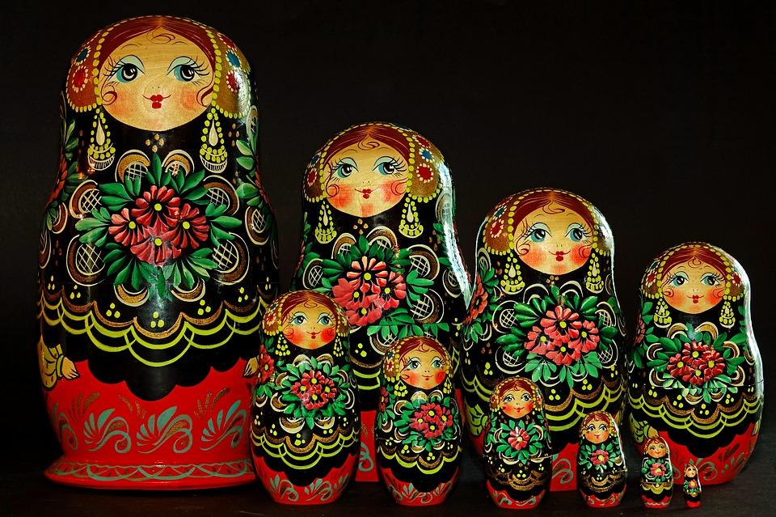
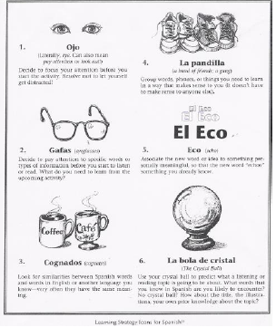

--- 
title: "Hizkuntzaren Didaktika (Lehen Hezkuntza) V-2020/09"
author: 
  name: "Irakaslea: Juan Abasolo"
  affiliation: UPV/EHU
  # email: juan.abasolo@ehu.eus
date: "2020/2021"
site: bookdown::bookdown_site
output: bookdown::gitbook
documentclass: book
# bibliography: [book.bib, packages.bib]
biblio-style: apalike
link-citations: yes
description: "Hizkuntzaren Didaktika ikasgaiko apunteak dira hauek. Ikasgaian aurrera egin ahala egokitzen joango dira"
url: 'https://juanabasolo.github.io/HD-LH/apunteak/'
cover-image: "assets/azala.png"  # relative to index
github-repo: JuanAbasolo/HD-LH
favicon: "assets/azala.png"
---

```{r echo=FALSE}
# options(tinytex.verbose = TRUE)
```

# Hizkuntzaren Didaktika (LH): apunteak 2020/2021 {-}


## Jakingarriak {-}

Hemen duzun dokumentuak ikasgairako beharko dituzun elementu gehienak editu berton edo estekatuta:

1. Ikagaiaren gida eta nirekin harremanetan paratzeko argigarriak
2. [Gida ofiziala](https://www.ehu.eus/eu/web/hld-dll/ikasgaiak?p_redirect=consultaAsignatura&p_anyo_acad=20200&p_ciclo=X&p_curso=3&p_cod_asignatura=25868&p_cod_plan=GPRIMA30&p_cod_centro=354) (kapitulu honetan)
3. Kapitulurik kapitulu, apunteak, diapositibetarako estekak eta bakoitzaren amaieran bibliografia eta ariketak aurkituko dituzu.

Goiko "download" botoian PDF(?) edo EPUB formatuan ere jaits dezakezue gida.

**Irakaslea**: Juan Abasolo

Nirekin kontaktuan jartzeko, Telegram erabiltzea gomendatzen dizuet, korreoak eta abar baino eraginkorragoa baita. Hala ere, batzuetan ibili ez arren eta biltegiratze gaitasun urria badu ere, denok dugunez UPV/EHUko korreoa, komunikazio ofizialak bertatik egin behar ditugu. Aurten zuen banaketa zerrenda ez dabil.

+ Telegram: [abildua] JuanAbasolo
+ emaila: juan [puntu] abasolo [abildua] ehu [puntu] eus
+ Bulegoa: 3S40B
+ Tutoretzak: https://labur.eus/JAbasolo-tutoretzak  
   Aurretik norbaitekin hitzordua egiten dudanean hor ere agertuko da. Fakultatekoa edo GAURrekoa bitaminizatua, beraz.

**Ikastaldea**: LH 32, 3. maila, lehenengo lauhilekoan.

Balibideak partekatzeko, eztabaida informaletarako eta azken momentuko informazio edo premietarako-eta proposatzen dizuedan foroa [hemen](https://t.me/joinchat/CheQnxAMdJ206V3d4kDLkw) duzue. Hori erabiltzeko Telegrameko kontua egin beharko duzue (telefonoan edo ordenagailuan erabil dezakezue). Whatsappeko taldeen antzerako kudeaketa du, baina inori telefono zenbakia eman beharrik gabe.

Ikasgaiaren lehenengo zatian ia ez dugu erabiliko Moodle-n oinarritutako plataformarik.

**Ikasgaia**: Gida hau UPV/EHUko web [orritik bertatik](https://www.ehu.eus/eu/lehen-hezkuntzako-gradua-bizkaia/kreditu-eta-irakasgaiak?p_redirect=consultaAsignatura&p_cod_proceso=egr&p_anyo_acad=20180&p_ciclo=X&p_curso=3&p_cod_asignatura=25868) hartutakoa da, beraz, irakurri eta aztertuta baduzu, hurrengo pausura iragan.

**Proiektua**: 

[](syllabusa/Syllabus_HDLH20-V1-1.pdf)

# Hizkuntzaren eta Literaturaren Didaktika - 25868 {-}

- Ikastegia  
  Bilboko Hezkuntza Fakultatea

- Titulazioa  
  Lehen Hezkuntzako Gradua

- Ikasturtea  
  2020/21

- Maila  
  3

- Kreditu kopurua  
  10

- Hizkuntzak  
  Euskara 

## Irakaskuntza {-}

| Irakaskuntza mota | Ikasgelako eskola-orduak | Ikaslearen ikasgelaz kanpoko jardueren orduak |
| ----------------- | ------------------------ | --------------------------------------------- |
| Magistrala        | 20                       | 30                                            |
| Gelako p.         | 80                       | 120                                           |

## Irakaskuntza-gida {-}

### Helburuak {-}

A) Hizkuntzen eta literaturaren eskolako curriculuma ezagutzea, aztertzea  eta balioestea, eta ahozko eta idatzizko hizkuntzaren irakaskuntzarako  proposamen metodologikoak aztertzea eta ebaluatzea
B) Lehen  Hezkuntzako curriculumean aurreikusitako erabilera arloei dagozkien  ahozko eta idatzizko berbaldiak ulertzen eta sortzen irakasteko  estrategiak menderatzea
C) Ahozko edo idatzizko hizkuntzaren garapena sustatzeko sekuentzia didaktikoak diseinatzea, Lehen Hezkuntzako  ikasgeletan aplikatzeko eta ikasleen hizkuntza-gaitasunen garapena  bermatuko dituzten sekuentzia berriak diseinatu ahal izateko
D)  Ikasleari oinarrizko ezagutzak ematea bere literatur prestakuntza eta  etorkizunean izango dituen ikasleena osatzeko, eta Haur eta Gazte  Literaturaren genero eta kontzeptuei buruzko hausnarketa kritikoak  egiteko
E) Ikaslea literatur lanen irakurketa lantzeko eta  bultzatzeko gai izatea, egile klasiko eta garaikideen lanak ezagutzea,  eta bere sentikortasuna garatzea Haur eta Gazte Literaturaren  prestakuntza-, sormen- eta estetika-balioez jabetzeko
F) Ikasleari  gaitasuna ematea, didaktikako irizpideen arabera eta ahozko zein  idatzizko literatur materialetatik abiatuta, irakaskuntza/ikaskuntako  metodo, baliabide eta teknikak praktikan jartzeko, eta literatur  irakurketak aukeratzeko irizpide egokien arabera 

### Irakasgai-zerrenda {-}

1. GAIA.- Hizkuntzen eta literaturaren curriculumaren diseinua.  
- Curriculumaren kontzeptua  
- Hizkuntzaren curriculuma gaur egungo ikuspegi didaktikotik:  
        - ezaugarriak
        - osatzen duten elementuak (helburuak, edukiak, metodologia, ebaluazioa)  
2. GAIA.- Ahozko hizkuntzaren didaktika.  
- Ahozkotasuna eta ulermena:  
          - hitz egitea
          - mintzamenaren ulermena
          - hitz egitea eta entzutea gelaren egunerokoan  
- Mintzamena irakastea:  
          - Irakasleen jarduerak ikasleen mintzamena garatzeko
          - Orientabideak LHko gelarako
3. GAIA.- Idatzizko hizkuntzaren didaktika  
    - Ahozko hizkuntza vs. hizkuntza idatzia
    - Zer da irakurtzea?
    - Zer da idaztea?
    - Hizkuntza idatziaren psikogenesia
    - Irakurtzen-idazten irakasteko metodoak
    - Erabaki didaktikoak.
    - Proposamen didaktikoak: erabilera praktikoa eta erabilera zientifikoa.  
4. GAIA.- Hausnarketa metalinguistikorako didaktika LHn.  
    - Tartehizkuntza eta errorea.
    - Hizkuntzaren funtzioak umeen lengoian.
    - Testua eta diskurtsoa
    - Erroreak  
5. GAIA.- LHn ahozko eta idatzizko hizkuntza garatzeko sekuentzia didaktikoak programatzea. 
    - Programak eta proposamen didaktikoak
    - Atazak eta zereginak ahozko gaitasun komunikatiboa lantzeko
    - Atazak eta zereginak idatzizko gaitasun komunikatiboa lantzeko  
6. GAIA.- Haur- eta gazte-literaturaren kontzeptua: teoriak, eztabaidak eta ikerketako ikuspegiak.
7. GAIA.- HGLren ezaugarriak eta generoak.
8. GAIA.- HGLren historiara hurbiltzea.
9. GAIA.-  HGL eta eskola; irakurtzeko ohitura eta literatura-gaitasuna.
10. GAIA.- HGLa eta horren aplikazioa ikasgelan.


### Metodologia {-}

- Era indibidualean edota taldeka egindako lana
- Ikaskuntza gidatua edota autonomoa
- Ikaskuntza kooperatiboa
- Jarduera teoriko-praktikoak

### Ebaluazio-sistemak {-}

+  Azken Ebaluazioaren Sistema
+  Kalifikazioko tresnak eta ehunekoak:
  + Garatu beharreko proba idatzia (%): 30
  + Test motatako proba (%): 20
  + Banakako lanak (%): 10
  + Talde lanak (arazoen ebazpenak, proiektuen diseinuak) (%): 14
  + Lanen, irakurketen... aurkezpena (%): 10
  + DAL (%): 16

### Nahitaez erabili beharreko materiala {-}

1513/2006 Errege Dekretua, 2006ko abenduaren 7koa, Lehen  Hezkuntzako gutxieneko irakaskuntza ezartzen duena.

175/2007 DEKRETUA, urriaren 16koa, Euskal Autonomia Erkidegoko Oinarrizko  Hezkuntzaren curriculuma sortu eta ezartzekoa. 218. gehigarria. 2007ko  azaroak 13, EHAA. 

• Testuen dossierra komentarioak egiteko
• Lehen Hezkuntzako hizkuntza ikasgaiaren testu liburuak 
• Ordenagailua
• Testu liburuak

### Bibliografia {-}

#### Oinarrizko bibliografia {-}

Abascal, D., Beneito, J.M. y Valero, F. (1997) Hablar y escuchar. Barcelona, Octaedro

Camps, A y Zayas, F. (Coords) (2006) Secuencias didácticas para aprender gramática. 
Barcelona, Graó

Camps, A (coord) (2003) Secuencias didácticas para aprender a escribir. Barcelona, Graó.

Cassany, D. Enseñar lengua (1994) Barcelona, Graó.

COLOMER, T. (2009). Introducción a la literatura infantil y juvenil. Madril: Síntesis. 

COLOMER, T.; Manresa, Mireia; Ramada Prieto, Lucas & Lara Reyes López (eds.) (2018). Narrativas literarias en educación infantil y primaria. Madril: Síntesis. 

CULLER, J. (2009). Breve introducción a la teoría de la literatura. Bartzelona: Crítica. 

DURAN, T. (2009). Álbumes y otras lecturas. Análisis de los libros infantiles. Bartzelona: Octaedro. 

ETXANIZ ERLE, X. eta J.M. López Gaseni (2011). XXI. mende hasierako haur eta gazte literatura. Arabako Foru Aldundia 

ETXANIZ & LOPEZ GASENI (2011): Egungo haur eta gazte literaturaren historia. Bilbo: UPV-EHU Argitalpen zerbitzua.

Fons Esteve, M. (2004) Leer y escribir para vivir. Barcelona, Graó.

IGERABIDE, J. K. (1993). Bularretik mintzora. Donostia: Erein. 

JIMÉNEZ-PÉREZ, E. eta S. Fabregat Barrios (koords.) (2019). La literatura infantil y  juvenil: investigaciones. Bartzelona: Octaedro. 

LLUCH, G. eta F. Zayas (2015). Leer en el centro escolar. El plan de lectura. Bartzelona: Octaedro. 

RETOLAZA, Iratxe (2017): Egungo euskal komikiaren historia. Bilbo: UPV-EHU Argitalpen Zerbitzua.

RODARI, G. (1979). Gramática de la fantasía. Madril: Avance.

Ruiz Bikandi, U., (2000) Didáctica de la segunda lengua en educación infantil y primaria. Madrid, Síntesis. 

Palou, J Y Bosch, C. (Coords) (2005) La lengua oral en la escuela. Barcelona, Graó.

Sainz, M., (1996) ¿Irakurketa eta idazketa LHko bigarren eta hirugarren zikloetan¿, in HIK HASI, 10. zb.

Solé, I. Estrategias de lectura. Barcelona, Graó.

Wells, G., (1988) Aprender a leer y escribir.  Barcelona, Laia

#### Gehiago sakontzeko bibliografia {-}

Alcoba, S. (coord) (1999) La oralización. Barcelona, Ariel.

Bronckart, J. P. (1996), Activité Langagière, textes et discours. Lausanne.Delachaux et Niestlé.

Cassany, D. La cocina de la escritura. Barcelona Anagrama

Colomer, T. y Camps, A. (1996), Enseñar a leer, enseñar a comprender

González Fernández, A. (2004) Estrategias de comprensión lectora. Madrid, Síntesis.

Mendoza.A. (Coord) (2003) Didáctica de la lengua y la literatura. Madrid, Pearson Educación.

Pérez Rodríguez, M. A. (2004) Los nuevos lenguajes de la comunicación. Enseñar y aprender con los medios. Barcelona, Paidós.

Sanz Moreno, A.(2003) Cómo diseñar actividades de comprensión lectora. Departamento de Educación. Gobierno de Navarra

Schneuwly, B., (1992) ¿La concepción vygotskiana del lenguaje escrito¿ en Comunicación, Lenguaje y Educación, 16, pp. 49-59, 

Teberosky, A. (1992), Aprendiendo a escribir. Barcelona, Horsori.

Tolchinsky, L. (1993); Aprendizaje del lenguaje escrito. Barcelona, Anthropos.

#### Aldizkariak {-}

TEXTOS de Didáctica de la lengua y la literatura.
ARTICLES de Did.actica de la lengua y la literatura
Lenguaje y textos

## Taldeak {-}

...

#### Ikasgela(k) {-}

- 1S03G - IRAKASLEEN ESKOLAKO ERAIKIN HORIZONTALA - LEIOA

### 32 Teoriakoa (Euskara - Goizez)Erakutsi/izkutatu azpiorriak

| Asteak | Astelehena | Asteartea                           | Asteazkena | Osteguna                | Ostirala |
| ------ | ---------- | ----------------------------------- | ---------- | ----------------------- | -------- |
| 1-1    |            |                                     |            | 14:00-16:30 17:00-19:30 |          |
| 5-5    |            |                                     |            | 14:00-16:30 17:00-19:30 |          |
| 16-16  |            | 14:00-16:00 16:30-18:30 19:00-20:00 |            |                         |          |
| 19-19  |            | 14:00-16:00 16:30-18:00             |            |                         |          |

#### Irakasleak {-}

- [ABASOLO ISASA, JUAN SEBASTIAN](https://www.ehu.eus/eu/web/hld-dll/ikasgaiak?p_redirect=consultaTutorias&p_anyo_acad=20200&p_idp=351472)
- [ROJO COBOS, FRANCISCO JAVIER](https://www.ehu.eus/eu/web/hld-dll/ikasgaiak?p_redirect=consultaTutorias&p_anyo_acad=20200&p_idp=4636)

### 32 Gelako p.-1 (Euskara - Goizez)Erakutsi/izkutatu azpiorriak

| Asteak | Astelehena  | Asteartea | Asteazkena  | Osteguna    | Ostirala    |
| ------ | ----------- | --------- | ----------- | ----------- | ----------- |
| 2-4    | 18:30-20:00 |           |             | 16:30-20:00 |             |
| 6-10   | 18:30-20:00 |           |             | 16:30-20:00 |             |
| 17-18  |             |           | 14:00-15:30 |             | 16:00-17:30 |
| 20-30  |             |           | 14:00-15:30 |             | 16:00-17:30 |

#### Irakasleak {-}

- [ABASOLO, JUAN](https://www.ehu.eus/eu/web/hld-dll/ikasgaiak?p_redirect=consultaTutorias&p_anyo_acad=20200&p_idp=351472)
- [KORTAZAR URIARTE, JON BATTI](https://www.ehu.eus/eu/web/hld-dll/ikasgaiak?p_redirect=consultaTutorias&p_anyo_acad=20200&p_idp=2768)
- [ROJO COBOS, FRANCISCO JAVIER](https://www.ehu.eus/eu/web/hld-dll/ikasgaiak?p_redirect=consultaTutorias&p_anyo_acad=20200&p_idp=4636)

#### Ikasgela {-}

- 2S08M - IRAKASLEEN ESKOLAKO ERAIKIN HORIZONTALA - LEIOA

<!--chapter:end:index.Rmd-->

# Testuingurua

 [](../Diapoak/01_Diap-testuingurua.html)

Hizkuntza Didaktikaz aritu aurretik, hizkuntza, didaktika honen objektua alegia, inguratzen duten ezaugarriez jardun beharra dugu.

## Hizkuntza desberdinek egoera desberdinak

Begiratzen badugu zen zen egoera XX. mendera arte, ikusiko dugu eskolan gehien irakatsi diren hizkuntzak, hizkuntza handiak izan direla (Idiazabal, 2003; Martí eta beste, 2005).

Kontuan izan behar da XIX. mendeko estatu mugen sorrerak hizkuntza gutxituen presentzia eskolan erabat baztertu zuela, eskolak hizkuntza nagusia eta bakarra irakatsi behar zuen. *Nazioa*^[kultura, hizkuntza, etnia] eta *estatua*^[ofiziala, administratiboa] kontzeptuak bat egin ziren.

Hizkuntzak nazioak eta estatuak baino askoz ere ugariagoak dira, eta ez datoz bat lurraldeetako mugekin, gainera, hizkuntza asko estatu bat baino gehiagoko lurretan hitz egiten dira (euskara, gaztelania eta frantsesa adibide argiak dira).

> El concepto de lengua no es preciso, ni las fronteras lingüísticas coinciden con las geográficas. En España se reconocen cuatro lenguas, pero hay otras más, desde el leonés, el bable o la fabla aragonesa, hasta las lenguas de los emigrantes o el caló. Así y todo, España es uno de los países lingüísticamente más homogéneos, pues tiene una lengua oficial y común, el español, que hablan y entienden la mayoría de sus ciudadanos.”

_**Santiago Trancón **_[https://www.lanuevacronica.com/lengua-nacion-estado](https://www.lanuevacronica.com/lengua-nacion-estado)

## Zer da Hizkuntzaren Didaktika

Jakintza eremu hau prozesu luze baten ondorioz finkatu da ikerketa eremu bakar gisa. Berez, eremu ezberdinetatik aztertua izan da *hizkuntza* objektuaren didaktika: hizkuntzalaritzatik, pedagogiatik, filologiatik, politikatik eta abarretik.

Hizkuntzaren irakaskuntzak aspaldiko erroak ditu; hizkuntza bera zer den ulertzeko era bakoitzak irakasteko era edo filosofiaren bat ekarri baitu, horrela, aniztasun handia aurki dezakegu hizkuntzaren didaktikaren arloaren historian eta jardunean.

70eko hamarkadan has daiteke hizkuntzaren didaktikaz hitz egiten. Lehenago hizkuntzalaritza aplikatuaz hitz egiten zen, eta ordura arte psikologiako, soziologiako eta pedagogiako jakintzak alde batera uzten ziren.

> Así (Galisson, 1986) podemos decir que la Didáctica de la Lengua dependió directamente de la Lingüística y que de ahí surgió la Lingüística Aplicada, la cual intentó responder ante todo a las cuestiones ¿Qué? y ¿Cómo?. 
>
> A continuación y bajo la ínfluencia de la Psicología Evolutiva, de la Psicología Educativa y de la Psicología Cognitiva, añadió una preocupación por la metodología. 
> 
> Finalmente y del conjunto de una serie de disciplinas tales como las Ciencias del Lenguaje, de la Psicología, de la Sociedad y de la Educación surgiría con entidad propia la Didáctica de la Lengua y la Literatura que intenta responder a las preguntas: ¿Por qué enseñar lengua y Literatura?, ¿Qué enseñar?, ¿A quién enseñar?, ¿Cómo? Y ¿Dónde?
>
> --*López Valero*, 1998: 222

Galdera horiei erantzuna emateko sortu zen **Hizkuntzaren Didaktika** diziplina hau honela defini dezakegu:

> La Didáctica de la Lengua constituye un campo de conocimiento que tiene como objeto el complejo proceso de enseñar y aprender lenguas con el fin de mejorar las prácticas y adecuarlas a las situaciones cambiantes en que esta actividad se desarrolla
>
> --Camps, Guasch y Ruiz Bikandi, 2010, p. 71

Gogoratu ditzagun, beraz, azpimarratutako ideiak:

*Ezagutza eremu bat da bere objektua hizkuntzak irakastea eta ikastea duena, jarduna hobetu eta egokitzea helburu*

## Hizkuntzak zergatik galtzen dira?

Kanpoko indarren ondorioz: **Globalizazioa.** Sarritan kanpoko indarrak barnekoari eragiten dio. Hizkuntza indartsuak, aurrerapen soziala eta pertsonala, hizkuntza natiboak desagertu.

Barneko indarren ondorioz: **Estatu/nazio** kontzeptuaren eragina ulertu behar da (grikoa, behe-prusiera edo euskara bera, bakoitza bere historiarekin).

Moreno-Cabrerak (2008) horren azalpena ekskaintzen du hurrengoa azalduaz: Hizkuntza inperialistak hedatzeak homogeneotasun linguistikoa ekarri du eta ez aniztasuna, izan ere hiztunek euren hizkuntza natiboak baztertu dituzte edota ez dituzte zaindu behar bezala, sarritan pentsatu baitute hizkuntza horiek garapen eta aurrerapen sozialaren nahiz pertsonalaren kontra doazela. Era honetan, bost kontinenteetako hizkuntza internazionalek beste zenbait baztertu eta desagertarazi dituzte.

## Bost kontinenteetako hizkuntzen egoeraz

Hurrengo taulak hizkuntzen egoera erakusten du, ikuskera administratibo-kauntitatibo batetik gehienbat.

|                     | Amerikak | Afrika | Europa | Asia | Ozeania|
| :------------------ |---------:|-------:|-------:|-----:|-------:|
| Instituzionala      | 37       | 194    | 73     | 203  | 71     |
| Garatzeko bidean    | 234      | 542    | 81     | 362  | 379    |
| Indartsua           | 145      | 1026   | 31     | 856  | 421    |
| Arazoduna           | 309      | 245    | 50     | 693  | 234    |
| Desagertzeko zorian | 339      | 131    | 51     | 187  | 208    |

Table: Hizkuntzen egoera administratiboa (Iturria:[ethnologue.com](https://www.ethnologue.com/)).

Kontuan izan, hizkuntza instituzionalez ari garenean, ez garela ari 578 hizkuntzez. Kontinente guztietako gehiketak horretara eramango bagintuzke ere, Europako hizkuntza nagusiak dira Ameriketan, Afrikan, Asian eta Ozeanian hizkuntza instituzionalak; hala nola, ingelesa, gaztelania, frantsesa, portugesa eta neerlandera.

Hizkuntza minorizatuen gaineko testigantza batzuk Nathional Geographic-eko erreportai [honetan](http://www.nationalgeographic.com.es/mundo-ng/grandes-reportajes/lenguas-peligro-extincion_6174/26).

## Hizkuntzen egoera eta hizkuntzen didaktikak

Lewisek 2005ean azaldu zuenez, bada ezaugarri zerrenda bat kontuan hartu beharrekoa:

* Hizkuntzaren transmisioa edo ondorengoetaratzea
* Hiztun kopuru absolutua
* Hiztun-portzentajea
* Hizkuntzaren erabilera-eremu berrien sorrera
* Alfabetatzerako eta hezkuntzarako materialak egotea (gramatikak, hiztegiak, idatzizko literatura, hedabideak…)
* Gobernu eta erakundeen babesa
* Hiztunen jarrera
* Hizkuntza dokumentatua egotea

## Hizkuntza gutxituak: Irakatsi beharraz gain, indarberritu ere egin behar dira

**UNESCO**:[http://www.unesco.org/languages-atlas/es/atlasmap.html](http://www.unesco.org/languages-atlas/es/atlasmap.html)

> “INSTRUMENTO de ratificación de la Carta Europea de las Lenguas Regionales o Minoritarias, hecha en Estrasburgo el 5 de noviembre de 1992.
>
> Los Estados miembros del Consejo de Europa, signatarios de la presente Carta, Considerando que la finalidad del Consejo de Europa es conseguir una unión más estrecha entre sus miembros, en articular para salvaguardar y promover los ideales y principios que son su patrimonio común; Considerando que la protección de las lenguas regionales o minoritarias históricas de Europa, de las que algunas corren el riesgo de desaparecer con el tiempo, contribuye al mantenimiento y al desarrollo de las tradiciones y la riqueza culturales de Europa.”
>
>--Carta Europea de las Lenguas Minoritarias o Regionales
>
>_BOE, 2001_

> La Declaración es un texto necesario, tal como manifiestan sus Preliminares, para «corregir los desequilibrios lingüísticos de manera que aseguren el respeto y el pleno despliegue de todas las lenguas y que establezcan los principios de una paz lingüística planetaria justa y equitativa, como factor principal de la convivencia social».
>
> La propia voluntad de universalismo de la Declaración comporta la corrección de los desequilibrios para que se asegure el respeto y el pleno desarrollo de todas las lenguas.
>
>--Declaración Universal de Derechos Lingüísticos
>
> _1996, Bartzelona_

### Europako Erreferentzia Marko Bateratuak:

Gaitasunak, jarduera komunikatiboak, mailak, deskribatu eta zehazten ditu helburuak, edukiak eta ebaluazio-irizpideen oinarri gisa.Europako Kontseiluak hartutako erabakiak dira.

### Ikastetxeko Hizkuntza Proiektuaren bidez:

Ikastetxeak duen identitatea kontuan izanik, hizkuntzaren aldetiko erabakiak hartzen dira bai alor pedagogikoan bai instituzionalean.

#### Adibideak:

<iframe width="560" height="315" src="http://www.youtube.com/embed/iFEjAhnv3ys?rel=0" frameborder="0" allowfullscreen></iframe> 

Bideoa: [Hizkuntz Proiektua guraso bilera](http://www.youtube.com/embed/iFEjAhnv3ys?rel=0)

[http://elblogdemiguelcalvillo.blogspot.com.es/2011/02/video-promocional-del-proyecto.html](http://elblogdemiguelcalvillo.blogspot.com.es/2011/02/video-promocional-del-proyecto.html)

[http://elblogdemiguelcalvillo.blogspot.com.es/2011/04/proyecto-linguistico-de-centro-el-video.html](http://elblogdemiguelcalvillo.blogspot.com.es/2011/04/proyecto-linguistico-de-centro-el-video.html)

### Hizkuntza Programak

Irakasleek ikasleekin egin beharreko **jarduerak **dira, eta betebeharretako bat zentroan dauden hizkuntza ezberdinen gaineko kontzientzia piztea izan daiteke.

### Munduko eskola batzuetan nolako programez erantzuten zaie hizkuntza gutxituei?

Adibide bi ikusi ditzakegu hurrengo bideoan, bata Hego Afrikako errepublikan eta bestea Mazedoniako errepublikan.


<iframe width="560" height="315" src="http://www.youtube.com/embed/nPUMvUBuX00?rel=0" frameborder="0" allowfullscreen></iframe> 

Bideoa: [Euronews Learning World - El bilingüismo en el mundo](http://www.youtube.com/embed/nPUMvUBuX00?rel=0)

## Irakaskuntzan

Txepetx

Hizkuntza bat **ikastean **hiru faktorek eragiten dutela dio, gainera, osagarriak dira eta lotura dute:

1. **Motibazioak**: Hizkuntza bat ikastera daramaten arrazoi, nahi edo interesak

2. **Ezagutzak**: Hizkuntzaren funtzionamendua ulertzeko gaitasuna edo prozesua.

3. **Erabilerak**.


## Metodoak

**Hizkuntza ulertzeko modua**-**Irakasteko modua**-**Metodologia ezberdinak**

* Gramatika/itzulpen metodoak
* Eredu audiolinguala(egituren errepikapena, buruz ikasi)
* Eredu kognoszitiboa (arauak)
* Pragmatika eta eredu nozional/komunikaziozkoa:_The communicative approach_


Testu horiek era egokian “erabiltzea” nahi badugu, gure lan eduki nagusiak trebezia mailakoak izango dira: hitz egiten, idazten, irakurtzen, entzuten irakastea izango da gure zeregina. 
Eta testu horiek gero eta hobeto erabili ahal izateko, gero eta hobeto hitz egin, idatzi, irakurri edo entzuteko,  egiten dugun horren inguruko hausnarketa beharko dugu. Gramatika eta hizkuntzaren sistemaren gaineko lanak beste era bateko funtzioa hartzen du, ez da aprendizaiaren helburu, baizik eta  baliabide

---

##  Erreferentziak

Idiazabal I.(2003). Eskolaren kalitatea eta euskara.*BAT Soziolinguistika Aldizkaria* 49, 2003, 195-199. ISSN: 1130-8435

Idiazabal, I., & Manterola, I. (2009). Euskal eredu elebidunak, murgilketa eta hizkuntzen irakaskuntza bateratua: kontzeptuen berrikusketa. *Euskera*, 54, 2–1. Eskuragarri http://www.euskaltzaindia.net/dok/euskera/74632.pdf helbidean

Lewis, M. P.(2005). Towards a categorization of endangerment of the world’s languages._SIL International_.

López Valero, A. (1998). Hacia una conformación histórica de la Didáctica de la Lengua y la Literatura. *Didáctica. Lengua y literatura*, (10), 215–232.

Martí, F., Ortega, P., Idiazabal, I., Barreña, A., Juaristi, P., Junyent, C., … Amorrortu, E.(2005).*Hizkuntzen mundua. Munduko hizkuntzei buruzko txostena*. Bilbo: UPV/EHU.

Moseley, Christopher (ed.). *2010. Atlas of the World’s Languages in Danger*, 3rd edn. Paris:UNESCO Publishing. Online version: http://www.unesco.org/culture/en/endangeredlanguages/atlas

Moreno-Cabrera, J. C.(2008). _El nacionalismo lingüístico: Una ideología destructiva_. Barcelona: Ediciones Península.

Sánchez, J. M.(1991). *Un futuro para nuestro pasado. Claves de la recuperación del Euskara y teoría social de las lenguas* (Libk. 1). Donostia: Gipuzkoako Foru Aldundia. Berreskuratua [http://www.ehu.eus/ojs/index.php/ASJU/article/view/8593](http://www.ehu.eus/ojs/index.php/ASJU/article/view/8593-%28e%29tik)-tik

[^1]: *Txepetx* da Jose Maria Sánchezen desizena. izenpetu ere bere desizenez egiten zuenez, hori ere erabiltzeko ohitura zabaldu da.


# Lehenengo jarduera {-}

Landu Idiazabal & Manterola (2008) testua, bertako kontzeptu gakoak ulertze aldera.


### Taldearen hizkuntz esperientzia {-}

Ikaskideen aurreko aurkezpena egin behar duzue aipatu testuko gako idiak kontuan izanda.

Honako kontzeptuok argitu behar dira irakurketaren bitartez, gero aurkezpenean egoki erabiltzeko.

+ Ikasteredua
+ Eskola hizkuntza
+ Murgilketa eredua
+ D eredua
+ D eredu naturala
+ Tesuinguru euskalduna
+ Elebiduna
+ Elebakarra
+ Bigarren hizkuntza (H~2~)
+ Garapen interdependentea

Lanerako galdera  
  : Zein izan da zuon taldearen eskarmentua hizkuntzaren ikaskuntzari dagokionez?

## Hautazko jarduera: {-}

- [ ] Irakurri *Txepetx*ek[^1] dioena eta erantzun galderak. Horretarako aparteko laburpena dago, Telegrameko kanaleko lehenengotariko dokumentua edo [esteka honetan](https://github.com/JuanAbasolo/HD/blob/01-gaia/1_Txepetx_testuak.pdf).

# Ahozko aurkezpena ebaluatzeko errubrika {-}


Hurrengo errubrika hau erabiliko dugu ahozko ebaluazioetarako

|                         | **Hobekuntza franko behar duen lana**    | **Lan nahikoa**                        | **Lan ona**                            | **Lan bikaina**                        |
| ----------------------: | :--------------------------------------- | ---------------------------------------- | ---------------------------------------- | ---------------------------------------- |
|      **Taldeko lana** | Taldekideen artean ez da elkarlanik egon eta lanean nabaritzen da | Kohesio falta dago, lana taldekideen artean banatu dute baina oso zaila da tokatu zaien zatiaz hitz egitea. | Lana taldekideen artean banatu dute baina azken entsegua denen artean egin dute. | Koordinazio eta komunikazio handia dago, guztiek tokatu zaien zatia ondo egin dute. |
|             **Edukiak** | Edukiak txarto hautau dituzte, txarto antolatuta daude eta errepikatuta | Edukiak egokiak dira, baina edukiak hobeto antolatu daitezke | Edukiak ondo aukeratu dituzte, ondo antolatuta daude eta ondo azalduta | Edukiak ondo aukeratu dituzte, ondo antolatuta daude eta ondo azalduta. |
| **Irudia** | Kolorea txarto aukeratu da, testu gehiegi, ikusteko arazoak. | Aurkezpena ondo ikusten da, baina itxusia da. | Argazkiak  ondo aukeratu dira, testua orekatua da, ondo ikusten da. | Argazkiak ondo aukeratu dira, testua orekatua da, gainera, ikusten dena oso erakargarria da. |
| **Ahozko aurkezpena** | Isilune handiak, testua falta da. Diapositibak nahasten dira. | Aurkezpena egokia da, baina denboretara egokitzeko arazoak. Ahozkera arazoak. | Aurkezpen egokia, denboretara ondo egokituta, ahozkera ona. | Aurkezpen egokia, denboretara ondo egokituta, ahozkera ona.	Gorpuzkerak, aurpegikerak eta keinuek diskurtsoari indarra ematen diote.|

<!--chapter:end:01-testuingurua.Rmd-->

# Hizkuntza eta ageriko curriculuma

[](https://gitpitch.com/JuanAbasolo/HD/02-gaia?grs=github&t=moon)

Hizkuntza eskolan tratatzeko erez ari garenean, kontuan izan behar dugu horren inguruan ereikitako lege ikuspegi osoa. Besteak beste, horren arabera sortu beharko duzuelako dena delako elementua oposizioak-eta egiteko.

Curriculumez ari garenean hitz egin dezakegu eskola esperientziak eragindako bizipen/ikaskuntzez edota aurrez prestatutako ikaskuntza-ibilbiderako planez. Oraingo honetan bigarren horri buruz hausnartu behar dugu: Curriculum diseinuaz.

Legeen bitartez eraikitzen da curriculumaren lehenengo zehaztapen maila. Kapitulu honetan legeei begiratu behar diegu, zehazki, hizkuntzari begiratzen dion alderdia landuko dugu.

Lege markoa matroysken antzera eregiten da, pausu bakoitzak jarraikortasuna behar du aurrekoarekiko. Euskal Herriko ikasgeletara iristen den legearen forma aurretiko beste lege batzuk moldatutakoa da.


[iturria](https://pixabay.com/en/ornament-matryoshka-babuschka-3131097/)

Gure kasuan, UPV/EHUk baskongadetako errealitateari begiratu behar dionez, Heziberri 2020 planak ezartzen duen errealitatea aztertuko dugu. Baina Euskal Herriko ikuspegi zabalago batetik ere begira genezaioke Ipar Euskal Herriko lege markoa edota Nafarroakora egokituta, dagozkien elementuak.

Gaur egungo paradigmatik ulertuta, hezkuntzaz aritzeak esan nahi du gaikuntzaz hitz egitea, gaitasunak garatzeari buruz jardutea.

Horrela, gaurko lege-markoa ulertzeko paradigamren eraikuntzatik hasi, legeek egiten duten interpretaziora pasa eta gelako jardunaren diseinura iritsi behar dugu. Matryoskak bailiran legez

* Delors txostena (UNESCO) 1998  
  Education for the twenty-first century: issues and prospects: contributions to the work of the International Commission on Education for the Twenty-First Century ([en](http://unesdoc.unesco.org/images/0011/001147/114766e.pdf))  
  La educación encierra un tesoro ([es](http://www.unesco.org/education/pdf/DELORS_S.PDF))
* DeSeCo (OCDE) 
  Definition and Selection of Competences (DeSeCo): Theoretical and conceptual foundations (2002)[(\*)](http://deseco.ch/bfs/deseco/en/index/02.parsys.34116.downloadList.87902.DownloadFile.tmp/oecddesecostrategypaperdeelsaedcericd20029.pdf)
  Key Competencies for a Successful Life and a Well-Functioning Society (2003)
  Definition and Selection of Key Competencies - Executive Summary[\*](http://deseco.ch/bfs/deseco/en/index/02.parsys.43469.downloadList.2296.DownloadFile.tmp/2005.dskcexecutivesummary.en.pdf) (2005)
* Gaitasun giltzarriak (Europar Legebiltzarra) 
  [2006/962/CE](http://eur-lex.europa.eu/legal-content/EN/TXT/?uri=CELEX:32006H0962) ([es](http://infofpe.cea.es/fpe/norm/Rec 18_2006.pdf))
  Recommendation of the European Parliament and of the Council of 18 December 2006 on key competences for lifelong learning.
* LOMCE 8/2013 + Frantziako ordenamendua
* Curriculuma 126/2014 + Frantziako Curriculuma
* Agindua ECD/65/2015 + Frantziako baliokidea
* Oinarrizko Hezkuntzarako curriculum Dekretua + Nafarroako ordenamendua

---

## Hegoaldeko lege markoa

Hemen Hegoaldeko kasuaren azterketan ardazten ari gara analisia, baina berdin egin liteke Iparraldeari begiratu nahi bageuntse Frantziako kasua aztertuaz. Hori ikusteko, [Araka](http://www.vc.ehu.es/araka/orri12.htm)ko web orriko baliabideak interesgarriak izan daitezke, baina kontuan izan behar da azken legeak ez dituela hartzen.

### LOMCE

Ley Orgánica 8/2013, de 9 de diciembre, para la mejora de la calidad educativa[\*](https://www.boe.es/buscar/act.php?id=BOE-A-2013-12886).

> ...      Obligatoria en un curso fundamentalmente propedéutico y con dos trayectorias bien diferenciadas.
>
> La LOMCE hace especial incidencia con vistas a la transformación del sistema educativo: las Tecnologías de la Información y la Comunicación, el fomento del plurilingüismo, y la modernización de la Formación Profesional.

### Curriculuma ezartzeko dekretua

126/2014 Erret dekretua[\*](https://www.boe.es/buscar/pdf/2014/BOE-A-2014-2222-consolidado.pdf)

Real Decreto 126/2014, de 28 de febrero, por el que se establece el currículo básico de la Educación Primaria[\*](https://www.boe.es/buscar/pdf/2014/BOE-A-2014-2222-consolidado.pdf).

> ...se entiende por currículo la regulación de los elementos que determinan los procesos de enseñanza y aprendizaje para cada una de las enseñanzas...

Ikasgaien antolaketa ere dekretu horretan zehazten da:

* Curriculuma
* Helburuak
* Konpetentziak
* Edukiak
* Ikaskuntza estandarrak
* Ebaluazio irizpideak
* Metodologia didaktikoa

### Gaitasunak, edukiak eta ebaluazio irizpideak

Zehazten dira ECD/65/2015 Aginduan[\*](https://www.boe.es/buscar/doc.php?id=BOE-A-2015-738)

Orden ECD/65/2015, de 21 de enero, por la  que se describen las relaciones entre las competencias, los contenidos y los criterios de evaluación de la educación primaria, la educación secundaria obligatoria y el bachillerato

#### Honako konpetentziak zehazten dira:

1. Comunicación lingüística.
2. Competencia matemática y competencias básicas en ciencia y tecnología.
3. Competencia digital.
4. Aprender a aprender.
5. Competencias sociales y cívicas.
6. Sentido de iniciativa y espíritu emprendedor.
7. Conciencia y expresiones culturales.

### Legedia, hizkuntzaren didaktikaren arautzailea

|  | Ebaluazioa | Hizkuntza ofizial eta koofizialak | Atzerriko hizkuntza | Komunikazio gaitasuna | Ikuspuntu komunikatiboa |
| ---: | :---: | :---: | :---: | :---: | :---: |
| **LOMCE** | x |  |  |  |  |
| **Curriculum <br>Dekretua** | x | x | x | x |  |
| **ECD 65/2015 <br>Agindua** |  |  |  | x |  |
| **Heziberri 2020** | x | x | x | x | x |

## Oinarrizko konpetentzia giltzei buruzko proposamen arteko erlazioa [\*](http://www.hezkuntza.ejgv.euskadi.eus/contenidos/informacion/heziberri_2020/eu_erlazioa/adjuntos/oinarrizko_konpetentzia_giltzei_buruzko_proposamen_arteko_erlazioa.pdf)


## Baskongadeei dagokien araudia

Kontuan izan dezagun, soilik Euskal Autonomia Elkarteaz ari bagara, ez dugula kontuan hartzen Hegoaldeko hezkuntza errealitatea. Ber analisia egin dakioke Nafar curriculumari zein besteren bati ere.

### Oinarrizko Hezkuntzarako curriculum dekretua [\*](https://www.euskadi.eus/y22-bopv/eu/bopv2/datos/2016/01/1600141e.shtml)

[236/2015 Dekretua](http://www.jusap.ejgv.euskadi.eus/r47-bopvapps/es/bopv2/datos/2016/01/1600141e.pdf), abenduaren 22koa, Oinarrizko Hezkuntzaren curriculuma zehaztu eta Euskal Autonomia Erkidegoan ezartzen duena (EHAA, 2016-01-15)

#### 1. Hizkuntza- eta literatura- komunikaziorako konpetentzia.

1.1.2.– Eduki multzoen ezaugarriak.

Lehen Hezkuntzari dagozkion adierazpenezko, prozedurazko eta jarrerazko edukiak honako eduki multzo hauetan multzokatzen dira:

#### Eduki multzoak

1. Arlo guztietan komunak diren oinarrizko zehar-konpetentziekin lotutako edukiak.
2. Ahozko komunikazioa: hitz egitea, entzutea eta elkarrekin solasean jardutea.
3. Idatzizko komunikazioa: irakurtzea eta idaztea.
4. Literatura-hezkuntza.
5. Hizkuntzari eta haren erabilerei buruzko gogoeta.
6. Hizkuntzaren alderdi soziala.

---

## Kapituluko erreferentziak

Araka ikertaldea. (2003). Araka ikertaldea - legeria \[web\]. Berreskuratua 2018(e)ko otsailakaren 9a, [http://www.vc.ehu.es/araka/orri12.htm](http://www.vc.ehu.es/araka/orri12.htm) etik

Centro Universitario de Desarrollo Intelectual. (2016). Catálogo de rúbricas para la evaluación del aprendizaje. Berreskuratua [http://evirtual.uaslp.mx/FCQ/estrategias/Material de Apoyo/cat\_rubrica.pdf](http://evirtual.uaslp.mx/FCQ/estrategias/Material de Apoyo/cat_rubrica.pdf) -etik

Delors, J., International Commission on Education for the Twenty-First Century, & UNESCO (Arg.). (1998). _Education for the twenty-first century: issues and prospects: contributions to the work of the International Commission on Education for the Twenty-First Century_. Paris: UNESCO Publishing.

EURIDYCE (Arg.). (2002). _Key competencies: a developing concept in general compulsory education_. Brussels.

Europar Batasuna. (2006). _2006/962/CE Recommendation of the European Parliament and of the Council of 18 December 2006 on key competences for lifelong learning_ (Gomendioa No. 32006H0962) (or. 10~18). Estrasburgo: Europako Parlamentua. Berreskuratua [http://data.europa.eu/eli/reco/2006/962/oj/eng](http://data.europa.eu/eli/reco/2006/962/oj/eng) -etik

EURYDICE. (2003). _Las Competencias clave: un concepto en expansión dentro de la educación general obligatoria._ Madril: Eurydice. Unidad Española. Berreskuratua [http://www.hezkuntza.ejgv.euskadi.eus/contenidos/informacion/dig\_publicaciones\_innovacion/es\_curricul/adjuntos/14\_curriculum\_competencias\_300/300001c\_Pub\_UE\_Eurydice\_Competencias\_c.pdf](http://www.hezkuntza.ejgv.euskadi.eus/contenidos/informacion/dig_publicaciones_innovacion/es_curricul/adjuntos/14_curriculum_competencias_300/300001c_Pub_UE_Eurydice_Competencias_c.pdf) -etik

Eusko Jaurlaritza (Hezkuntza, Hizkuntza Politika eta Kultura Saila). (2017). Oinarrizko konpetentzia giltzei buruzko proposamen arteko erlazioa \[pdf formatudun dokumentoa\]. Berreskuratua 2018(e)ko otsailakaren 9a,  [http://www.hezkuntza.ejgv.euskadi.eus/contenidos/informacion/heziberri\_2020/eu\_erlazioa/adjuntos/oinarrizko\_konpetentzia\_giltzei\_buruzko\_proposamen\_arteko\_erlazioa.pdf](http://www.hezkuntza.ejgv.euskadi.eus/contenidos/informacion/heziberri_2020/eu_erlazioa/adjuntos/oinarrizko_konpetentzia_giltzei_buruzko_proposamen_arteko_erlazioa.pdf) -etik

Eusko Jaurlaritzaren legebiltzarra. (2015). 236/2015 Dekretua, abenduaren 22koa, Oinarrizko Hezkuntzaren curriculuma zehaztu eta Euskal Autonomia Erkidegoan ezartzen duena. _Euskal Herriko Agintaritzaren Aldizkaria, 2016ko urtarrilaren 15a_, _141_. Berreskuratua [https://www.euskadi.eus/y22-bopv/eu/bopv2/datos/2016/01/1600141e.shtml](https://www.euskadi.eus/y22-bopv/eu/bopv2/datos/2016/01/1600141e.shtml) -etik

Gobierno de España. (2013). Ley Orgánica 8/2013, de 9 de diciembre, para la mejora de la calidad educativa. _Boletín Oficial del Estado_. Berreskuratua  [https://www.boe.es/buscar/act.php?id=BOE-A-2013-12886](https://www.boe.es/buscar/act.php?id=BOE-A-2013-12886) -tik

Gobierno de España (Ministerio de Educación, Cultura y Deporte). (2014). Real Decreto 126/2014, de 28 de febrero, por el que se establece el currículo básico de la Educación Primaria. _Boletín Oficial del Estado_, _52_, 19349–19420. Berresekuratua [https://www.boe.es/buscar/act.php?id=BOE-A-2014-2222](https://www.boe.es/buscar/act.php?id=BOE-A-2014-2222) -tik

Gobierno de España (Ministerio de Educación, Cultura y Deporte). (2015). Orden Ecd/65/2015, de 21 de enero, por la que se describen las relaciones entre las competencias, los contenidos y los criterios de evaluación de la educación primaria, la educación secundaria obligatoria y el bachillerato. _Boletín Oficial de Estado_, (25). Berreskuratua [https://www.boe.es/buscar/doc.php?id=BOE-A-2015-738](https://www.boe.es/buscar/doc.php?id=BOE-A-2015-738) -tik

Organisation for Economic Co-operation and Development. (2002, urriak 7). Definition and Selection of Competences (DeSeCo): Theoretical and conceptual foundations. Berreskuratua [http://deseco.ch/bfs/deseco/en/index/02.parsys.34116.downloadList.87902.DownloadFile.tmp/oecddesecostrategypaperdeelsaedcericd20029.pdf](http://deseco.ch/bfs/deseco/en/index/02.parsys.34116.downloadList.87902.DownloadFile.tmp/oecddesecostrategypaperdeelsaedcericd20029.pdf) -etik

Organisation for Economic Co-operation, & Development (OECD). (2005). _The definition and selection of key competencies: Executive summary_. OECD Paris. Berreskuratua [http://deseco.ch/bfs/deseco/en/index/02.html](http://deseco.ch/bfs/deseco/en/index/02.html) -etik

Organización para la Cooperación y el Desarrollo Económicos (OCDE). (2015). _La definición selección de las competencias clave. Resumen ejecutivo_.

Rychen, D. S., & Salganik, L. H. (Arg.). (2003). _Key competencies for a successful life and a well-functioning society_. Cambridge, Massachusetts: Hogrefe & Huber.

# Bigarren jarduera {-}

* Oinarrizko Hezkuntzako Curriculuma 
  (236/2015eko Dekretuaren II. Eranskina osatzen duen curriculum orientatzailea)

* Aurkeztu eta konpartitu:
  Sort ezazu  egokitu zaizuen multzoaren eskema. Ikaskideei aurkeztu eta eurekin partekatu beharko duzue.

**Ebaluazioa** egiteko [hau](http://evirtual.uaslp.mx/FCQ/estrategias/Material de Apoyo/cat_rubrica.pdf) erabiliko dut.

<!--chapter:end:02-hizkuntzaren-didaktika-curriculumean.Rmd-->

# Ahozko Trebetasuna LHn

[](../Diapoak/03_Diap-ahozko_trebetasunak.html)

Hizkuntzen irakaskuntzan ikuspegi eta metodo ezberdinak eraman dira
praktikara eta ahozko komunikazioak ez du beti toki bera izan:


|                                     | Ikuspegia/Metodoa                                            | Ahozkotasunaren<br/>irakaskuntza                             |
| ----------------------------------- | ------------------------------------------------------------ | ------------------------------------------------------------ |
| XX. Mendearen aurretik              | Metodo zuzena edo Naturala                                   | Ahozko elkarreragina:<br/>irakaslearen galdera-ikaslearen erantzuna |
| XX. mendea                          | Metodo Estrukturalistak:<br/>Situaliazionala eta Audiolinguala | Egituren errepikapena<br/>Dena ahoz lantzen da eta idatzizko hizkuntza bigarren maila |
| Ikuspegi eta metodo alternatiboak   | Erantzun fisiko Totala, Metodo Isila,<br/>Hizkuntzaren Ikaskuntza Komunitarioa,<br/>Sugestopedia,<br/>Adimen anitzak,<br/>Ikuspegi Lexikoa<br/>eta Gaitasunetan Oinarritutako Hizkuntzen Irakaskuntza. | Gramatikaren irakaspenari emandako garrantzitik alde egin nahi zuten, eta ikasgeletan elkarrizketarako tartea zabaldu. |
| Gaur egungo ikuspegi komunikatiboak | Hizkuntzaren Irakaskuntza Komunikatiboa,<br/>Ikuspegi Naturala,<br/>Hizkuntzaren Ikaskuntza Kooperatiboa,<br/>Edukietan Oinarritutako Instrukzioa,<br/>Atazetan Oinarritutako Hizkuntzaren Irakaskuntza eta post-metodo aroa. | Ikasleen arteko harremanak sortzea; ez bakarrik egiturak ezagutzea.<br/>Ikasleek hizkuntza ikasiko dute komunikatzeko beharragatik |

Table: Metodoen garapenaz

## Ahozko ekoizpen eta jarduera motak

+ Adierazpen publikoak egitea (informazioa, jarraibideak, etab.)
+ Jendaurrean hitz egitea (azalpenak ematea bileretan, unibertsitateko hitzaldiak, sermoiak, ikuskizunak, kiroletako azalpenak, salmenten aurkezpenak, etab.)
+ Elkarrizketak

...eta ekintza horiek hurrengoak eska ditzakete:

+ Idatzizko testu bat ozen irakurtzea;
+ Oharretan, idatzizko testu batean edo ikusizko elementuetan (eskemak, irudiak,
grafikoak, etab.) oinarrituta hitz egitea;
+ Aldez aurretik prestatutako zerbait antzeztea;
+ Bat-batean hitz egitea;
+ Abestea.

```{r echo=FALSE}
library(DiagrammeR)
mermaid("
graph TB
  A[Hizkuntza<br> ezaugarriak]-->B[Azentua<br>Intonazioa<br>Fokua<br>Esaldiaren egitura]
  C[Diskurtso<br> ezaugarriak]-->D[Esaldairen<br>egitura]
  E[Testuinguru<br> ezaugarriak]-->F[Hizkuntza barietatea<br>Testuinguru soziala]
  G[Pragmatika<br> ezaugarriak]-->H[Informazio ez-linguistikoa<br>Informazino paralinguistikoa]
")

```

## Bazter utzitako eremua

> Hizkuntzaren ikaskuntzan nahiz irakaskuntzan, sarritan, ahozkotasuna ahaztu
egin da. Horren ondorioz, ahozkotasunaren ezaugarri segmentalak
(kontsonanteak eta bokalak) nahiz suprasegmentalak (erritmoa, azentua eta
intonazioa) sarritan ez omen ditugu irakatsi 
>
> ---*Usó, 2008*

> El papel marginal de la pronunciación tanto en
los materiales didácticos (en la introducción, en
el apéndice, en actividades desligadas del tema
de la unidad... ) como en las publicaciones en
el ámbito de la didáctica de la LE.
>
> ---*Cortés Moreno, 2001: 128*

### Garrantziaz

> Hoy en día, muchos profesionales sin conocimientos específicos de fonética
quieren o necesitan por motivos laborales adaptar su pronunciación al uso
estándar de la lengua y alejar, en su proyección pública, rasgos considerados
demasiado dialectales o marcados especialmente de algún modo. Pueden estar
en este caso periodistas, locutores de televisión y de radio, cantantes de éxito,
políticos, empresarios, financieros... Para dirigirse a un amplio público y
transmitir mensajes alejados de la broma como puede ser un telediario o un
discurso de política general puede ser interesante intentar circunscribirse a un
estilo estándar formal de pronunciación para que aspectos marcadamente
dialectales o sociales no desvíen la atención del contenido que se pretende
transmitir. También puede verse en esta situación un actor o una actriz que para
poder trabajar deba disimular su acento original o, por el contrario, deba
adoptar un acento que no es el suyo nativo.
>
> ---*Fernández, 2007:43*

### Baliabideak

BIDEOJOKOAK: Bideojokoak sortu izan dira behar bereziak dituztenei
laguntzeko (Corrales, 2015; Aguilar et. al., 2015), izan ere bideojokoek aukera
ematen dute errealiatea errepresentatzeko, hiztunen arteko erlazioak
adierazteko eta komunikazio egoeretan gertatzen diren kausa-ondorio erlazioak
lantzeko (Aguilar et. al., 2015).

#### [Pradia](http://pradia.net/) bideojokoa:

Intonazio eta emozio patroiak
Identifikatu eta lantzeko.
Batez ere behar bereziak dituzten
Umeentzako baliabidea da.


#### Jolasak

Hurrengoa Gaminde eta beste (2014) liburutik hartutako adibidea duzu

> **ESKU JOLASA**
>
> **Antolaketa**: Binaka.
>
> **Helburua**: Emozioen adierazpena lantzea.
>
> **Materiala**: Errezitatu bat.
>
> **Prozesua**: Jolasarekin hasi aurretik: Irakasleak binaka jarriko ditu umeak
eta errezitatu bitartean zati batzuk pozik, haserre eta triste adieraziko
dituztela esango die, irakasleak aukeratuko du zer zati esango duten
pozik, haserre ala triste, eta emozio mota adierazten dutenean, ikasleek
era horretan errezitatuko dute.
Jolasaren hasieran: Errezitatu hau denen artean esango dute ahoz
gora:
>
> <center>*Arre arre mandako  
Bihar Tolosarako  
Etzi Iruñerako  
Handik zer ekarriko  
Zapata ta gerriko*  
> ---Gaminde, 2007</center>
>
> *Jolastu bitartean*: Eskuekin binaka jolastuko dira, errezitatu bitartean
binaka ezkuekin jolastuko dira eta irakasleak emozio mota adieraztean
errezitatua adierazteko era emozio horretarako moldatuko dute.
>
> ---*Gaminde et al. 2014*

## Trebetasunak eta sekuentzia didaktikoak

+ ikasgela txokoetan antolatzen da
+ antolatzeko era ezberdinak: espazio eta denbora berean
+ bakarkako zein taldekako ariketa ezberdinak landu daitezke aldi berean
+ ikasleak autonomiaz aritzen dira
+ irakasle zein ikaskideei laguntza eskatzeko aukera dago
+ irakasleak ikasleak behatzeko aukera zabalagoa du

# Hirugarren jarduera (1/3) {-}

[Heziberri 2020](http://heziberri.berritzegunenagusia.eus/heziberri_eus/) proiektuaren barruan badira zenbait *sekuentzia didaktiko*. Hortik hasita nabigatu behar duzu sekuentzia didaktiko batzuk aurkitzeko; aurkitutakoan txosten labur bat idatzi beharko duzu(e) egituraketaren berri emanaz, bereziki kontu hauek kontuan izanda:

+ gaitasunak eta helburuak (behar bereziak, irakurzaletasuna, kokapena curriculum dekretuan...)
* taldekatzea (teknikarik? ...)
+ berdinen arteko tutoretza (bai/ez)
+ familien, ingurunearen... parte hartzea (bai/ez, zein neurritan...)
+ baliabideak edo materialak originalak diren eta zein neurritan
+ denboralizazioa

Taldeko txosten bat egin behar duzue, zeinetan sekuentzia didaktiko bat baino gehiago agertu beharko diren aztertuta.


<!--chapter:end:03-ahozko_trebetasunak-eta.Rmd-->

# Idatzizko trebetasunak Lehen Hezkuntzan

[](../Diapoak/04_Diap-idatzizko_trebetasunak.html)

**Irakurtzea eta idaztea elkarrekin doaz**

Kapitulu honen hasieran irakurtze-ekintza nola ulertzen den ikusiko dugu, jarraian irakurketa prozesuaren analisia egingo dugu, irakurketaren irakaspeneri oratzeko. Azken horretan alfabetatzeaz, Hezkuntza Sisteman duen LHko kokapenaz eta irakurketaren lanketarako proposatzen diren estrategiez jardungo dugu. Irakurtzea eta idaztea lotzen dira hurrengo blokean, fokoa idazkuntzara eramanda. Azkenaurreko blokean kontaketaren garrantzia nabarmenduko dugu. Kapituluaren azken blokean egin beharreko zerrendatzen dira Heziberri2020 proiektuaren barruan kontuan izanbeharreko elementu batzuk, egin beharreko jarduera kokatzen hasteko. Amaieran gomendatzen diren baliabide batzuk eta kapituluko erreferentziak aurkituko dituzu.

Gorago azaldu den moduan, irakurketari dagokion ikuskeratik emango zaio abioa kapitulu honetako teoriari.  Horrela, erakundeek planteatzen duten ulerkuntzatik hasi behar dugu, teoria eta praktikari justifikazio markoa eregiteko.

## Erakundeetatik

> Ahozko komunikazioarekin lotutako hizkuntza-trebetasunak ahaztuak izan ditu erabat gure eskola-sistemak. Eta, hala eta guztiz ere, behar-beharrezkoa da hizkuntza-trebetasunon garrantzia behar bestetan azpimarratzea, horiek emango baitiete aukera ikasleei beren komunikaziorako konpetentzia guztiz garatzeko, ikasgelan ikaskideen arteko komunikazioa errazteko eta esaten dituztenen esanahia behar bezala negoziatzeko. Esan gabe doa, noski, hori guztia funts-funtsezkoa dela gure neska-mutilek, arlo guztietan landuko dituzten ezagueren bitartez, beren trebetasun kognitibo-linguistikoak ganoraz landu ditzaten. Horrekin batera, baina, Euskal Autonomia Erkidegoko egoera soziolinguistikoa zein den kontuan hartuta, eta gure hizkuntzaren erabilera soziala eta normalizazio-prozesua sustatuko baditugu, begi-bistakoa da eskolan nahitaez bultzatu behar dugula gure ikasleek elkarrekin euskaraz hitz egin dezaten.
>
> Era berean, garbi esan behar dugu hitz egitea eta entzutea, bai eta irakurtzea eta idaztea ere, elkarrekin estu lotuta daudela, eta, beraz, komeni dela ikaskuntza-jardueren  sekuentzian hizkuntza-erabileraren bi alderdiak, ulerkuntza eta ekoizpena, integratzea. *Eusko Jaurlaritzaren Legebiltzarra (2015:153)*


## Zer da irakurtzea?

PISA

> ... se entiende por competencia lectora la capacidad de un individuo para comprender, utilizar y reflexionar sobre textos escritos, con el propósito de alcanzar sus objetivos personales, desarrollar su conocimiento y sus capacidades, y participar en la sociedad.  
*OECD, (2014:7) [+](https://www.oecd.org/pisa/39730818.pdf)*

[PIRLS](https://en.wikipedia.org/wiki/Progress_in_International_Reading_Literacy_Study "Progress in International Reading Literacy Study (PIRLS)"):

> La competencia lectora es la habilidad para comprender y utilizar las formas lingüísticas requeridas y/o valoradas por el individuo. Los lectores son capaces de construir significado a partir de una variedad de textos. Leen para aprender, para participar en las comunidades de lectores del ámbito escolar y de la vida cotidiana, y para su disfrute personal.  
*Ministerio de Educación y Ciencia (2007:19)*

Aurreko definizio honen oinarrian ideia hauek daude:

- Prozesu **konstruktiboa** eta **interaktiboa** da. 
  Anderson y Pearson, 1984; Chall, 1983; Kintsch, 1998; 2012; 2013; Ruddell y Unrau, 2004; Rumelhart, 1985
- Esanahia testua eta irakurlearen arteko interakziotik **eraikitzen** da, horri irakurlearen eskarmentuak eragiten dio. 
  Britt, Goldman y Rouet, 2012; Snow, 2002
- Esanahia eraikitzeko  trebetasun linguistikoek, estrategia kognitiboek eta metakognitiboek nahiz aurretik dakitenak esanahia sortzen dute. 
  Baker y Beall, 2009; Kintsch, 2012; 2013; Pressley y Gaskins, 2006; Rapp y Van den Broek, 2005.

<small>Tarte honetako erreferentzia guztiak Mullis & Martin (2016) lanean daude. Gehitu barik daude praktikotasunaren mesedetan.</small>

## Irakurtzea ulertzea da

> Leer es el proceso mediante el cual se comprende el texto escrito.  
*Solé (1987)*

## Ikuspegi bi irakurketaren irakaskuntzan:

1. Komunikazioaren ikuspegitik: Gizartean betetzen duen helburuari ematen dio
garrantzia: Ingurua material inprimatuetan (Kartelak, elikagaien etiketak,
seinaleak...) aberatsa dela ikusita, haurrak ulertzen hasten dira zer funtzio betetzen
dituzten irakurtzeak eta idazteak beren gizartean.
2. Kodea ikastearen ikuspegitik: zentzua ematen diegu idatzizko zeinuei, eta soinuen
eta letren arteko harremana finkatzen dugu. Kontzientzia fonologikoa landu behar
da.

### Alfabetatze prozesua

* Alfabetatze **partzial**eko fasea:  
  5 urteen ingurukoa
  * Zenbait letraren izena edo soinua ikasi dute ikasleek.
  * Ez dituzte erabiltzen letra guztiak, batzuk bakarrik; oro har, hasierako letrak eta, hainbatetan, azkena.
  * Oker irakurtzen dituzte antzeko letrez osatutako hitzak.
* Alfabetatze **oso**ko fasea:  
  6 urteen ingurukoa
  * Ikasleek letren eta soinuen arteko lotura guztiak ikasi dituzte.
  * Hitzak irakurtzeko erabil ditzakete.
  * Zehazki irakurtzen dute.
  * Nekez nahasten dituzte antzeko letrez osatutako hitzak.
* Alfabetatze **finkatu**ko fasea:  
  7 urteen ingurukoa
  * Osotasuntzat ikasten dituzte hitzak, eta buruz irakurtzen dituzte.
  * Lotura fonologikoek ere hartzen dute parte fase honetan[^EBAZ].

[^EBAZ]: Euskarari dagokionenan Euskaltzaidiaren 87. araua, 1998koa, ezagutzea komeni da; eskola gehiegitan ez baita kontuan hartzen, nahiz eta euskara bizian erabiltzen diren ezaugarriak deskribatu.
  
#### Adibide batzuk: *Zer du gustoko?* ariketa HHn

Haur Hezkuntzako gela batean 3 urtetik 6 urtera arteko umeak daude elkarrekin, HH3, HH4 eta HH5. Apirilean egindako ariketa honetan umeek marraztu zuten *zer duten gogoko* eta izenburua idatzi dute. Lehenengo faseen arteko hurrenkera antzeman daiteke umeon lanetan.

**KJO9I874ºGHU**


```{r Mapi, fig.width=6, fig.height=4,echo=FALSE}
library(magick)
library(grid)
img <- image_read('https://3.bp.blogspot.com/-WaASfY4W9xQ/VyNe3wCa69I/AAAAAAAADHg/qugElR2vz9I0ocM0W7qndYENcG8RKSo8wCLcB/s400/00000001.jpg')
grid.raster(img)
```

3 urte eta 5 hile: "pelikula bat mounstroana"

**OCIEA UEX OAEA**

```{r Auza, fig.width=6, fig.height=4,echo=FALSE}
img <- image_read('https://2.bp.blogspot.com/-N5cl93A8OHs/VyNdyKTU39I/AAAAAAAADHQ/GONzy_0K2rMXmRLQ3YlHDYdmCegQJkgvgCLcB/s400/00000001.jpg')
grid.raster(img)
```

4 urte eta hilabete "lo egitea eta muinekakaz jolastea"

**LORAK BIE**


```{r Enara, fig.width=6, fig.height=4,echo=FALSE}
img <- image_read('https://1.bp.blogspot.com/-rZ1z8axBA5Y/Vx4aCMOQxMI/AAAAAAAADEQ/CEY-vPGqSoo9Bn6axXLC0MYjbwAjQUEzACKgB/s1600/00000001.jpg')
grid.raster(img)
```

4 urte eta 5 hile: "lorak batzie"

**DANSA EGTA**


```{r Aina, fig.width=6, fig.height=4,echo=FALSE}
img <- image_read('https://2.bp.blogspot.com/-RdW9-J-z2Nc/Vw5MIvlnMAI/AAAAAAAAC6Y/2Pk1a5irrgY0tkNLsTAKDrDQBsi_ma9awCLcB/s400/Aina.jpg')
grid.raster(img)
```


4 urte eta 7 hile: "dantza egitea"

**KOPAKO COKOA**

```{r Xabier, fig.width=4, fig.height=6,echo=FALSE}
img <- image_read('https://3.bp.blogspot.com/-xwrzNIpACVQ/VxonJpwxWOI/AAAAAAAADCU/R77z7uaHf6QrFFdFtX_A4yBdTwy4ZGxrACLcB/s1600/00000001.jpg')
grid.raster(img)
```

4 urte eta 9 hile: "kopako jokoa"

**MUEAI  JOLSTA**


```{r Olaia, fig.width=6, fig.height=4,echo=FALSE}
img <- image_read('https://3.bp.blogspot.com/-XQahBvBqyuk/Vx4aHbbEODI/AAAAAAAADEM/1me_0Z3tY9Ux0BfZS-0zyP4uGwipkAw2wCLcB/s400/00000001.jpg')
grid.raster(img)
```

4 urte eta 9 hile: "muinekakin jolastea"


**PAIOJ OLASTEA**


```{r Lander, fig.width=6, fig.height=4,echo=FALSE}
img <- image_read('https://3.bp.blogspot.com/-Fub22OuPfoA/VxDRnRv94oI/AAAAAAAAC7E/N5j5XE36F_A53NWct5P_3vgtpo32-oppACLcB/s400/Lander.jpg')
grid.raster(img)
```

5 urte eta 4 hile: "Playmobilakin jolastea"

**ESKUPPILOTAN GOLSTEA**


```{r Aner, fig.width=4, fig.height=6,echo=FALSE}
img <- image_read('https://3.bp.blogspot.com/-8f0IDZWlwAQ/VxDR13b4toI/AAAAAAAAC7M/NTvaQtPlnqofNZX57LPx8snK29JC7qYpwCLcB/s400/Aner.jpg')
grid.raster(img)
```

6 urte eta hile bi: "eskupilotan jolastea"

--

## Eskolan gaur

### Irakurketaren irakaskuntza Lehen Hezkuntzako lehen zikloan (6 eta 8 urteen artean)

* Bestalde, idatzizko kodean, testu- eta formatu-motetan eta idatzizko hizkuntza erabiltzeko moduetan sakontzen dute.
* Fonemaren eta grafemaren arteko harremana sendotzen dute.
* Lehen Hezkuntzako lehen zikloa funtsezkoa da idatzizko kodeaz jabetzeko, eta gela arruntean (berezko esparruan) heldu behar diogu jabekuntza horri.

### Irakurketaren irakaskuntza Lehen Hezkuntzako bigarren eta hirugarren zikloetan (8 eta 11 urte bitartean)

* *Irakurtzen ikasteari* uzten diote eta *ikasteko irakurtzen* hasten dira
* Irakurketaren beste funtzio batzuk alde batera utzi gabe  
  Besteak beste, aisia, plazera, pertsonen arteko komunikazioa eta komunikazio soziala.

### Helburua… irakurtzen duguna ulertzen irakastea:

* "irakurketaren funtsa” da irakurtzen duguna ulertzea, Durkin (1992:32)
* Prozesu horren bidez eratzen baitugu testuaren esanahia.
* Prozesu konplexua da testuen esanahia eratzea.
* Ez da prozesu automatikoa, eta, motibazioak eta intentzioak ez ezik, pentsatzeko eta arazoak konpontzeko prozesuek hartzen dute parte, baita irakurleek dakitenak ere.

## Irakurritakoaren ulermen estrategiak

Dekodetzea ez da arazoa eta hitzak identifikatzeko mekanismoak garatuta daude.
Testuari buruz aldez aurretik dakiena erabili behar du.
Ulermen estrategiak erabiltzea komenigarria da: Metakognizioaren garrantzia (zer eta nola egiten duen ohartzea). 

Ruizek & Aldekoak (2000) irakurtzeko estrategiak honela definitzen dituzte:

> Arazoak konpontzeko edo helburu jakin bat lortzeko eman behar diren pausoak.

Hiru multzotan sailkatzen dituzte esrategiok:

1. Irakurketa aurrekoak  
   garrantzitsuenak jatorrizko hiztun ez diren irakurleentzat.
2. Irakurri bitartekoak
3. Irakurri ondorengoak

Estrategion helburua da zer ulertzen duten eta zer ez ohartaraztea, Sole (1992)

## Eskema eta adibideak

Solék 1992an irakatsi beharko liratekeen estrategien honako eskema zehaztu zuen:

1. Irakurketa **aurrekoak**:  
   Helburuak zehazteko eta aldez aurretiko jakintza ateratzeko.  
   Xedea ulertzea:  
     + Zergatik irakurri behar dut? Zertarako irakurri behar dut?
   Kasuan kasuko edukiaren jakintza aktibatzeko:  
     + Zer dakit testu horren edukiaz? Testu motta horretaz? Zer dakit autore horretaz? Zer dakit testuinguruaz?
2. Irakurri **bitartean**:  
   Ulertzen dena berrikusteko eta egiaztatzeko, akatsen aurrean neurriak hartzeko bidea ematen duten jarduerak:  
   Inferentziak:   
   Zein izan liteke eleberri edo ipuin honen amaiera? Zer proposatuko nuke hemen planteatzen den arazoa konpontzeko? Zer esanahi izan lezake hitz ezezagun horrek?
   Berrikustea eta laburtzea:  
   Zer azaldu nahi zen paragrafo, atal edo kapitulu honetan? Zer erlazio du aurrekoekin? Berregin al dezaket azaldutako argudioen haria?
   Zentzua neurtzea:  
   Ba al du zentzurik testu honek? Koherentea al da? Ulertzen al da? Zer zailtasun ditu?
3. Irakurri **ondoren**:  
   Irakurri bitartean lortutako ezagutza laburtzeko, sintetizatzeko eta hedatzeko jarduerak.  
   Arreta ideia nagusira zuzentzea:  
   Zein da testuak ematen duen informazio ezinbestekoa, irakurketa-helburua lortzekoa? Zer informazio jo ditzaket garrantzi gutxikoa? Eta funtsezkoa? Zer ekarpen egiten du testuak nik ez nekienik? Nola antolatuko ditut ideia nagusiak zentzua izango duen testu batean?

## Testu motak ere garrantzia du…

Enseñar lenguan (Lomas & Osoro, 1994) lau trebetasun bereiztu zituzten: hitz egitea, entzutea, irakurtzea eta idaztea. Trebetasun horien bitartez helburu komunikatiboa lortzen genuela adierazi zuen. Trebetasun horiei makrotrebetasunak deitu zien.

Makrotrebetasun horien azpian mikrotrebetasunak identifikatu zituen, trebetasun bakoitzean egin beharreko ekintzak dira, esaterako:

1. Idazteko sistema: grafiak identifikatu, hitzak nola ordenatzen diren ikasi…
2. Hitzak eta esaldiak: hitzak identifikatu eta esanahia…
3. Gramatika eta sintaxia: perpausaren zatiak identifikatu…
4. Testua eta komunikazioa (mezua): informazioa bilatu, testua zehatz ulertu, abiadura egokian irakurtzen jakin…

Horretarako proposamen didaktikoak aurkeztu zituen.

Gaur egun, berriz,…

```{r echo=FALSE}
knitr::include_url('https://www.youtube.com/embed/lsHc3SWiWEQ?rel=0')
```

Prácticas letradas contemporáneas por Daniel Cassany: la perspectiva sociocultural (10 min).


## Idaztea eta irakurtzea lotura duten prozesu bi dira?

**Tradizioan**: lehenengo irakurtzen eta gero idazten.

**Ondoren**: batera irakatsi eta ikasi beharreko jarduera bakartzat hartu zen, fase bi dituena: “lectoescritura”.

*Zergatik*? Biek testu idatzia hartzen dutelako oinarritzat.
Fons Esteve (2004: 20)

### Garatuta al dituzte ikasleek gaitasunak agintzen zaizkien testuak sortzeko?

> Se escribe mucho pero se enseña poco a escribir... las prácticas explícitas de escritura, cuyo objetivo es incrementar las capacidades compositivas del alumnado, son escasas, breves y disciplinarias de lengua.  
*Cassany, Luna, & Sanz (2000:128)*

Egoera horri aurre egiteko zenbait proposamen sortu ziren ideia honetan oinarrituta:

Jakintza eraiki behar da ikasleak lehendik dakiena aprobetxatuz eta egoera komunikatibo jakinetan. Hori konstruktibismoaren ideia duzu, igarriko zenuenez.

Baina, ikuspegi konstruktibista ezin da uztartu metodologia didaktiko zehatz batekin, ez baitago *metodologia didaktiko konstruktibista*rik; dagoena zera da: izaera konstruktibista duen estrategia didaktiko orokorra.

## Hizkuntza idatzia eta konstruktibismoa

Zer ikasten dugu irakurtzen ikasten dugunean? Zer ikasten dugu idazten ikasten dugunean?

Konstruktibisten arabera, mezuak interpretatzen eta ekoizten ikasten dugu.

Irakurtzea eta idaztea ekintza sinbolikoak dira. *Zergatik*? Ez direlako diruditena (gainazal baten gaineko trazu batzuk), baizik eta adierazten dutena.

Zergatik esaten da umeak hizkuntza idatzia eraiki egiten duela?

Umea aktiboa da, ingurunetik datorkion informazioa etengabe
interpretatzen eta berrantolatzen ari delako. Umeek hasiera batean ez dute ikusten idazkera hizkuntzari lotua. Hori prozesu geldo eta luze baten helmuga da.
Idazkera sistema interpretatu nahian, hipotesiak formulatu, frogatu eta birformulatu egin beharko ditu.


## Kapituluko erreferentziak

Cassany, D., Luna, M., & Sanz, G. (2000). *Enseñar lengua* (6. arg.). Bartzelona: Graó.

Durkin, D. (1992). *Teaching Them to Read* (6. argitalpena). Boston: Pearson.

Euskaltzaindia. (1998). Euskara batuaren ahoskera zaindua (EBAZ). *Euskera: Euskaltzaindiaren lan eta agiriak*, 43, 485–490.

Eusko Jaurlaritzaren Legebiltzarra. (2015). 236/2015 Dekretua, abenduaren 22koa, Oinarrizko Hezkuntzaren curriculuma zehaztu eta Euskal Autonomia Erkidegoan ezartzen duena. *Euskal Herriko Agintaritzaren Aldizkaria, 2016ko urtarrilaren 15a*, *141*. Berreskuratua https://www.euskadi.eus/y22-bopv/eu/bopv2/datos/2016/01/1600141e.shtml  -(e)tik 

Fons Esteve, M. (2004). *Leer y escribir para vivir: alfabetizacion inicial y uso real de la lengua escrita en el aula*. Bartzelona: Graó.

Lomas, C., & Osoro, A. (1994). Enseñar Lengua. In *El enfoque comunicativo de la enseñanza de la lengua* (or. 17–30). Bartzelona: Paidós Ibérica.

Ministerio de Educación y Ciencia. (2007). *PIRLS 2006. Estudio internacional de progreso en comprensión lectora de la IEA. Informe español*. Madril: Ministerio de Educación y Ciencia.

Mullis, I. V. ., & Martin, M. O. (Arg.). (2016). *PIRLS 2016. Marco de la evaluación* (2. arg.). Madril: Ministerio de Educación Cultura y Deporte. Berreskuratua https://www.mecd.gob.es/inee/dam/jcr:d79b8f8b-d4a8-42b7-b63e-42aed382a8e7/pirls2016webokk.pdf -tik

OECD. (2014). El programa PISA de la OCDE. Qué es y para qué sirve. OECD. Berreskuratua https://www.oecd.org/pisa/39730818.pdf  -tik 

Oñederra, M. L., Elordui, A., Epelde, I., Etxeberria, P., Jauregi, O., & Salaberria, J. (2015). Euskaltzaindiaren Ahoskera batzordearen txostena (Ahoskerak axola du). *Euskera: Euskaltzaindiaren lan eta agiriak*, 60(2), 499–531.

Ruiz, U., & Aldekoa, I. (2000). La comprensión lectora. In U. Ruiz (Arg.), *Didáctica de la segunda lengua en educación infantil y primaria* (or. 217–248). Madril: Síntesis.

Solé, I. (1987). Las posibilidades de un modelo teórico para la enseñanza de la comprensión lectora. *Infancia y Aprendizaje*, *10*(39–40), 1–13. https://doi.org/10.1080/02103702.1987.10822170

Solé, I. (1992). *Estrategías de lectura*. Bartzelona: Graó.

# Zenbait baliabide eta kontsultarako material {-}

Oinarrizko gaztelaniazko baliabide bat: http://leer.es/

Madrilen Daniel Cassanyk leer.es-eko markoan emandako hitzaldia: Prácticas letradas contemporáneas, lehenengo zatia, [la perspectiva sociocultural](https://www.youtube.com/embed/lsHc3SWiWEQ "Bideoa hutsik, 10 min"), klasean ikusia behar genuke. Hitzaldia osorik eta beste elementu batzuk ere bai: [hemen](http://www.youtube.com/watch?v=lsHc3SWiWEQ&list=PLB91A13AEFDB0D9B0&index=3).

## Sarrera egiteko

Zuen hautu tekniko eta metodologikoak oinarritzeko, [hemendik](https://github.com/JuanAbasolo/HD/raw/03-gaia/05_hizkuntzen_irakaskuntzarako_metodoak.pdf) jaits dezakezuen dokumentua erabiltzea komeni da (gorde dokumentua).

## Baliabideak sortzeko…

Eduteka, [Siete elementos esenciales de las Narraciones Digitales](http://eduteka.icesi.edu.co/articulos/NarracionesDigitales_Educause), ICESI (Cali, Kolombia) 

> Traducción al español del documento de Educause que se enfoca en los 
> siete elementos que todo educador debe conocer sobre narraciones 
> digitales: 1) ¿qué son? 2) ¿quiénes están trabajando en ellas? 3) ¿cómo 
> funcionan? 4) ¿por qué son significativas? 5) ¿qué aspectos negativos 
> tienen? 6) ¿para dónde van? y 7) ¿cuáles son sus implicaciones para la 
> enseñanza y el aprendizaje?.

Cuaderno Intercultural, [Cuentos infantiles y explotaciones didácticas](http://www.cuadernointercultural.com/materiales/lectura/cuentos-fabulas-y-leyendas/#cuentosdidact). 
Baliabide honetan hainbat baliabide aurkituko dituzue. Nabarmentzen ari garen ipuinen erabilera didaktikoaz gain, beste hainbat aukera ere erakutsi eta estekatzen dituzte; Espainiako ikuskeratik egindakoa izan arren, beste toki batzuetako zenbait baliabide ere harrtzen ditu kontuan, beti ere gaztelaniaz.

Mario Aller (2011-11-13) [La narrativa digital y la escuela ](http://www.educacontic.es/blog/la-narrativa-digital-y-la-escuela) *EducaconTIC*, INTEF

> Dicen que contar historias es una actividad parecida al arte. Y la 
> literatura es considerada como una de las artes más perfectas porque utiliza las palabras,
>  que son el medio más reconocido para expresar la belleza. La narrativa 
> trata, precisamente, de la manera de contar historias de una manera 
> efectiva, interesante y, sobre todo, emocionante y hermosa. Sin embargo,
>  hoy en día las historias no sólo se cuentan con palabras, sino 
> especialmente con imágenes; y no solo eso, sino con imágenes y sonidos. 
> Así, se ha originado una nueva categoría en las tecnologías de la 
> información y la comunicación, [una nueva narrativa](http://www.storycenter.org/).

## Estrategiak

¿Qué significa enseñar estrategias de lectura? izan zen 2010 Escorialeko udako  ikastaroetan Isabel Solék emaniko hitzaldia. Horretariko lau bideo labur oso gomendagarri dira, sekuentzia didaktikorako zenbait erabaki era oinarrituan egiteko:

- [Irakurketarako estrategiak](http://leer.es/web/leer/-/estrategias-de-lectura-1-introduccion "Estrategias de lectura")
- [Aurretiko laguntzak](http://leer.es/web/leer/-/estrategias-de-lectura-10-ayudas-previas) 
- [Irakurri ondorengoak](http://leer.es/web/leer/-/estrategias-de-lectura-12-despues-de-leer) 
- [Irakurri bitartean](http://leer.es/web/leer/-/estrategias-de-lectura-11-durante-la-lectura)

Daniel Cassanyk sortutako baliabideak, ezagutu beharrekoak (eta goiko bideoetan erreferentziatzat hartzen dituenak):

- [Irakurtzen **irakasteko** irizpideak](http://educalab.es/documents/235507/242734/ep_eso_prof_10clavesparaensenarainterpretar.pdf)
- [Irakurtzen **ikasteko** irizpideak](http://leer.es/documents/235507/353837/art_alum_ep_eso_leereradigital_10clavesparaaprenderrainterpretar_danielcassany.pdf)

### Gehiago jakiteko baliabide bibliografiko batzuk 

Díaz Blanca, L. (2002). [La Escritura: Modelos Explicativos e Implicaciones Didácticas](http://www.scielo.org.ve/scielo.php?script=sci_arttext&pid=S0798-97922002000200007&lng=es&nrm=iso). *Revista de Pedagogía*, *23*(67), 319–332. 

Ibarra, I. (2009, irailak 5). Konstruktibismoa, hizkuntza idatzia eta eskola. UPV/EHU. Berreskuratua https://ikasmaterialak.ehu.eus/hezkuntza/konstruktibismoa/Konstruktibismoa.pdf -(e)tik 

> Hizkuntza idatziari eta eskolari buruz konstruktibistek idatzitako zenbait testu bilduta dituzue jarraian:  Emilia Ferreiro‐ren eta Ana Teberosky‐ren hasierako ikerketetatik gaur egunera arte konstruktibismoaren  eta hizkuntza idatziaren inguruan dihardutenen ahotsak dira. Ahots horien bidez konstruktibistek  idazkerari eta horren inguruko auziei buruz zer dioten ulertuz joango gara. Niri argigarri suertatu  zaizkit, eta zuentzat ere hala izatea espero dut. Liburu honek bi zati ditu: 10 orri inguruko sarrera bat  (bibliografia atzean dago), eta, ondoren, pasarte edo aipuak, euskarara itzuliak. 1979tik gaur egunera  bildutako pasarteak dira eta urteez gain liburuen barruan dauden zatiak direla gogoratu behar dugu,  hots, testuinguru bat daukatela. Bibliografian dituzue aipatuta «jatorrizko testu» guztiak, liburuaren  osotasunean hobeto uler ditzazuen eta gehiago jakin dezazuen. Testua arintzeko, irudiak, argazkiak...  jarri ditut.  
> Hizkuntza idatzia lantzerakoan jarraitzen diozuen ildoari jarraitzen diozuela, ondoko lerroetan datorrena  irakurtzera gonbidatzen zaituztet... eta ondoren, ERAIKI!

Ulzurrun, A. D. de, Pinyol, N. F., Ràfols, R. F., Cardete, M. R. M., Rovira, D. R., Pujol, V. S., … Olivella, F. C. (2000). *El aprendizaje de la lectoescritura desde una perspectiva constructivista.* (M. D. M. B. COLET, Itzul.) (1. arg.). Bartzelona: Graó.

  UPV/EHUko liburutegian zenbait ale.

## Oharra

Zuen lana egiteko prozesuan aurkitzen dituzuen baliabide onak eta interesgarriak partekatu ikasgaiko txatean komentario/balorazio labur batez.

# Hirugarren jarduera (2/3) {-}

Oraingoan zuok sortu behar duzue sekuentzia didaktikoa. Horren (auto/kanpo) ebaluazioa Heziberri 2020ko dokumentazioa erabiliko dugu, propio horretarako sortutakoa.

Sekuentzia didaktiko honetan agertzen diren baliabide guztiak zuok sortutakoak izan behar dute; hau da, jabetza intelektuala zuok izan behar duzue.


<!--chapter:end:04-Idatzizko_trebetasunak-eta.Rmd-->

# Hizkuntzen irakaskuntzarako metodoak

[](../Diapoak/05_Metodoak.html)

Zenbait galdera hasieran erantzuteko:

1. Badago alderik, zure ustez, *ikuspegia*, *metodoa* eta *teknika* kontzeptuen artean?
2. Zerk osatzen du hizkuntzen irakaskuntzarako metodoa?
3. Zein metodo daude hizkuntzen ikaskuntza eta irakaskuntzarako?
4. Zein ezaugarri dituzte?

Galderon lehenengo erantzun bat eman behar zenuke(te), argiago ulertzeko segidan datorren teoria-eta. Horretan aurreko galderei erantzun oinarritu bat ematen saiatu nahi da.

```{r echo=FALSE}
library(DiagrammeR)
mermaid("
graph LR
  Teknika-->Metodoa
  Metodoa-->ikuspegia
")
```

'Edward Anthony, 1963',

```{r echo=FALSE}

mermaid('
graph TB
  Ikuspegia
  Ikuspegia-->ikus[TEORIA<br>Deskribapenak:<br>hizkuntzarena eta<br>ikaskuntzarena]
  Metodoa 
  Metodoa-->met1[PROZESUA<br>Teoria praktikara<br>zer, nola, hurrenkera]
  Teknika
  Teknika-->tek1[APLIKAZIOA<br>Helbururako baliabidea<br>bat besteekin]
')


```

```{r echo=FALSE}
mermaid('
graph TD
  B[Metodoa]
  B---C[Ikuspegia]
  C---c1[1. Hizkuntzari buruzko teoria<br>Hizkuntza gaitasunaren deskribapena<br>2. Hizkuntzaren irakaskuntzari buruzkoa<br> Prozesuen deskribapena<br>linguistiko eta kognitiboak]
  B---D[Diseinua]
  D---d1[1. Metodoaren helburuak<br>orokorrak eta espezifikoak<br><br>2. Programa eredua<br>Eduki ling.ak edo gaiak<br>aukeratzeko eta antolatzeko<br>irizpideak<br>3. Jarduera motak eta materialak<br>4. Ikasleen egitekoa<br>5. Irakasleen egitekoa<br>6. Materialak]
  B---E[Prozesua]
  E---e1[1. Metodoa aplikatzean<br> behatutako teknikak, <br>praktikak eta jokaerak<br>-Irakasleek erabilitako baliabideak<br>-Ikasgaietan behatutako elkarreragin-ereduak<br>-Irakasleek eta ikasleek erabilitako estrategiak]
')

```

(Richards, C eta Rodgers, S, 2009)


## Hizkuntzari buruzko teoriak

Kontzeptu batzuk oinarrizkoak dira hizkuntzen ikas-irakaskuntzaz aritzeko:

Hizkuntza jabekuntza
: Gizakien berezko prozesua eta inkontzientea
: Hizkuntzaren arauak berez barneratzen dira
: Hizkuntzaren erabilera naturalean egina
: Komunikatzeko helburua
: Hizkuntza-formari arreta gutxi

Hizkuntza ikaskuntza
: Prozesu kontzientea
: Hizkuntzaren sistema ikasia
: Ikasketa formala

Bigarren Hizkuntza
: Hizkuntzak komunikazioan funtzio soziala eta instituzionala betetzen du
: Komunitate batzuek hizkuntza sistema bi dituzte arrazoi historiko eta sozialek eratuak.
: Adibidez: gaztelania (edo euskara) EHan ikastea

Atzerriko Hizkuntza
: Testuinguru instituzionalean ikasten da eta ez du funtzio sozialik gizarte horretan.
: Adibidez, gaztelania Portugalen  (eskola edo unibertsitatean) ikastea

### Iraganean

**XVIII. eta XIX. mendeetan** hizkuntza modernoen irakaskuntza bideratzen zen gramatika arauemailearen ikaskuntzara; horretarako *gramatika-itzulpenezko metodoa*k ikaslea eramaten zuen gramatika era induktiboan ikastera, hitzen zerrenda elebidunak buruz ikastera eta itzulpenak egitera.

**XIX. mendearen amaieran** hizkuntza eta literaturaren ikaskuntzari begiratu zitzaion. Horretarako, hizkuntza arauak era induktiboan ikasi behar zituen ikasleak eta literaturaren irakasuntzari begiratzen hasi zitzaion. *Metodo zuznea* deritzo ordukoari. Ezaugarri nabarmenak dira ahozko elkarreraginaren erabilera, xede hizkuntzaren bidez edukiak ikastea eta gramatikari buruzko ikaskuntzak era deduktiboan lantzen ditu.

### 50ko hamarkadan

Metodo audiolinguala
: EEBBetan. Mintzaira hartzen zen hizkuntzaren oinarritzat

Metodo situazionala
: Erresuma batuan, edukiak egoera jakinetan aurkezten eta lantzen ziren.

Metodo estruktural-globala
: Izena, berez, *ikus-entzunezko metodo estruktural-globala (IEEG, SGAV)* du; Frantzian garatu zen eta hizkuntza laborategiak ziren euren ezaugarri behinena.

### 80ko hamarkadaren erditik aurrera

**Planteamendu komunikatiboa** garatu zen orduan; horretan, egiazko komunikazio egoerak indartzen dira. Komunikazioaren unitatetzat testua hartzen da; erabiltzen diren testuak egiazkoak dira eta testuinguratuta lantzen dira, testuinguru jakinetan. Komunikazioa bultzatzeko, lanketak elkarlanean egiten dira (bikoteka, taldeka ...). Helburua izaten du hizkuntzaren lau trebetasunen lanketa.

### XXI. mendean

Europako Erreferentzia Marku Bateratua (Europako Kontseilua, 2002) bihurtu da hizkuntzaren ikaskuntzaz pentsatzeko ardatz. Errealitate eleaniztunari begiratzen dio. Horretarako hizkuntzan murgiltzea du helburu, Edukien Bitarteko Hizkuntzen Ikaskuntza^[Ingelesezko *CLIL* akronimoaz aipatzen da askotan]; planteamenduak ekintzetan oinarritzen dira eta atazen bitarteko ikaskuntza bideratu nahi izaten da. Elkarrizketa berarizko trebetasuntzat orduan hasten da hartzen.

Oinarrizko Gaitasunen formulazioan sustraituta dago metodoa eta curriculumaren planteamenduetan txertatzen dira. Gizarte berriaren ikasteko eredu berriei erantzuteko mugimendua antzematen da.

Gaitasun komunikatiboa (edo *komunikazio-gaitasuna*) oinarrizko gaitasunetarikotzat hartzen da.

Ikastetxeetako antolakuntzan aldaketak eragin dira Ikastetxearen Hizkuntza Proiektua (IHP) eta eleaniztasunerako planteamenduak ahalbidetzeko.

**Planteamendu komunikatiboaren ezaugarriak**

1. Eskolako irakaskuntzak badu zerikusirik hizkuntzaren erabilerarekin eta ez hizkuntzaren jakintzarekin
2. Hizkuntzak eguneroko bizimoduaren komunikazio-egoera errealetan erabiltzeko ikasten dira
3. Ikasleak/hiztunak oinarrizko trebetasunak garatu behar ditu: ulermenezkoak (irakurri, entzun) eta adierazkorrak (hitz egin, idatzi)
4. Egoera errealetan hizkuntza erabiltzeak ikasketa eraginkorragoa egiten du
5. Ikaslea da ikaste-prozesuaren ardatza
6. Irakaslea ez da ikasketaren erdigunea, eta toki hori ikasleari utzi behar dio ikasketa autonomoagoa egin dezan
7. Ikaslearen beharrizanak, asmoak eta ikasteko modu anitzak kontuan hartu behar dira, bai eta ikaslearen esperientziak beste hizkuntzen ikasketetan
8. Material irekiak erabili behar dira: helburuen arabera behar dena gehituz, kenduz edo egokituz
9. Oreka bat bilatu behar da zuzentasun gramatikalaren eta komunikazio eraginkorraren artean
10. Dena den, gramatika komunikazioaren  zerbitzuan dago (eta ez alderantziz)


### Estrukturalismoa ('50)

Behaviorismoa eta linguistika estrukturalean oinarritzen da. Hizkuntza arau jakinak dituen ohitura sistema da. Beraz, irakaskuntzan:

* Garrantzia du jatorrizko hiztunek elakrrizketan erabiltzen dituzten **esaldiak imitatu eta buruz ikasteak**.
* Hizkuntza ikastea **ohitura linguistikoak** ikastea da. Behin eta berriro **errepikatu** behar dira egiturok.
* Ahalegin handia egiten da ikasleak **ez dezan okerrik egin**.
* **Egiturak progresiboki ordenatzen** dira eta banan banan irakasten.
* Garrantzi berezia ematen zaio ahoskerari.
* **Gramatika deduktiboki azaltzen da** adibideen bitartez.
* **Entzun-ikusgailuak** erabiltzen dira: zintak, hizkuntza laborategiak eta metodo bisualak

### Nozional-funtzionala ('70)

Hizkuntzaren dimentsio semantiko-komunikatiboari begiratzen zaio. Hizkuntza tresnatzat hartzen da, funtzio joakin bat lortzeko erabiltzen dena. Beraz, irakasuntzan:

* Edukiak antolatnze dira adieraren eta tuntzioaren arabera (National Syllabuses, Wilkins, 1976)
* Gramatikaren irakaskuntzari ez zaio garrantzi handirik ematen.
* Hizketarako egiturak irakatsi behar dira.
* Nozioen (hitzen esangura, denbora...) eta funtzioen (agurtzea, aurkeztea...) arteko loturari garrantzia.
* Irakaskuntza programek honakoak zehaztu behar ditu ikaslea komunikatzeko:
* Gramatika
* Lexikoa
* Gaiak
* Nozioak
* Kontzeptuak

### Interaktiboa ('80)

Hizkuntza ulertzen da elkarreragin moduan, norberaren garapenerako eta elkarreragin sozioalerako. Beraz, honela ulertu behar da irakasuntza:

+ Elkarreraginean agertzen diren egiturak aztertu eta irakatsi:
+ Negoziazioa
+ Ekintza

> Los estudiantes logran la facilidad en el usa de una lengua cuando su atención se centra en transmitir y recibir mensajes auténticos.
> *Rivers1987*

**Adibideak**: Hizkuntza jardueren bidez ikastea, programazio neurolinguistikoa, hizkuntzaren ikaskuntza kooperatiboa, Edukietan oinarritutako irakaskuntza.

### Galdera nagusi bi erantzuteko:

> Zer prozesu kognitibok eta psikolinguistikok hartzen du parte hizkuntzaren ikaskuntzan?

> Zein baldintza dira nahitaezkoak ikaskuntza-prozesu horiek aurrera eramateko?

1. KRASHEN-en Monitorearen Eredua (1981) eredu naturala
Jabekuntza eta ikaskuntza bereizten ditu.

Stephen Krashen (1987) psikolinguistak hizkuntza‐informazioa prozesatzeko –eta ondorioz hizkuntza gaitasuna lortzeko ere‐ bi prozesu bereizi zituen: jabekuntza (acquisition) eta ikaskuntza (learning), hurrenez hurren.

#### Hizkuntzen jabekuntza

| Ezaugarriak | Prozesua | Emaitza |
| ------------------------------------------------------------ | ------------------------------------------------------------ | ------------------------------------------------------------ |
| Praktikoa<br />Erabilerari lotua (elkarreragina).<br />Ez-kontzientea.<br />Okerrez jabetzen garen arren, ez dakigu zergatia (gramatika arauak) | Egoera komunikatiboan input ulergarria jaso ondoren berez sortzen den hizkuntza-gaitasuna | Era automatikoan sortzen eta ateratzen diren hitzak eta esaldiak |

#### Hizkuntzen ikaskuntza

| Ezaugarriak | | |
| ------------------------------------------------------------ | :--: | ---- |
| Indukzio eta dedukzio prozesu logikoen emaitza.<br />Arau, definiziko, printzipio eta informazio-unitateen ezagutza esplizitua<br />Arreta kontzientea<br />Arrazoiaren eremua<br />Metahizkuntza: hizkuntzari buruzko ezagutza teorikoa.<br />Itzulpen-mekanismoa: H1ean esaldiak sortu eta hizkuntza ezagutza formala erabilz H2ko esaldi bihurtu.<br />Monitorearen teoria. | | |

```{r echo=FALSE}
mermaid('
graph TB
  id1[Ezagutza gramatikala]
  id2[irakaskuntza formala]
  +
  id3(BILTEGIA)
  id1 ==> +
  id2 ==> +
  + ==> id3    
        ')
```

**Eta praktikan zer?**

Praktikan maiz ikusten ditugu bata eta bestea hiztun baten jardueran. Ez dira nahastu behar:

* Berezko ezagutza eskuratzea **jabekuntza** prozesuaren ardura da.
* Arrazoiaren bitarteko ezagutza **ikaskuntzari** dagokio.

#### Nola jabetzen da bigarren hizkuntzaz pertsona bat?

Krashenek (1987) dioenez hizkuntzaz jabetzen gara **I+1 ulertzean**.

Ekuazio horretako elementuak hauek dira:

I
: Hizkuntza inputa

\+1
: Ulertzen dena baino maila bat gehiago

Hizkuntza-inputaren bitartez hizkuntzaren jabe izateko beharrezkoa da:

* Inputa ulergarria izatea.
* Arreta edo interesa piztu behar du.
* Hizkuntza osotasunean agertu behar da, ez arau gramatikalak soilik.
* Xede-hizkuntza hitz egiten den eremuan murgilduta.

#### Haurrak nola jabetzen dira hizkuntzaz

Itziar Laka (2005)

Jaio aurretik: Amaren hizkuntzaren doinu batzuk bereizten ditu.

Jaio bezain laster: Soinuak izan daitezkeen fonema guztiak bereizteko gaitasuna du. Gero hori galdu egiten da. Lehen 4-5 hilabeteetan.

Adibideak
: Japoniarrek eta txinatarrek *R* eta *L*. Denok berdin erabiltzen duzue gaztelaniazko *J*? Entzun.
: Euskara ikasten duten helduek ergatiboaren *K*.

Hizkuntza jakinen fonologia bereganatu ahala, soinuak bereizteari uzten zaio.

6 hilabetetik aurrera: Egiturez jabetzen hasten dira. Helduen hitz jarioan silabak non diren sumatzen dute. Frekuentziak ateratzen dituzte. Fonologiaz eta silabez jabetzean “ma”, “pa”... silabak egiten dituzte. Mundu osoko ume guztiak silaba berberak egiten dituzte hasieran: ezpainkaria (b, m, p)+bokala.

Ondoren... espezialiazazioa: hizkuntzari dagozkion soinu bereziak egiten dituzte.

3 urterekin: Hizkuntza ikasi du: atal guztien jabekuntza ez da aldi berean egiten (ikertzen ari dira).

## Metodoaren diseinua

Metodoa diseinatzeko orduan, ikasleen eta irakasleen jardunak antolatzeko irizpideak eta baliabideen erabilerarako irizpideak ezarri behar dira.

### Ikaslearen zeregina

```{r echo=FALSE}
mermaid('
  graph TB
    i1[Jarduera motak]
    i2[Ikasleek edukiez duten <br>jakintza maila]
    i3[taldekatze irizpideak]
    i4[ikasleen arteko eragin maila]
    i5(ikasletzat hartu beharrekoa <br>informazioa prozesatzen duena<br>jarduera egiten duena<br>zerbait ebazten duena)
    i1 === i2
    i3 === i4
    i2 === i5
    i4 === i5
        ')
```

### Irakaslearen zeregina

```{r echo=FALSE}
mermaid('
graph LR
  a1(Irakaslearen betebehar motak)
  a2(Irakaslearen eragin maila irakaskuntzan)
  a3(Irakaslearen eragin maila edukietan)
  a4(Irak. eta ikaslearen arteko elkarreragin mota)
    a1---koherentzia
    a2---koherentzia
    a3---koherentzia
    a4---koherentzia
        ')
```

### Baliabide materialak

```{r echo=FALSE}
mermaid('
     graph BT
      a(materialen funtzioa)
      b(materialen forma -liburu, ikusentzunezko...)
      c(bestelako informazio-iturriekiko lotura)
      a---b
      b---c   
        ')


```

## Hizkuntzaren ikaskuntza kooperatiboa

> “El aprendizaje cooperativo es una actividad de aprendizaje en grupo organizada de manera que el aprendizaje esté en dependencia del intercambio de información, socialmente estructurado, entre los alumnos distribuidos en grupos, y en el cual a cada alumno se le considera responsable de su propio aprendizaje y se le motiva para aumentar el aprendizaje de los demás.”
>
> (Olsen y Kagan, 1992: 8)

Hizkuntzen ikaskuntza komunikatiboaren ildokoa da ikaskuntza kooperatiboa. Hona zergatik:

* Hizkuntza era naturalean lantzen da taldean eta bakarka egiten diren jardueren bidez.
* Elkarreraginaren bidez hizkuntzaren sistema lantzen da: lexikoa, hizkuntza-egiturak eta funtzio komunikatiboak.
* Komunikazio- eta ikas-estrategiak lantzen dira.

---

# Jarduera(txoa) (3/3) {-}

**Zein ikaskuntza teoria**tan oinarritu dugu gure planteamendu praktikoa; hurrengo jarreretan zuena identifikatu eta horren arabera + hemengo baliabidetxu hau erabilita **sarrera idatzi zuen Sekuentzia Didaktiko / Unitate Didaktikoari**.

> Hitz egiteko jaio gara

ala

> Gehien erabiltzen dugun testu mota elkarrizketa da

ala

> Elkarrizketak kooperazio irizpideen arabera antolatu ditugu

Vygotskyk eta Piagetek nabarmendu zuten 1965ean: ***Gizartearekiko elkarreraginaren bidez ikasten dugu***.

Aztertu ezaugarriok:

- Interdependentzia positiboa
- Taldea eratzea
- Bakoitzaren ardura
- Gizarteko trebetasunak
- Egituratzea

Orain bai: zuen lana aztertu eta sarrera polita idatzi egiozue.


<!--chapter:end:05-Hizkuntzen_Irakaskuntzarako_Metodoak.Rmd-->

---
output:
  pdf_document: default
  html_document: default
---
# Hizkuntzen irakaskuntza estrategiak

[](../Diapoak/06_diapo_estrategiak.html)

Hizkuntzen ikaskuntzaren gainean hainbat zalantza eta galdera etortzen zaizkio irakasle zein ikasleari, askotan antzerako erantzuna izaten dutena

**Irakasleenak**:

  > Ikasle txarra da

edo

> Oso motibatuta dago

edo

> Ez dauka motibaziorik

edo

> Zergatik ateratzen ote ditu horrelako nota txarrak?

  edo

> Zergatik ikasten du hain erraz horrek?

  **Ikasleenak**:

  > Ez dut ondo entzuten

edo

> Gogaituta nago akatsekin

edo

> Zaila da hizkuntza honetan aritzea!

  Eta asko-askotan, galdera guztien ardatza estrategiak eta motibazioak zehazten dute!

## Testuingurua

  80ko eta 90eko hamarkadetanko **eredu psikopragmatiko**ari jarraituz:

>  Teoria **kognitiboen** (ikaskuntzari buruzkoak) eta **konstruktibisten** garaia da,  estrategiez  jabetzea komunikazio egoeretan nahiz  **autonomiaren** garapena lortzea izan dira helburuak.  Ekintza **metakognitiboak** bultzatzen dira.
>
> *M.L. Villanueva, 1997: 82- 84*

  Hizkuntzak ikasten dituen ikaslea ez da subjektu pasiboa

* Zenbait ezaugarri propio ditu ikastunak:
  * sinismenak,
* beharrizanak,
*  motibazioak,
* estilo kognitiboa,
* izaera,
* ...
* Prozesu horretan gaitasunak garatzeko eta trebetasunak lantzeko zenbait prozedura egiten ditu (Cuq, 2003; Legendre, 1993; Tardif, 1992; Stern, 1983):
  * Planak
* Buruko ariketa konszienteak, ez konszienteak  eta erabat konszienteak
* Arazoak konpontzeko ekintza kognitiboak portaerak, ekintza funtzionalak

Prozedurok ikas-estrategiak definitzeko erabili dira

> Ikasleak bere ikaskuntza era autonomoan eta aktiboan hobetzeko erabiltzen dituen prozedurak dira ikas-estrategiak
>
> --*Oxford, 1989*

Egoera horiei aurre egiteko **metakognizioa**, **kontzientzia  estrategikoa**  eta  **esperientzia praktikoa** lantzeko bidea ireki da eta honako ideia honi garrantzia ematen hasi zaio: **ikasleei ikasten irakastea** da irakasleak egin beharreko lana, bakoitzaren ikaskuntza-prozesua kontuan hartuaz eta landuaz (Roy, 1991), horretarako honako pausuak proposatzen dira:

* Ikasleak **ezagutu** behar ditu
* Hizkuntzaren ikaskuntzaren planifikazioa egiteko ikasleek **zer helburu eta estrategia dituzten jakin** behar du.
* Ikasgelako interbentzioa egiteko **zer egoera diren egokienak jakin** behar du irakasleak
* **Ebaluazioa** egiteko, zer baliabide dauden jakin behar du, ikasleen aurrerapena eta emaitzak ikusteko

## Estrategia motak

* Motibazio estrategiak
* Ikas estrategiak
* Komunikazio estrategiak

> Motibazioa gaur egun irakasleek aurrean daukaten erronkarik konplexu eta handiena da, zalantza barik
>
> --*Scheidecker eta Freeman, 199: 116*

### Motibazio estrategiak

Zer diren:

>  Gizakiarengan helburuak kontuan hartuta portaera positiboa bultzatzen duten teknikak, nahita sortutako motibazioa eraginez.
>
> --*Dörnyei, 2003: 40*

Jarraitu beharreko irizpideak:

* Motibaziorako oinarrizko baldintzak sortzea.
* Hasierako motibazioa sortzea.
* Motibazioa elikatu eta babestea.
* Atzera begirako autoebaluazio positiboa bultzatzea.


#### Motibazioaren garrantziaren ondorioz

Irakaskuntzan saiatu behar dugu ikasi behar dutenen motibazioaz ere arduratzen. Horretarako Dörnyeik prestatu eta HABEk euskaratu zuen [*Motibazio-estrategiak hizkuntza-ikasgelan](https://b08normalkuntza.wikispaces.com/file/view/MOTIBAZIO+ESTRAT.pdf) artikuluan eskaintzen den irakaslearentzako galdetegia erabil daiteke.


### Ikasteko estrategiak eta komunikazio estrategiak

Ikuskera desberdin eta osagarriak zenbaitetan.

> Ikasleak komunikazioarekin erlazionatutako arazo bat duenean, eta hizkuntza baliabide nahiko ez dituenean, komunikazio-estrategiak erabiltzen ditu (parafrasia erabiltzea, laguntza eskatzea). Ikertzaile biek adierazten dute komunikazio-estrategien bidez ikasten dela eta, horregatik, bi helburu izan ditzaketela: alde batetik, ikastea; eta bestetik, komunikatzea.
>
> --*Faerch eta Kasper (1980)*


Oxford-ek (1990), ordea, ez du uste *komunikazio-estrategiak* terminoa erabiltzea egokia denik, euren funtzioa ikas-prozesuan ez dagoelako argi eta uste du ikaskuntzan laguntzaile bezala besterik ez dutela jokatzen, hau da, ez direla erabakigarriak hizkuntza ikasteko orduan, lagundu egiten dute besterik ez.

O'Malley eta Chamot-ek (1990), aldiz, komunikazio-estrategiek duten garrantzia ez dute ukatzen, eta bi funtzio bereizten dituzte: bata ikastea da, **ikas-estrategia**, eta bestea komunikazioa, **komunikazio-estrategia**.

#### Adibidea: *plumber*

Gerta daiteke ikasleren batek plumber hitza ez ezagutzea eta hori komunikazio-ekintza batean erabili behar izatea.

Zer egingo du ikasleak?

Komunikazio-estrategia bat erabili dezake, hala nola, parafrasia, *hoditeria konpontzen duen langilea*, adierazi nahi duena esateko.

Momentu zehatz horretarako lagungarri izango zaio, baina helburua hitz hori ikastea baldin bada, beste estrategia bat erabili beharko du. Esate baterako, hiztegian bilatuko du hitza, solaskideari hitza errepikatzea eskatuko dio edota koadernoan idatziko du ez ahazteko (ikas-estrategiak).

Hainbat estrategia erabili ditzake hitza barneratzeko. Estrategia-mota bat edo bestea erabiltzea **ikas-estiloa**ren araberakoa izango da.

### Ikas estiloak

Zer dira? Ikas-estrategiekin zerikusirik ote dute?

Erabili diren definizio batzuk dira hurrengoak:

>  Informazioa prozesatzeko erak
>
> --*Smith (1988)*

> Ikasteko gaitasunak genetikak, inguruak eta norberaren eskarmentuak baldintzatuak dauden ezaugarriak
>
> --*Kolb (1984)*

> Ezaugarri afektiboen, joera psikologikoen eta ezagutza-ezaugarrien multzoa
>
> --*Rumiche-Chávarry (2013)*

Argigarria da Estebanek eta Ruizezk 1996an zehaztutakoa:

> Ikas estrategien bidez, ikas estiloak antzeman ditzakegu
>
> --*Esteban eta Ruiz (1996:121-122)*

#### Ikas-estiloak

Aurrez Oxfordek egindako lanean (1993) oinarrituta, Pikabeak (2002) egindako zerrenda dakargu, ikasleen ikas-estiloen hurrenkera bat aurkezteko.

+ Zentzumenak erabiltzen dituzten estiloak
+ Ikuslea
Ikusiz hobeto ikasten duenari deritzo: bideoak, grafikoak, liburuak
+ Entzulea
Entzunez eta mintzatuz hobeto ikasten duenari deritzo: eztabaidak, audiozintak, rol-jokoak...
+ Egilea
Ekinaz ikasten hobeto ikasten duenari deritzo: mugimenduzko jokoak, esku-lanak, etab.
+ Jendearekin duten **harremanaren** araberakoa:
  + Konparakoia.  
   Gustuko ditu hartuemanak, eztabaidak, rol-jokoak...
+ Barnerakoia  
   Gustuko du bakarka, bere kasa edo gertukoekin ikastea
+ Norabideen arabera
+ Intuitiboa
Gustuko ditu abstrakzioa, orokortzea eta geroaldia
+ Zehatza eta sekuentziala
Gustuko ditu zehaztasuna, orainaldia eta urratsez urrats aritzea.
+ Ariketa moten arabera
+ Ariketa itxi zalea
Gustuko ditu ariketa zehatz eta oso arautuak: azpimarratzea, egituraketak, planifikazioak...
+ Ariketa ireki zalea
Gustuko ditu egoera ez egituratuak: informazioa jasotzea, era ez sistematikoan ikastea...
+ Ideiak tratatzeko moduaren arabera
+ Globala
Globaltasuna ezagutzea du gustuko: ideia nagusiak biltzea, esanahiak asmatzea, istorioen hasierak edo bukaerak asmatzea; hitz guztiak ezagutu ez arren komunikatzea du gustuko.
+ Analitikoa
Gustuko ditu logika eta xehetasunak: esaldi eta hitzak zatitu eta txikitzea, arauak aztertzea eta alikatzea

#### Ikas-estrategiak

Horiek zerrendatzeko O'Malleyk eta Chamotek (1990) egindako tipologia erabiliko dugu:

+ Estrategia metakognitiboak:
  + Ikas-prozesuari buruzko gogoeta.
  + Ikasteko prestakuntza.
  + Ikas-ekintzen kontrola.
  + Autoebaluazioa.
+ Estrategia kognitiboak:
  + Gaiarekiko elkarreragina.
  + Gaiaren manipulazioa.
+ Estragegia sozio-afektiboak:
  + Beste pertsona batekiko elkarreragina.
  + Alde afektiboaren kontrola.

---

## Klasean egin beharreko ariketa {-}

Teorian eta galdetegiko erantzunetan oinarrituta, erantzun galderok:

1. Zein da taldean gailentzen den ikas-estiloa?
2. Zeintzuk ikas-estrategia erabiltzen dituzue gehien?
   Eta gutxien?

Sortu grafikoa eta azaldu.

---

### Ikas-estrategiak lantzeko proposamenak

Proposamen ugarien artean, hona batzuk, Etxeberria eta Garay (2012) artikulutik ekarrita:


Beste proposamen bat egin zuten O'Malleyk eta Chamotek (1994)

Prestakuntza fasea
: Ezagutza metakognitiboa garatu.
Hizkutza-ariketa laburrak taldean egin eta nola egin duten azaldu.

Aurkezpena
: Ikas-estrategiak modu esplizituan irakasten dira, zer diren eta nola erabili.

Praktika
: Ariketen bidez ikas-estrategien erabilera jarduera ezberdinetan txertatzen da.

Ebaluazioa
: Galdeketa erantzun

--

Fase horietako adibide batzuk izan litezke:

##### Aurkezpena:

  

A. Chamot eta M. O'Malley, 1994

##### Praktikarako proposamena:

+ Ikaskuntza kooperatiboa
+ Berdinen arteko tutoretza
+ Zientzia esperimentuak
+ Matematika problemak
+ Ikerkuntza proiektuak
+ Erreportajeak
+ Literatura

##### Adibideak

**Topatu zure bidea jarduera**

Entzutezko ulermena lantzen den ariketa honetan mapa batean ibilbide bat adierazteko eskatuko zaie ikasleei.

Ariketa hau egiteko estrategia hauek erabil daitezke:

+ zuzeneko estrategiak:
  + praktikatzea
  + galdetzea
  + irudiak erabiltzea
+ zeharkako estrategiak
  + arreta jartzea

Baliabide materiala
 : mapa baten fotokopia

Denbora
 : 20 minutu

Nola egin
 : leku baten mapa lortu. Irakasleak bere mapan ibilbide batmarkatuko du, gero ikasleei nora joan behar duten azalduko dieinguruko lekuak, jendea... aipatuz.

Oxford, 1989: 106

**Esanahia asmatzea irakurtzen ari diren testu batean**.

Ariketa honek ikasleei irakurtzen ari diren testu baten esanahia asmatzen laguntzeaz gain, nolaasmatu duten azaltzen ere laguntzen die.

Baliabide materiala
 : irakurtzeko testu-zatiak.

Denbora
 : 30-50 minutu irauten du.

Nola egin
 : irakasleak ikasleei asmakizunak hainbat hizkuntzatan egingo dituztela azalduko die.
Gero,orri bat instrukzioekin eta irakurri behar dituzten testu-zatiekin emango die.
Ikasleak, testu-zatiak irakurri ondoren, esanahi orokorra asmatzen ahaleginduko dira.
Bukatzeko, ikasleek R. Oxford-ekproposatzen dituen galdera hauek erantzun beharko dituzte:

> 1. Summarize the meaning of each passage in one sentence
> 2. How well did you understand the meaning of each the passages above
>    Which passages gave you the most trouble, and why?
> 3. If you did not understand certain words, which ones werw they?
> 4. Did you try to guess the meaning of unknown or unclear words?
>    If so, how often?
>    What are some examples of wunknown words you were able to guess?
>    Whatt information did you use to make your guesses?
> 5. What other information sources might you hvave used to guess the meanings?
>    List as many sources as you can think of.
> 6. Did you need tto know (or guess) the meanings of all the words in a passage in order to know (or guess) the overall meaning of the whole passage? In other words, do you need to get the details in order to get the general idea?

Oxford, 1989: 112

**Irudiekin asmatzen**
Ariketa honek ikasleari irudiak erabiliz asmatzeko estrategiak praktikatzen lagunduko dio.

Baliabide materiala
 : hitzik gabeko komiki bat.

Denbora
 : 10-30 minututan egin daitekeen ariketa da, baina erabiltzen diren komikien kopuruaren arabera, denbora hori aldakorra izan daiteke.

Nola egin
 : ikasleek hitzik gabeko komikietako hutsuneak xede hizkuntzan bete beharko dituzte. Irudiak hutsuneak betetzeko orduan erabilgarriak izan daitezke.

Oxford, 1989: 112

## Erreferentziak

Chamot, A. U., & O'Malley, J. M. (1994). *The CALLA handbook: implementing the cognitive academic language learning approach /*. Reading, Mass.: Addison-Wesley Pub. Co.,.

Cuq, J.-P. (2003). *Dictionnaire de didactique du français langue étrangère et seconde*. Paris: Clé International.

Cyr, P. (2000). *Estrategiak bigarren hizkuntza baten irakaskuntzan*. (B. Urkizu, Itzul.). Donostia: Habe.

Dörnyei, Z. (2003). *Motibazio-estrategiak hizkuntz ikasgelan*. (A. I. Morales, Itzul.). Donostia: Habe.

Etxebarria, A. (2008). Estrategiak hizkuntzen ikaskuntzan eta irakaskuntzan: M. O'Malley-ren eta A. Chamot-en ekarpena. *Litterae vasconicae: euskeraren iker atalak*, (10), 241–279.

  Etxebarria, A., & Garay, U. (2012). Estilo de aprendizaje basado en el uso de estrategias cognitivas por medio de aplicaciones virtuales. Learning style based on the use of cognitive strategies by virtual applications. In *V Congreso Mundial de Estilos de Aprendizaje*. Santander. Berreskuratua <https://dialnet.unirioja.es/servlet/articulo?codigo=4636744>-(e)tik

Færch, C., & Kasper, G. (1980). Processes and Strategies in Foreign Language Learning and Communication. *Interlanguage Studies Bulletin*, *5*(1), 47–118.

Kolb, D. (1985). *Learning style inventory*. Boston, MA: McBer and Company.

Legendre, R. (1993). *Dictionnaire actuel de l’éducation*. Paris: Guérin. Berreskuratua  <https://dspacecdc-test.inlibro.net/xmlui/handle/11515/5065> -(e)tik

Oxford, R. L. (1990). *Language Learning Strategies: What Every Teacher Should Know* (1. arg.). Heinle ELT. Berreskuratua <http://gen.lib.rus.ec/book/index.php?md5=D35AD86CE0610D7EC0AD25197FB3BBE4> -(e)tik

Pikabea, I. (2002). *Ikasle helduen ikas-estiloak eta ikas-estrategiak euskararen ikaskuntzan eta erabilera ohiturak ikasgelatik kanpo: interventzio-programa bat* (PhD). Euskal Herriko Unibertsitatea, Donostia. Berreskuratua  <http://www.euskara.euskadi.net/appcont/tesisDoctoral/PDFak/Inaki_Pikabea_TESI.pdf>-(e)tik

recherche,  résultats de. (2003). *Dictionnaire de didactique du français langue étran- Livre*. Paris: Clé International.

Ruiz, J. C., & Albert, M. E. (1996). Presentación del tema monográfico ¿Estrategias y estilos de aprendizaje?. *Anales de psicología*, *12*(2), 121–122.

Rumiche-Chávarry, R. del P. (2013). *Los estilos de aprendizaje y el uso de la plataforma virtual por los estudiantes de la facultad de educación de la universidad católica Santo Toribio de Mogrovejo* (Doktorego-tesia). Universidad de Málaga. Berreskuratua <https://dialnet.unirioja.es/servlet/tesis?codigo=132172>-(e)tik

Scheidecker, D., & Freeman, W. (1999). *Bringing Out the Best in Students: How Legendary Teachers Motivate Kids*. New York: Skyhorse Publishing.

Smith, R. M. (1984). *Learning How to Learn*. Milton Keynes: Open University Press.

Stern, H. H. (1984). *Fundamental concepts of language teaching*. Oxford: Oxford University Press.

Tardif, J. (1992). *Pour un enseignement stratégique. L’apport de la psychologie cognitive*. Montreal: Logiques.

Villanueva, M. L., & Navarro, I. (1997). *Los estilos de aprendizaje de lenguas: un estudio sobre las representaciones culturales y las interacciones de enseñanza-aprendizaje*. Castellón: Universitat Jaume I.

## Laugarren jarduera {-}

Jarduera hau klasean azalduko da ondo. Baina, despistatuentzat lehenengo pausuak:

1. Aberiguatu (eta definitu) 
  + Zer den *bideotutoriala*
  + Zein ezaugarri izaten dituen
  + Nolako motak dauden
  + Era desberdinetakoen adibide itxurosoak aurkitu

<!--chapter:end:06-Estrategiak_book.Rmd-->

---
output:
  pdf_document: default
  html_document: default
---

# Hizkuntzaren inguruko jarduera metalinguistikoa

[](../Diapoak/07-GogoMetaDiapo.html)

Zer da?

Portaera linguistikoa

Kontrol ez kontzientea

> Ezagutza inplizitua: Hitz bat beste baten ordez aukeratzea, errepikatzea argiago azaltzeko, esandako zerbait zuzentzea okerraz jabetuta…
>
> --Rodríguez, 2013

Actividad metalingüística y reflexión gramatical

> La facultad metalingüística es la posibilidad que tenemos los humanos de elevarnos por encima de la lengua y de contemplarla, al tiempo que la utilizamos en la comunicación.
> 
> -- BENVENISTE (1966)

**Gramatika esplizitua**

Letrez eta soinuez hitz egiten dugu, izen mota ezberdinez (aditzak, izenak, adjektiboak…)… idatzitakoa berriro irakurtzen dugu, ondo idatzi dugun birpasatzeko.

Hizkuntzaz dugun ezagutza osatu egiten dugu, hizkuntza bera hobeto erabiltzeko eta ulertzeko, ekintza metalinguistiko honi gramatika esplizitoa deitzen zaio, hizkuntzaz dugun ezagutza adierazteko hizkuntza-baliabideek osatzen dute gramatika esplizitoa.

Metahizkuntza

Hizkuntzaren bidez hikuntza-ezaugarrien berri ematen da. adibideak: gurutzegramak, hizkuntzalaritza (hizkuntzen jatorria, egitura…)

**Garrantzia**

Gure buruan dagoen edo ezagutzen dugun hizkuntza aztertzean egiten dugun gogoetak **gogoeta metalinguistikoa** du izena. Lan metakognitiboaz ari gara.

Ekintza metalinguistiko kontzientea eskolan lantzen da, batez ere idatziaren inguruan. Berez, behar beharrezkoa da-eta:

+ L1aren erabilera ona izan dadin
+ Beste hizkuntza batzuk ondo ikasteko

(Ruiz-Bikandi, U. 2013) 

## Eboluzioa

a)garai edo planteamendu klasikoa. 

+ Gramatika izan du oinarri
+ Gramatika irakatsi
+ Errore gramatikalak zuzendu

b) Planteamendu komunikatiboaren garaia

+ Komunikazioa eskatzen duten ataza errealak erabiltzea;
+ Gramatika-zuzentasunari indarra kentzea;
+ Ikaslearen autonomia handitzea;
+ Aintzat hartzea materialak, metodoak, ikaslearen helburuak, ikasgelaren soziologia eta beste zenbait faktore.

Ondorioz...

Ezagutzatik **erabilerara**
Produktutik **prozesura**
Esalditik testura eta **pragmatikara**
Zuzentasunetik **egokitasunera**

c) Egungo kontestualizazio eta planteamendu berriagoak: testuarena, testu-tipologiarena, diskurtsoarena, hizkuntz aniztasunarena, merkatuko premia berriena...

Testua berbazko produkzio-unitatea da, berezko hizkuntz bateko unitatez
osatua dago, eta komunikazio-egoera bati lotua; testu eta diskurtso batek, edozeinek, badu helburua eta beti ere solaskidearengan koherentziazko efektua eragin nahi du (Bronckart, 2004: 47 eta ond.), ahozkoa zein idatzizkoa izan daiteke, eta luzeagoa edo laburragoa. Hitzezko ekintza baten gauzatzea da. Unitate linguistikoz osatua dago, baina, bere horretan, **ez da hizkuntz unitate**, komunikazio-unitate baizik.

(Larringan, 2009)

### Idatzizko testuetarako bereizketa 

(Larrea, K, 2009)

Erroreak desbideratze sistematikoak dira.
Hutsegitea, berriz, desbideratze aldakorra da.
Lapsusak gizakien mugapenek eragindakoak dira, eta arretarik eza, oroimen laburra edo nekea erakusten dute.

#### Errore ohikoenak 

a) Antzeko itxura duten hitzak (paronimoak): nahiz / naiz
b) Antzeko esanahia duten hitzak (sasi sinonimoak), baina ezaugarri semantiko berberak ez dituzte: bera / berdin;
c) Sasi esapideak: ez du esan beharrik/ *ez du zertan esan beharrik...
d) Erregistroak eragindakoak: hizkera (jasoa, estandarra, zientifikoa, etxekoa...), euskalkia, soziolektoa edota erregistro ezberdinak era nahasian erabiltzea.
e) Errore morfologikoak/gramatikalak/fonetikoak/lexikoak: sistema linguistikoa

Azken finean, idatzizko testuetan ohikoenak hurrengoak dira:

- Mezu iluna egitea
- Hautaketa okerra egitea
- Hitzen arteko loturarik eta ordena logikorik ez izatea
- Noizean behineko akatsak
- Behin eta berriz egiten diren akatsak
- Irizpideen araberako akatsak (gramatikalak, fonologikoak, ortografikoak, morfologikoak, sintaktikoak, lexikoak, pragmatikoak, komunikatiboak...)
- Zerbait ez jartzea
- Behar ez dena jartzea
- Esaldian okerren bat egitea
- Eskualde bateko akatsak
- Gizatalde baten akatsak
- Norberaren akatsak
- Akats orokorrak
- Akats puntualak
- Irakaslearen metodologiak eragindako erroreak 

## Ahozko testuan ... zer?

Hiru testu mota:

* Ahozko bat-bateko testuak: elkarrizketak
* Testu irakurriak
* Ahozko idatzizko testuak: sare sozialetakoak

Kontuan izan beharrekoak

+ Artikulazioa
+ Intonazioa: tonua eta azentua
+ Abiada
+ Etenak
+ Bolumena

### Soinuen artikulazioa

**Bokalak**

| **Bokalak** |                |      |      |      | **Diptongoak**|       |      |      |
| ----------- | -------------- | ---- | ---- | ---- | ------- | ----- | ---- | ---- |
| i           |                |      |      | u*   |         |       |      | ui** |
|             | e              |      | o    |      | ei / eu |       | oi   |      |
|             |                | a    |      |      |         | ai/au |      |      |

Euskara Institutua, EHU, "Hots motak, euskal soinuak", Sareko Euskal Gramatika (SEG), www.ehu.eus/seg
ISBN: 978-84-693-9891-3

**Kontsonanteak**

Artikulatorioki kontsonanteak dira aire etorrian nolabaiteko traba duten hotsak; traba izan daiteke ahots kordak estutzea, mihiarekin sabaia ukitzea, ezpainek elkar ukitzea, mihiak hobia ukitzea, eta abar. Kontsonanteak definitzeko kontuan hartzen da traba non egiten den, traba nola egiten den eta aire-etorriko zein zatirekin ekoizten den. 


### Ezaugarri suprasegmentalak

**Azentua**: Silaba batek daraman prominentzia da.

**Intonazioa**: Esaldi mailakoa da eta esaldi motak bereizteko erabiltzen da (galderak, harridurazkoak, enuntziatiboak…)

**Abiada**: Hiztunak daukan abiadura testu egitean; hiztunaren ezaugarri pertsonalek eragina izan dezakete, baita tesua gauzatzen den egoeraren baldintzek ere. 
Geldoa: mezuari eman nahi zaion garrantziarekin lotzen da
Testuen irakurketan, abiadura handiegiak, edo lar arin irakurtzeak, lapsus kopurua, artikulazio akatsak, etenen desegokitasuna eta ulermen-zailtasuna eragiten ditu.

**Etenak**: Irakurketan eten grafikoekin bat etortzen dira sarritan. 
Akatsik ohikoena bereizi ezin daitezkeen sintagmak apurtzea izaten da.
Bat-bateko testuetan eten gehiago egiten dira.
Etenak isilunedunak edota soinu luzaketak izan daitezke. 

**Bolumena**

## Azken erreferentziak

González-Trujillo, M. C., Calet, N., Defior, S., & Gutiérrez-Palma, N. (2014). Scale of reading fluency in Spanish: Measuring the components of fluency / Escala de fluidez lectora en español: midiendo los componentes de la fluidez. *Estudios de Psicología*, 35(1), 104–136. https://doi.org/10/ghjgsh

Larrea, K. (2009). Ikasleen hizkuntza erroreak eta hutsegiteak: Zuzentzeko proposamena. *Revista de Psicodidáctica*, 14(1), 63–78.

<!--chapter:end:07-Gogoeta_Metalinguistikoa.Rmd-->

