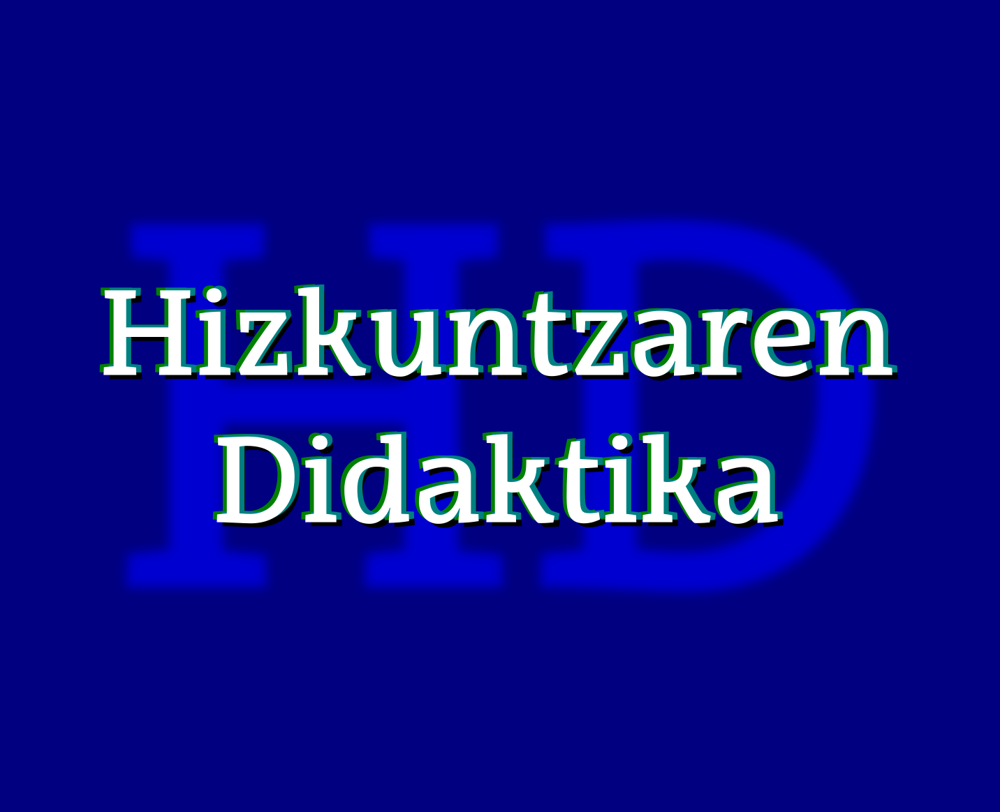

--- 
title: "Hizkuntzaren Didaktika (Lehen Hezkuntza) V-2020/09"
author: 
  name: "Irakaslea: Juan Abasolo"
  affiliation: UPV/EHU
  # email: juan.abasolo@ehu.eus
date: "2020/2021"
site: bookdown::bookdown_site
output: bookdown::gitbook
documentclass: book
# bibliography: [book.bib, packages.bib]
biblio-style: apalike
link-citations: yes
description: "Hizkuntzaren Didaktika ikasgaiko apunteak dira hauek. Ikasgaian aurrera egin ahala egokitzen joango dira"
url: 'https://juanabasolo.github.io/HD-LH/apunteak/'
cover-image: "assets/azala.png"  # relative to index
github-repo: JuanAbasolo/HD-LH
favicon: "assets/azala.png"
---

```{r echo=FALSE}
# options(tinytex.verbose = TRUE)
```

# Hizkuntzaren Didaktika (LH): apunteak 2020/2021 {-}




## Jakingarriak {-}

Hemen duzun dokumentuak ikasgairako beharko dituzun elementu gehienak editu berton edo estekatuta:

1. Ikagaiaren gida eta nirekin harremanetan paratzeko argigarriak
2. [Gida ofiziala](https://www.ehu.eus/eu/web/hld-dll/ikasgaiak?p_redirect=consultaAsignatura&p_anyo_acad=20200&p_ciclo=X&p_curso=3&p_cod_asignatura=25868&p_cod_plan=GPRIMA30&p_cod_centro=354) (kapitulu honetan)
3. Kapitulurik kapitulu, apunteak, diapositibetarako estekak eta bakoitzaren amaieran bibliografia eta ariketak aurkituko dituzu.

Goiko "download" botoian PDF(?) edo EPUB formatuan ere jaits dezakezue gida.

**Irakaslea**: Juan Abasolo

Nirekin kontaktuan jartzeko, Telegram erabiltzea gomendatzen dizuet, korreoak eta abar baino eraginkorragoa baita. Hala ere, batzuetan ibili ez arren eta biltegiratze gaitasun urria badu ere, denok dugunez UPV/EHUko korreoa, komunikazio ofizialak bertatik egin behar ditugu. Aurten zuen banaketa zerrenda ez dabil.

+ Telegram: [abildua] JuanAbasolo
+ emaila: juan [puntu] abasolo [abildua] ehu [puntu] eus
+ Bulegoa: 3S40B
+ Tutoretzak: https://labur.eus/JAbasolo-tutoretzak  
   Aurretik norbaitekin hitzordua egiten dudanean hor ere agertuko da. Fakultatekoa edo GAURrekoa bitaminizatua, beraz.

**Ikastaldea**: LH 32, 3. maila, lehenengo lauhilekoan.

Balibideak partekatzeko, eztabaida informaletarako eta azken momentuko informazio edo premietarako-eta proposatzen dizuedan foroa [hemen](https://t.me/joinchat/CheQnxAMdJ206V3d4kDLkw) duzue. Hori erabiltzeko Telegrameko kontua egin beharko duzue (telefonoan edo ordenagailuan erabil dezakezue). Whatsappeko taldeen antzerako kudeaketa du, baina inori telefono zenbakia eman beharrik gabe.

Ikasgaiaren lehenengo zatian ia ez dugu erabiliko Moodle-n oinarritutako plataformarik.

**Ikasgaia**: Gida hau UPV/EHUko web [orritik bertatik](https://www.ehu.eus/eu/lehen-hezkuntzako-gradua-bizkaia/kreditu-eta-irakasgaiak?p_redirect=consultaAsignatura&p_cod_proceso=egr&p_anyo_acad=20180&p_ciclo=X&p_curso=3&p_cod_asignatura=25868) hartutakoa da, beraz, irakurri eta aztertuta baduzu, hurrengo pausura iragan.

**Proiektua**: 

[](syllabusa/Syllabus_HDLH20-V1-1.pdf)

# Hizkuntzaren eta Literaturaren Didaktika - 25868 {-}

- Ikastegia  
  Bilboko Hezkuntza Fakultatea

- Titulazioa  
  Lehen Hezkuntzako Gradua

- Ikasturtea  
  2020/21

- Maila  
  3

- Kreditu kopurua  
  10

- Hizkuntzak  
  Euskara 

## Irakaskuntza {-}

| Irakaskuntza mota | Ikasgelako eskola-orduak | Ikaslearen ikasgelaz kanpoko jardueren orduak |
| ----------------- | ------------------------ | --------------------------------------------- |
| Magistrala        | 20                       | 30                                            |
| Gelako p.         | 80                       | 120                                           |

## Irakaskuntza-gida {-}

### Helburuak {-}

A) Hizkuntzen eta literaturaren eskolako curriculuma ezagutzea, aztertzea  eta balioestea, eta ahozko eta idatzizko hizkuntzaren irakaskuntzarako  proposamen metodologikoak aztertzea eta ebaluatzea
B) Lehen  Hezkuntzako curriculumean aurreikusitako erabilera arloei dagozkien  ahozko eta idatzizko berbaldiak ulertzen eta sortzen irakasteko  estrategiak menderatzea
C) Ahozko edo idatzizko hizkuntzaren garapena sustatzeko sekuentzia didaktikoak diseinatzea, Lehen Hezkuntzako  ikasgeletan aplikatzeko eta ikasleen hizkuntza-gaitasunen garapena  bermatuko dituzten sekuentzia berriak diseinatu ahal izateko
D)  Ikasleari oinarrizko ezagutzak ematea bere literatur prestakuntza eta  etorkizunean izango dituen ikasleena osatzeko, eta Haur eta Gazte  Literaturaren genero eta kontzeptuei buruzko hausnarketa kritikoak  egiteko
E) Ikaslea literatur lanen irakurketa lantzeko eta  bultzatzeko gai izatea, egile klasiko eta garaikideen lanak ezagutzea,  eta bere sentikortasuna garatzea Haur eta Gazte Literaturaren  prestakuntza-, sormen- eta estetika-balioez jabetzeko
F) Ikasleari  gaitasuna ematea, didaktikako irizpideen arabera eta ahozko zein  idatzizko literatur materialetatik abiatuta, irakaskuntza/ikaskuntako  metodo, baliabide eta teknikak praktikan jartzeko, eta literatur  irakurketak aukeratzeko irizpide egokien arabera 

### Irakasgai-zerrenda {-}

1. GAIA.- Hizkuntzen eta literaturaren curriculumaren diseinua.  
- Curriculumaren kontzeptua  
- Hizkuntzaren curriculuma gaur egungo ikuspegi didaktikotik:  
        - ezaugarriak
        - osatzen duten elementuak (helburuak, edukiak, metodologia, ebaluazioa)  
2. GAIA.- Ahozko hizkuntzaren didaktika.  
- Ahozkotasuna eta ulermena:  
          - hitz egitea
          - mintzamenaren ulermena
          - hitz egitea eta entzutea gelaren egunerokoan  
- Mintzamena irakastea:  
          - Irakasleen jarduerak ikasleen mintzamena garatzeko
          - Orientabideak LHko gelarako
3. GAIA.- Idatzizko hizkuntzaren didaktika  
    - Ahozko hizkuntza vs. hizkuntza idatzia
    - Zer da irakurtzea?
    - Zer da idaztea?
    - Hizkuntza idatziaren psikogenesia
    - Irakurtzen-idazten irakasteko metodoak
    - Erabaki didaktikoak.
    - Proposamen didaktikoak: erabilera praktikoa eta erabilera zientifikoa.  
4. GAIA.- Hausnarketa metalinguistikorako didaktika LHn.  
    - Tartehizkuntza eta errorea.
    - Hizkuntzaren funtzioak umeen lengoian.
    - Testua eta diskurtsoa
    - Erroreak  
5. GAIA.- LHn ahozko eta idatzizko hizkuntza garatzeko sekuentzia didaktikoak programatzea. 
    - Programak eta proposamen didaktikoak
    - Atazak eta zereginak ahozko gaitasun komunikatiboa lantzeko
    - Atazak eta zereginak idatzizko gaitasun komunikatiboa lantzeko  
6. GAIA.- Haur- eta gazte-literaturaren kontzeptua: teoriak, eztabaidak eta ikerketako ikuspegiak.
7. GAIA.- HGLren ezaugarriak eta generoak.
8. GAIA.- HGLren historiara hurbiltzea.
9. GAIA.-  HGL eta eskola; irakurtzeko ohitura eta literatura-gaitasuna.
10. GAIA.- HGLa eta horren aplikazioa ikasgelan.


### Metodologia {-}

- Era indibidualean edota taldeka egindako lana
- Ikaskuntza gidatua edota autonomoa
- Ikaskuntza kooperatiboa
- Jarduera teoriko-praktikoak

### Ebaluazio-sistemak {-}

+  Azken Ebaluazioaren Sistema
+  Kalifikazioko tresnak eta ehunekoak:
  + Garatu beharreko proba idatzia (%): 30
  + Test motatako proba (%): 20
  + Banakako lanak (%): 10
  + Talde lanak (arazoen ebazpenak, proiektuen diseinuak) (%): 14
  + Lanen, irakurketen... aurkezpena (%): 10
  + DAL (%): 16

### Nahitaez erabili beharreko materiala {-}

1513/2006 Errege Dekretua, 2006ko abenduaren 7koa, Lehen  Hezkuntzako gutxieneko irakaskuntza ezartzen duena.

175/2007 DEKRETUA, urriaren 16koa, Euskal Autonomia Erkidegoko Oinarrizko  Hezkuntzaren curriculuma sortu eta ezartzekoa. 218. gehigarria. 2007ko  azaroak 13, EHAA. 

• Testuen dossierra komentarioak egiteko
• Lehen Hezkuntzako hizkuntza ikasgaiaren testu liburuak 
• Ordenagailua
• Testu liburuak

### Bibliografia {-}

#### Oinarrizko bibliografia {-}

Abascal, D., Beneito, J.M. y Valero, F. (1997) Hablar y escuchar. Barcelona, Octaedro

Camps, A y Zayas, F. (Coords) (2006) Secuencias didácticas para aprender gramática. 
Barcelona, Graó

Camps, A (coord) (2003) Secuencias didácticas para aprender a escribir. Barcelona, Graó.

Cassany, D. Enseñar lengua (1994) Barcelona, Graó.

COLOMER, T. (2009). Introducción a la literatura infantil y juvenil. Madril: Síntesis. 

COLOMER, T.; Manresa, Mireia; Ramada Prieto, Lucas & Lara Reyes López (eds.) (2018). Narrativas literarias en educación infantil y primaria. Madril: Síntesis. 

CULLER, J. (2009). Breve introducción a la teoría de la literatura. Bartzelona: Crítica. 

DURAN, T. (2009). Álbumes y otras lecturas. Análisis de los libros infantiles. Bartzelona: Octaedro. 

ETXANIZ ERLE, X. eta J.M. López Gaseni (2011). XXI. mende hasierako haur eta gazte literatura. Arabako Foru Aldundia 

ETXANIZ & LOPEZ GASENI (2011): Egungo haur eta gazte literaturaren historia. Bilbo: UPV-EHU Argitalpen zerbitzua.

Fons Esteve, M. (2004) Leer y escribir para vivir. Barcelona, Graó.

IGERABIDE, J. K. (1993). Bularretik mintzora. Donostia: Erein. 

JIMÉNEZ-PÉREZ, E. eta S. Fabregat Barrios (koords.) (2019). La literatura infantil y  juvenil: investigaciones. Bartzelona: Octaedro. 

LLUCH, G. eta F. Zayas (2015). Leer en el centro escolar. El plan de lectura. Bartzelona: Octaedro. 

RETOLAZA, Iratxe (2017): Egungo euskal komikiaren historia. Bilbo: UPV-EHU Argitalpen Zerbitzua.

RODARI, G. (1979). Gramática de la fantasía. Madril: Avance.

Ruiz Bikandi, U., (2000) Didáctica de la segunda lengua en educación infantil y primaria. Madrid, Síntesis. 

Palou, J Y Bosch, C. (Coords) (2005) La lengua oral en la escuela. Barcelona, Graó.

Sainz, M., (1996) ¿Irakurketa eta idazketa LHko bigarren eta hirugarren zikloetan¿, in HIK HASI, 10. zb.

Solé, I. Estrategias de lectura. Barcelona, Graó.

Wells, G., (1988) Aprender a leer y escribir.  Barcelona, Laia

#### Gehiago sakontzeko bibliografia {-}

Alcoba, S. (coord) (1999) La oralización. Barcelona, Ariel.

Bronckart, J. P. (1996), Activité Langagière, textes et discours. Lausanne.Delachaux et Niestlé.

Cassany, D. La cocina de la escritura. Barcelona Anagrama

Colomer, T. y Camps, A. (1996), Enseñar a leer, enseñar a comprender

González Fernández, A. (2004) Estrategias de comprensión lectora. Madrid, Síntesis.

Mendoza.A. (Coord) (2003) Didáctica de la lengua y la literatura. Madrid, Pearson Educación.

Pérez Rodríguez, M. A. (2004) Los nuevos lenguajes de la comunicación. Enseñar y aprender con los medios. Barcelona, Paidós.

Sanz Moreno, A.(2003) Cómo diseñar actividades de comprensión lectora. Departamento de Educación. Gobierno de Navarra

Schneuwly, B., (1992) ¿La concepción vygotskiana del lenguaje escrito¿ en Comunicación, Lenguaje y Educación, 16, pp. 49-59, 

Teberosky, A. (1992), Aprendiendo a escribir. Barcelona, Horsori.

Tolchinsky, L. (1993); Aprendizaje del lenguaje escrito. Barcelona, Anthropos.

#### Aldizkariak {-}

TEXTOS de Didáctica de la lengua y la literatura.
ARTICLES de Did.actica de la lengua y la literatura
Lenguaje y textos

## Taldeak {-}

...

#### Ikasgela(k) {-}

- 1S03G - IRAKASLEEN ESKOLAKO ERAIKIN HORIZONTALA - LEIOA

### 32 Teoriakoa (Euskara - Goizez)Erakutsi/izkutatu azpiorriak

| Asteak | Astelehena | Asteartea                           | Asteazkena | Osteguna                | Ostirala |
| ------ | ---------- | ----------------------------------- | ---------- | ----------------------- | -------- |
| 1-1    |            |                                     |            | 14:00-16:30 17:00-19:30 |          |
| 5-5    |            |                                     |            | 14:00-16:30 17:00-19:30 |          |
| 16-16  |            | 14:00-16:00 16:30-18:30 19:00-20:00 |            |                         |          |
| 19-19  |            | 14:00-16:00 16:30-18:00             |            |                         |          |

#### Irakasleak {-}

- [ABASOLO ISASA, JUAN SEBASTIAN](https://www.ehu.eus/eu/web/hld-dll/ikasgaiak?p_redirect=consultaTutorias&p_anyo_acad=20200&p_idp=351472)
- [ROJO COBOS, FRANCISCO JAVIER](https://www.ehu.eus/eu/web/hld-dll/ikasgaiak?p_redirect=consultaTutorias&p_anyo_acad=20200&p_idp=4636)

### 32 Gelako p.-1 (Euskara - Goizez)Erakutsi/izkutatu azpiorriak

| Asteak | Astelehena  | Asteartea | Asteazkena  | Osteguna    | Ostirala    |
| ------ | ----------- | --------- | ----------- | ----------- | ----------- |
| 2-4    | 18:30-20:00 |           |             | 16:30-20:00 |             |
| 6-10   | 18:30-20:00 |           |             | 16:30-20:00 |             |
| 17-18  |             |           | 14:00-15:30 |             | 16:00-17:30 |
| 20-30  |             |           | 14:00-15:30 |             | 16:00-17:30 |

#### Irakasleak {-}

- [ABASOLO, JUAN](https://www.ehu.eus/eu/web/hld-dll/ikasgaiak?p_redirect=consultaTutorias&p_anyo_acad=20200&p_idp=351472)
- [KORTAZAR URIARTE, JON BATTI](https://www.ehu.eus/eu/web/hld-dll/ikasgaiak?p_redirect=consultaTutorias&p_anyo_acad=20200&p_idp=2768)
- [ROJO COBOS, FRANCISCO JAVIER](https://www.ehu.eus/eu/web/hld-dll/ikasgaiak?p_redirect=consultaTutorias&p_anyo_acad=20200&p_idp=4636)

#### Ikasgela {-}

- 2S08M - IRAKASLEEN ESKOLAKO ERAIKIN HORIZONTALA - LEIOA
